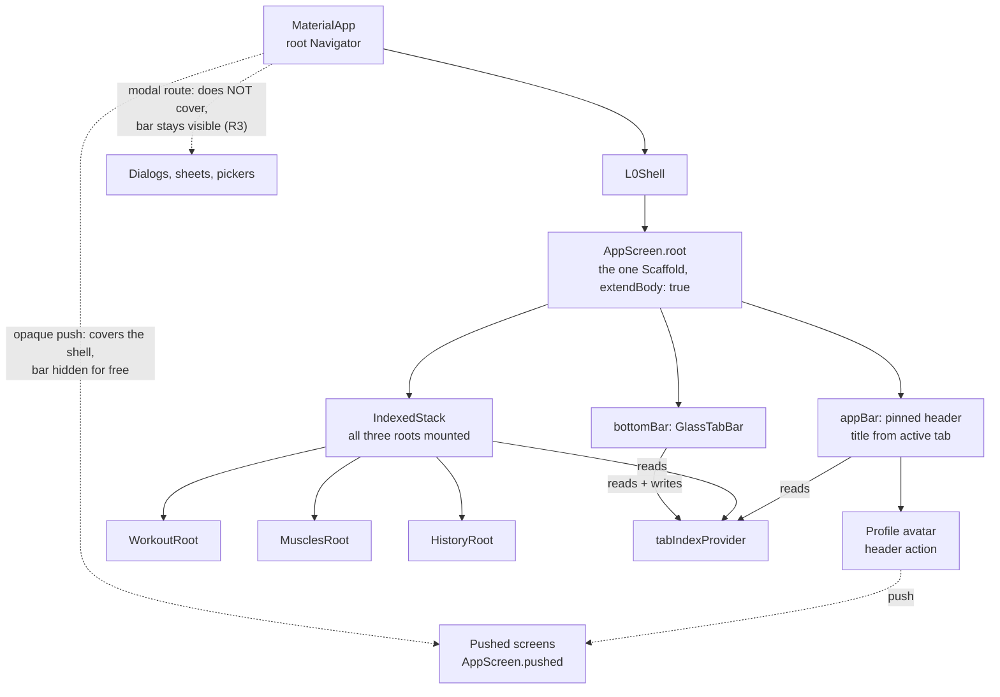
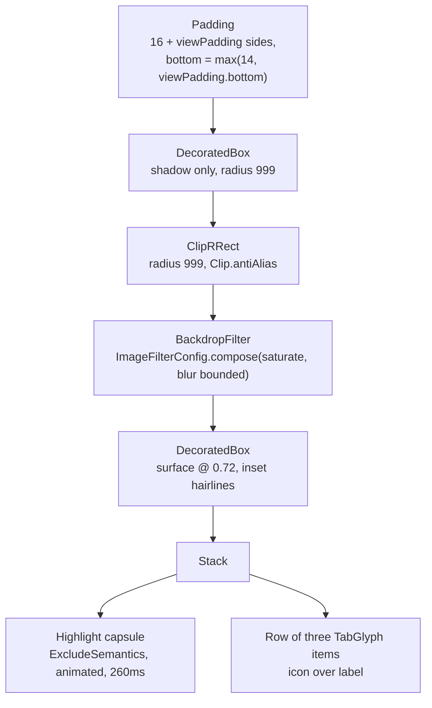

# L0 Tab Bar and Empty Tab Screens - Plan

## Goal Capsule

- **Objective:** A person opening the app lands in a navigable three-tab home, can move between Workout, Muscles and History without losing where they were in each, and can reach Profile — instead of the placeholder data-count screen that ships today.
- **Means:** A single-Navigator shell with a floating translucent tab bar and three real (empty-state) tab roots (KTD1).
- **Authority:** `docs/01`–`04` govern product rules; `prototypes/` govern layout; `lib/src/ui/app_screen.dart` governs the screen contract. Where this plan overrides `docs/01`–`04` on the tab set and the Resume card, R13 and the ADR in U6 are the reconciliation — do not leave the docs disagreeing.
- **Stop conditions:** Stop and ask if the blur measurably costs frames on device (Risk 1), or if implementing the shell requires a routing package or a per-tab back stack — either would invalidate KTD1.
- **Execution profile:** One implementer, seven units in the order U1 → U7 → U2 → U4 → U3 → U5 → U6. No data layer, no feature content.

---

## Product Contract

### Summary

Build the app's first navigation shell: a persistent L0 tab bar over three tab roots that today render only their empty states. The bar is a floating translucent capsule inset from the bottom edge, with content scrolling beneath it and a highlight that travels between tabs. Profile moves out of the tab set and into a header avatar. The placeholder `SetupCheckScreen` is deleted and the app boots into the shell.

### Problem Frame

`lib/main.dart` boots into `SetupCheckScreen`, a temporary screen that counts shipped data and goes nowhere. There is no navigation in the app at all — no tab bar, no routes, no second screen. Every subsequent build-order item needs somewhere to live, and none can start until the shell exists. The shell is also where the app's navigation shape stops being a prototype question and becomes a committed decision, which is why the tab-set conflict had to be settled before this work rather than during it.

### Key Decisions

- **Navigation variant A: tabs are Workout · Muscles · History; Profile is a header avatar; the bar shows only at L0; an open session takes over the Workout tab.** (session-settled: user-directed — chosen over variant B, the docs-as-written Workout · Muscles · Profile with the bar visible everywhere: the two newest prototypes already assume A, and promoting History gives the app's most-revisited surface a top-level home.) Governs R1, R2, R3.
- **Tab bar visual direction "Glass": translucent capsule with a backdrop blur, neutral highlight, accent tint on the active tab.** (session-settled: user-directed — chosen over Solid, which is cheaper to paint and never lets content bleed through, and over Ember, whose accent-filled highlight is the loudest of the three: Glass matches the iOS 26 App Store reference the prototype fixes as its target.) Governs R5, R6, R7.
- **This plan runs ahead of the documented build order.** `CLAUDE.md` puts the data layer first and the workout flow at step 4; the shell is a prerequisite for both and carries no data dependency, so it lands first. No requirement changes as a result.

### Requirements

**Navigation shell**

- R1. Three L0 tabs — Workout, Muscles, History — are reachable from a persistent bar, and each tab keeps its widget state and scroll offset across switches.
- R2. Profile is reached from a circular avatar control in the L0 header, on all three tab roots.
- R3. The tab bar is visible only at L0. An opaque page route covers the shell and hides it; popping restores it with the previously selected tab still selected. Modal routes — dialogs, bottom sheets, pickers — deliberately leave the bar visible, because they do not cover the shell.
- R4. System back on a pushed screen returns to the L0 shell rather than exiting the app, and Android's predictive-back gesture previews that destination.

**Tab bar**

- R5. The bar floats above the content: inset 16px from each side, offset from the bottom edge, with the tab roots' content scrolling underneath it rather than stopping above it.
- R6. The active tab is marked by a highlight capsule that travels between positions over 260ms, while the active icon's stroke thickens from 1.7 to 2.2 and its colour shifts to accent over 160ms.
- R7. Every colour the bar declares is a `docs/00` §12 palette colour with an alpha, or plain black. The bar introduces no new `Color` constant.
- R8. When the platform reports reduced motion — Android's `disableAnimations` or iOS's separate `reduceMotion` — the highlight moves without animating.
- R9. The bar is announced to assistive technology as a tab bar with three selectable tabs, and each tab meets the 48×48 minimum tap target.

**Tab roots**

- R10. Every screen in the app adds the safe-area insets to its own scrollable's padding, and each tab root's last item clears the floating bar rather than sitting under it.
- R11. Workout and History render their real empty state. Muscles renders its reference landing and has no empty state.

**Housekeeping**

- R12. `SetupCheckScreen` is deleted and the app boots directly into the shell.
- R13. No document in the repo states a tab set or a Resume-card behaviour that contradicts the shipped app, and the decision is recorded as an ADR.

### Scope Boundaries

In scope: the shell, the bar, three empty tab roots, the Profile avatar control (which pushes a placeholder Profile screen), and the doc reconciliation.

Out of scope: the template picker, exercise search, the body diagram, session list rows, profile stats, templates and personal details. Those are the tab roots' populated branches and each has its own build-order slot. No data layer, no Drift, no Riverpod providers beyond the tab index. The splash screen `docs/01` mandates is a separate surface from the shell and is also out.

#### Deferred to Follow-Up Work

- Which of `docs/00` §11's Profile content moves to the History tab (the tabbar prototype shows a `36 workouts · 4-day streak` summary strip on History) and which stays behind the avatar. This plan gives History its empty state only.
- The mid-session "Add exercise" screen cannot browse by muscle — variant C exists to answer that. Note the precise shape: variant A does **not** hide the Muscles tab during a session. The session overview is an L0 root with the bar visible, so a user can tab to Muscles mid-session, and `docs/03` §"Add to current workout" stays reachable that way. Only the pushed Add-exercise screen lacks in-flow browsing. Resurfaces at build-order step 4.
- Where Finish and Discard live on the session overview. Under variant A that overview is the Workout tab root, and the shell's one `bottomNavigationBar` slot is spent on the tab bar (System-Wide Impact B), so they cannot use `AppScreen`'s `bottomBar`. Decide at step 4 between inline scrolling actions and a second stacked bottom slot.
- The mascot's resting pose sits above empty-state copy per `docs/05-mascot-brief.md`. Empty states built here leave that slot addable without a relayout; the mascot itself is last to build.

### Open Questions

- **`material_ui` migration timing.** Flutter 3.47 shipped `material_ui` 1.0 as a standalone package, and the [3.47 release notes](https://flutter.dev/blog/whats-new-in-flutter-3-47) schedule formal deprecation of the in-SDK Material libraries for the November stable. This shell is new code written against a library that gets a deprecation warning in two months. It is a mechanical import swap (`dart fix --apply --code=migrate_design_widgets`) and does not block the shell, but it touches every file. Deferred, not blocking.
- **Typeface.** `CLAUDE.md` lists it as undecided; the prototypes use Inter and the app uses the platform default. Every px value in the bar spec was authored against Inter's metrics — the 10.5px/600 label in particular will set differently under the platform default. Deferred, not blocking.
- **Eager vs lazy tab mounting.** KTD10 ships eager `IndexedStack` mounting. Once History is Drift-backed and Muscles holds a search index, that means three live query subscriptions and three first-builds before the first frame. Revisit when the data layer lands, not now.

### Sources

- `prototypes/l0-tabbar-prototype.html` — the bar's geometry, materials and motion. Glass is variant 1; the geometry at lines 102–119 is shared across all three variants.
- `prototypes/l0-navigation-prototype.html` — variant A's config (line 179), the `showTabs()` visibility predicate (line 282), `workoutRoot()`'s session takeover (line 306), and the `rootTo()` / stack-replacement calls at lines 606, 646, 648 and 650 that System-Wide Impact A generalises.
- `prototypes/screens.html` — the richer empty-state shape (lines 82–87) and the Workout and History empty-state copy.
- `docs/00-build-spec.md` §9–§12; `docs/01-app-idea.md` §Navigation and shell; `docs/02-workout-tab-userflow.md` Step 2b (the authoritative Resume-card statement); `docs/03-muscle-groups-tab-userflow.md`; `docs/04-profile-tab-userflow.md`.
- [Scaffold.extendBody](https://api.flutter.dev/flutter/material/Scaffold/extendBody.html) and `Scaffold._BodyBuilder` in the installed SDK (`packages/flutter/lib/src/material/scaffold.dart:969`) — the measured-bar-height `MediaQuery` behaviour KTD6 rests on.
- `ImageFilterConfig` — verified in the installed SDK at `packages/flutter/lib/src/rendering/image_filter_config.dart`, exported **only** from `package:flutter/rendering.dart` (`packages/flutter/lib/rendering.dart:51`); `BackdropFilter.filterConfig` at `packages/flutter/lib/src/widgets/basic.dart:647`. Added in Flutter 3.41; most published guidance on Flutter glass bars predates it and recommends unbounded `ui.ImageFilter.blur` instead.
- `MediaQueryData.disableAnimations` doc comment (`packages/flutter/lib/src/widgets/media_query.dart:668`) — cannot be overridden by a `MediaQuery` widget, and iOS reduced motion is a separate flag. This shapes R8 and its test.
- `SemanticsRole.tabBar` assertions (`packages/flutter/lib/src/semantics/semantics.dart:266–296`) — every child of a tab bar node must be a `tab` with a real `selected` value and a tap action.
- [Predictive back](https://docs.flutter.dev/platform-integration/android/predictive-back). `PredictiveBackPageTransitionsBuilder` is already the Android default in 3.47 (`packages/flutter/lib/src/material/page_transitions_theme.dart:766`), so the manifest flag is the only code needed — no theme change.
- Impeller backdrop-blur history: [#149368](https://github.com/flutter/flutter/issues/149368), [#126353](https://github.com/flutter/flutter/issues/126353), [#161297](https://github.com/flutter/flutter/issues/161297) — all closed, and all about *many* blurs inside a scrolling list rather than one blur pinned outside it.

---

## Planning Contract

### Key Technical Decisions

- KTD1. **One root `Navigator`; no routing package and no nested navigators.** R3 hides the bar on push, which is the opposite of what `go_router`'s `StatefulShellRoute` exists to provide — that pattern keeps the bar visible by rendering pushed pages inside the shell. With a single stack and the shell as the bottom route, hide-on-push is free, R4 needs no code, and the iOS interactive back-swipe cannot desync the bar from the route. Flutter's guidance names two triggers for adopting a routing package — deep links, or multiple navigators — and this app has neither. The load-bearing precondition is stated in System-Wide Impact A: a tab switch is only reachable when the stack is empty, so no per-tab back stack can ever be observed.
- KTD2. **The shell is an `AppScreen.root`, not a second `Scaffold`.** `L0Shell` builds `AppScreen.root(title: <active tab>, actions: [avatar], bottomBar: GlassTabBar(...), extendBody: true, body: IndexedStack(...))`. `AppScreen` already owns a `bottomBar` slot; widening it with `extendBody` keeps one `Scaffold` construction site in the app, keeps `test/app_screen_test.dart`'s pinned-header net covering the screen users see most, and gives future `Scaffold`-level decisions one owner. Rejected: extracting the `AppBar` into a shared `AppHeader` and hand-rolling a second `Scaffold` in the shell — that fragments a contract `lib/src/ui/app_screen.dart` currently owns whole and leaves the shell's header untested, since the existing tests are typed to `find.byType(AppScreen)`.
- KTD3. **`BackdropFilter(filterConfig: ImageFilterConfig.blur(bounded: true))` inside a tightly-clipped `ClipRRect`.** `bounded: true` samples only within the capsule's own bounds and normalises to full opacity at the edges — the frosted-glass behaviour R5 wants, without colour bleeding from adjacent content. It does not clip its output, so the `ClipRRect` is required, not decorative; and an unclipped `BackdropFilter` samples the whole screen, which is the shape of the historical Impeller cost. Use `Clip.antiAlias`, never `Clip.antiAliasWithSaveLayer`. The saturation rides along via `ImageFilterConfig.compose` (see Assumptions), and is the first thing to drop if Risk 1's profiling finds the filter too costly. Skip `BackdropGroup`: it pays off across several blurred surfaces and this plan has one.
- KTD4. **`GlassTabBar` is a custom widget, not a themed Material 3 `NavigationBar`.** `NavigationBar` builds an internal `Material` with no `shape`, so it cannot be rounded without an external clip that would also clip its elevation shadow; its internal `SafeArea` is not optional and would add the home-indicator inset a second time inside an already-inset capsule; and its `backgroundColor` resolves to an opaque surface unless explicitly overridden. `lib/src/theme/app_theme.dart` already anticipates this — it deliberately declares no `bottomNavigationBarTheme` and notes the bar is a custom widget. Height is *not* the obstacle: `NavigationBar` has no height floor.
- KTD5. **Tab index is a Riverpod `NotifierProvider<TabIndex, int>`.** The app is on `flutter_riverpod ^3.4.3`, where `StateProvider` is legacy and lives behind `package:flutter_riverpod/legacy.dart` — the shape most tutorials reach for. `Notifier` needs no codegen, keeping the repo's no-codegen rule. A provider rather than local `State` because the index must be readable and settable from pushed routes: celebration-done returns the user to a named tab from outside the shell (System-Wide Impact A). The pop-to-root helper that pairs with it waits for that caller at build-order step 4.
- KTD6. **Bar clearance comes from `MediaQuery.paddingOf(context).bottom` through a single named helper, not a hardcoded height and not an open-coded expression.** With `extendBody: true` the `Scaffold` injects a `MediaQuery` whose bottom padding equals the bar's *measured* laid-out height, so clearance tracks the design instead of drifting from it. The trap: a `ListView` with no `padding` absorbs that inset automatically, but the moment it passes its own `padding` — which every screen here does, for `kScreenGutter` — the automatic behaviour is skipped entirely and the last item slides under the bar. The failure is silent, invisible in the default 800×600 test viewport, and defeated by any ancestor that consumes bottom padding. So the rule gets a call site (`screenScrollPadding(context)` next to `kScreenGutter`) rather than living in an implementer's memory.
- KTD7. **The pinned app bar stays the `Scaffold.appBar` on every screen, including the shell.** (session-settled: user-directed — chosen over a header that scrolls away with the body, as the prototypes' markup had it: a header outside the scroll view cannot desync from it.) Governs R10; KTD2 keeps the shell inside this contract rather than opening a second way to build a header.
- KTD8. **Bar visibility is a property of route opacity, never `Navigator.canPop`.** Under KTD1 this needs no state: an opaque page route covers the shell, a modal route does not. Two independent reasons not to reach for `canPop` — it would hide the bar behind dialogs and bottom sheets, which R3 says it must not, and the prototype's own predicate already carries an exception for the celebration screen. Add no `RouteObserver`, no `barVisible` provider.
- KTD9. **One safe-area rule for every screen, applied at the scrollable.** `AppScreen` currently wraps its body in `SafeArea(top: false)`, which gives pushed screens a free bottom inset while tab roots under `extendBody` would have to add it by hand — two mental models for one edge, and the faster-rotting kind. Worse, `SafeArea` *consumes* the padding `extendBody` injects and strips it from the descendant `MediaQuery`, so leaving it in place makes KTD6 silently no-op. Remove it and have every screen add `screenScrollPadding(context)` to its own scrollable. The helper must replace every edge `SafeArea` covered — left and right as well as bottom — because neither platform locks orientation (`ios/Runner/Info.plist` lists both landscape orientations and the Android manifest sets no `screenOrientation`), so a notched phone in landscape would otherwise run content under the cutout on every screen in the app. This also settles an existing contradiction: `app_screen.dart`'s `kScreenGutter` doc comment already says padding belongs on the scrollable, not a wrapper, while the code wraps at the bottom edge.
- KTD10. **`IndexedStack` mounts all three roots eagerly.** It is what preserves R1's state across switches, and with three empty screens the cost is nil. Recorded as a decision rather than an accident because it stops being free once the roots hold queries — see Open Questions.

### High-Level Technical Design

Widget topology. Everything below `L0Shell` is inside the one `Scaffold` that `AppScreen.root` owns; everything pushed goes above it on the root `Navigator`.

Bar layer composition, outermost first. The order is load-bearing: the shadow must sit outside the clip, the clip outside the filter, and the filter outside the fill. A `BoxShadow` paints outside its own box, so a shadow carried on the clipped fill would be erased entirely by the clip — it gets its own node above `ClipRRect`.

### Bar specification

Values from `prototypes/l0-tabbar-prototype.html`, Glass variant. Alphas are expressed against palette constants so R7 holds.

| Property | Value | Palette source |
|---|---|---|
| Side inset / bottom inset | `16 + viewPadding.left/right` / `max(14, viewPadding.bottom)` | — |
| Radius / inner padding | 999 (pill) / 5 | — |
| Bar fill | alpha 0.72 | `surface` |
| Inset ring / top highlight | 0.5px @ alpha 0.10 / 1px @ alpha 0.06 | `textPrimary` |
| Drop shadow | `0 10 28` @ alpha 0.42 | black |
| Blur | sigma 22, composed with a 1.6 saturation matrix | — |
| Highlight capsule | one third of inner track, radius 20, alpha 0.09 | `textPrimary` |
| Highlight travel | 260ms, `Cubic(0.23, 1, 0.32, 1)` | — |
| Icon | 22px, stroked, width 1.7 → 2.2 active over 160ms | — |
| Label | 10.5px, w600, letter-spacing 0.005em | — |
| Active / inactive tint | — | `accentStrong` / `textSecondary` |
| Item padding / icon-label gap | 8 top, 7 bottom / 3 | — |

The bar's overall height falls out of these at roughly 63px rather than being a token; KTD6 means nothing needs to know that number.

### Assumptions

- The Profile destination is a placeholder pushed screen in this slice. Its content is `docs/00` §11's and is out of scope; the avatar needs somewhere to land.
- History's empty state uses the icon-disc shape from `prototypes/screens.html` rather than the bare centred text in the navigation prototype. The two disagree; the navigation prototype states its screen bodies are scaffolding for judging navigation, so the richer one is the layout reference.
- `saturate(1.6)` composes with the blur rather than being dropped: `ImageFilterConfig.compose` exists and `ColorFilter implements ImageFilter`, so `compose(outer: ImageFilterConfig(ColorFilter.matrix(<1.6 saturation matrix>)), inner: ImageFilterConfig.blur(sigmaX: 22, sigmaY: 22, bounded: true))` reproduces the CSS ordering `blur(22px) saturate(1.6)`. Drop the saturation only if the Risk 1 profiling shows it adds measurable raster cost.
- New files sit flat in `lib/src/ui/`, matching the only existing precedent (`app_screen.dart`). Feature folders wait until the workout flow earns one at build-order step 4.

---

## System-Wide Impact

This is the app's first navigation code, so several of its choices bind every screen built after it.

**A. The root `Navigator` becomes the app's only stack, and tab switching is only reachable when it is empty.** That precondition is what makes KTD1 safe, and it is currently an emergent property of two separately-stated rules rather than a written invariant: `showTabs()` returns true only at stack depth zero, and variant A puts an open session at stack depth zero. So a user can never observe a per-tab back stack, because the control that would switch tabs is off-screen whenever a stack exists. Any future request for a per-tab stack invalidates KTD1 wholesale — which is why U6 puts the invariant in the ADR, not just this plan.

Its corollary is a "return to L0 tab N" move — set the tab index, then pop to the root route. Under variant A that shape is needed less often than the prototype's four `rootTo()`-ish call sites suggest: only celebration-done exercises both halves, template-picked pops without changing tab, and discard and finish both act from stack depth zero already (discard dismisses its confirmation dialog; finish pushes the celebration route). None of those callers exists in this plan's scope, so the helper is introduced at build-order step 4 with its first real caller rather than shipped here against a synthetic test. One caution for whoever writes it: predicate it on the shell route, not `isFirst`, so a splash route added later does not become the pop target.

**B. Only the shell may own a `Scaffold` bottom slot.** The one `bottomNavigationBar` is spent on the tab bar, so no tab root can contribute a `bottomBar`, `floatingActionButton` or `bottomSheet`. This collides with variant A at step 4, where `docs/02` puts Finish and Discard on the session overview — which is the Workout tab root. Recorded in Deferred to Follow-Up Work.

**C. Safe-area ownership changes for every screen, not just tab roots.** KTD9 removes `AppScreen`'s `SafeArea(top: false)` so one rule covers pushed screens and tab roots alike. Every existing and future screen adds `screenScrollPadding(context)` to its scrollable's own padding, and that helper carries the left and right insets too — dropping them would put content under the cutout on a rotated notched phone, since neither platform locks orientation.

**D. "Pushed hides the bar" holds only for opaque page routes.** Dialogs, `showModalBottomSheet` and `showDatePicker` do not cover the shell, so the bar stays visible behind the barrier — and both of the next flows hit this at L0, since the session-date picker and the Discard confirmation both live on the session overview. R3 states this as intended behaviour rather than leaving it to be discovered.

**E. The keyboard becomes an L0 concern from the very next build item.** The Muscles root opens with a search field and the session title is inline-editable on the overview — both L0. With `extendBody: true` and a floating bar, the capsule rides up above the keyboard by default, and the bottom padding the roots depend on is contended by `viewInsets`. Nothing in this slice has a text input, so the rule is set now and tested now: the bar hides when `MediaQuery.viewInsetsOf(context).bottom > 0`.

**F. The bar's band eats taps, not just pixels.** The capsule occupies a roughly 63px full-width band. KTD6 buys layout clearance for the last item, but content scrolled under the capsule is untappable while it is there. The body diagram is hit-tested with `Path.contains` and lands on both the Muscles root and the session overview, so its lower segments will only be tappable once scrolled clear. The rule for roots: do not place a primary interactive target in the bottom band.

---

## Implementation Units

Execution order is U1 → U7 → U2 → U4 → U3 → U5 → U6. U-IDs are stable and do not follow that order.

### U1. Widen `AppScreen` for a floating bar and unify the bottom-inset rule

- **Goal:** One screen contract that the shell can use, with one bottom-inset rule across every screen.
- **Requirements:** R10, KTD2, KTD6, KTD9
- **Dependencies:** none
- **Files:** `lib/src/ui/app_screen.dart`, `test/app_screen_test.dart`
- **Approach:**
  1. Add characterization tests **first**, against the current widget, for the behaviour no existing test covers: `toolbarHeight` 64 vs 56, `titleSpacing` 0 vs `kScreenGutter`, the trailing `SizedBox(width: kScreenGutter - 8)` after `actions`, both title `TextStyle`s, `titleWidget` overriding the text while `title` stays the semantics label, and `Semantics(header: true)`. The four existing tests only prove the header exists and is pinned — any `Scaffold.appBar` passes them — so without this step the widening is unguarded.
  2. Add an `extendBody` flag, defaulting false, forwarded to the `Scaffold`.
  3. Remove `SafeArea(top: false)` from the body (KTD9). It defeats `extendBody` by consuming the injected padding and stripping it from the descendant `MediaQuery`.
  4. Add `screenScrollPadding(BuildContext)` next to `kScreenGutter`, returning `kScreenGutter` plus the corresponding `MediaQuery.paddingOf(context)` inset on the left, right and bottom edges — everything the removed `SafeArea(top: false)` used to supply (KTD6, KTD9).
  5. Extend the class doc comment with the two new invariants and why breaking them is tempting, matching the style already there: the bar must remain the `Scaffold.bottomNavigationBar` (moving it into a `Stack` silently removes every screen's clearance), and screens pad their own scrollable.
- **Execution note:** Characterization-first. No *existing* assertion changes; adding new ones is the point of step 1.
- **Patterns to follow:** The doc-comment style in `lib/src/ui/app_screen.dart` — it states the invariant and why breaking it is tempting.
- **Test scenarios:**
  - Characterization: root header is 64 tall and pushed is 56.
  - Characterization: root `titleSpacing` equals `kScreenGutter`; pushed is 0.
  - Characterization: the last widget in `actions` is a `SizedBox` of width `kScreenGutter - 8`.
  - Characterization: root and pushed titles use 24/w600/-0.48 and 16/w600/-0.16.
  - Characterization: with a `titleWidget`, that widget renders and `title` is still the semantics label.
  - With `extendBody: true` and a `bottomBar` of known height, a descendant of the body reads that height from `MediaQuery.paddingOf(context).bottom` — the direct guard on KTD9, which fails if the `SafeArea` is left in.
  - `screenScrollPadding` returns gutter-plus-inset on all three edges: given a `MediaQuery` with non-zero left, right and bottom padding, each is added to `kScreenGutter`.
  - The four existing tests pass with no edit to their assertions.
- **Verification:** `flutter analyze` clean; all existing assertions unchanged and green; the `extendBody` scenario proves the inset reaches the body.

### U7. `TabGlyph` — the three stroked tab icons

- **Goal:** Three icons whose stroke width and colour animate, which is what R6 needs and what a Material font glyph cannot do.
- **Requirements:** R6
- **Dependencies:** none
- **Files:** `lib/src/ui/tab_glyph.dart` (new), `test/tab_glyph_test.dart` (new)
- **Approach:**
  1. A `CustomPainter` per glyph, on a 24 viewBox, with round caps and joins. The three paths are in `prototypes/l0-tabbar-prototype.html` at lines 211–215: Workout is a barbell, Muscles a figure, History a clock.
  2. Take `strokeWidth` and `color` as parameters so the bar animates them; the glyph itself holds no animation.
  3. `CLAUDE.md` forbids adding an SVG package, and these are simple enough to transcribe as `Path` operations.
- **Test scenarios:**
  - Each of the three glyphs paints without error at 22×22.
  - `shouldRepaint` returns true when `strokeWidth` or `color` changes and false when neither does.
  - Painted stroke width matches the parameter, so the bar's animation has something to drive.
- **Verification:** Three glyphs render standalone in a widget test with no bar around them.

### U2. `GlassTabBar` widget

- **Goal:** The floating capsule bar, correct in isolation before anything depends on it.
- **Requirements:** R5, R6, R7, R8, R9
- **Dependencies:** U7
- **Files:** `lib/src/ui/glass_tab_bar.dart` (new), `test/glass_tab_bar_test.dart` (new)
- **Approach:**
  1. Build the layer stack in the order the second diagram gives. Import `ImageFilterConfig` from `package:flutter/rendering.dart` — it is exported from nowhere else, and without that import the fallback is `dart:ui`'s unbounded `ImageFilter.blur`, exactly what KTD3 rules out.
  2. Take `selectedIndex` and `onSelected` as parameters. No provider dependency, so the widget is testable standalone and the shell owns the wiring.
  3. Declare every colour as a named `static const` built from `AppPalette.<x>.withValues(alpha: …)` — `withOpacity` is deprecated in this SDK. Naming them is what makes R7 assertable; a test that reaches into a `BoxDecoration` proves nothing about the hairlines, the highlight or the shadow.
  4. Drive the highlight with an implicit animation, and read reduced motion from both platforms: Android's `disableAnimations` and iOS's separate `View.of(context).platformDispatcher.accessibilityFeatures.reduceMotion` (R8). `MediaQueryData` has no `reduceMotion` field.
  5. Semantics: `SemanticsRole.tabBar` on the row, `SemanticsRole.tab` on each item. The SDK asserts in debug that every child of a tab-bar node is a tab, that every tab has a real `selected` value, and that every tab has a tap action — so wrap the highlight capsule in `ExcludeSemantics`, set `selected` on all three items rather than only the active one, and keep `onTap` wired even when already selected.
  6. Hide the bar when `MediaQuery.viewInsetsOf(context).bottom > 0` (System-Wide Impact E).
- **Test scenarios:**
  - Renders three items labelled Workout, Muscles and History.
  - Tapping the second item invokes `onSelected(1)`; tapping the already-selected item still reports it — load-bearing, because the semantics assertions require a tap action on every tab.
  - With `selectedIndex: 0`, the first item's glyph and label use `AppPalette.accentStrong` and the other two `AppPalette.textSecondary`.
  - Changing `selectedIndex` 0 → 2 moves the highlight: capture its offset before and after `pumpAndSettle`, assert it changed and settled at the third position.
  - Reduced motion, Android: set `tester.binding.platformDispatcher.accessibilityFeaturesTestValue = const FakeAccessibilityFeatures(disableAnimations: true)` with a teardown clearing it, then assert the highlight settles well before 260ms. Do not try to override `MediaQueryData.disableAnimations` — the SDK states it is read from the engine and a `MediaQuery` override does not affect `AnimationController`. Note the controller scales duration by 0.05 rather than to zero, so pump ~20ms rather than a single frame.
  - Reduced motion, iOS: same with `FakeAccessibilityFeatures(reduceMotion: true)`.
  - Every named colour constant on the bar, taken to full opacity, is in the `AppPalette` set or black (R7).
  - Semantics exposes three tab nodes under one tab-bar node, exactly one selected, each with a tap action.
  - Each item's hit-test area is at least 48×48.
  - At 320pt width the three labels render without overflow.
  - With `viewInsets.bottom > 0`, the bar is not shown.
- **Verification:** Bar renders and switches selection in a widget test with no `Scaffold` around it; `flutter analyze` clean with no deprecation infos.

### U4. The three empty L0 tab roots

- **Goal:** Each tab has a real screen with its real empty state, padded so nothing hides under the bar.
- **Requirements:** R10, R11
- **Dependencies:** U1
- **Files:** `lib/src/ui/workout_root.dart` (new), `lib/src/ui/muscles_root.dart` (new), `lib/src/ui/history_root.dart` (new), `lib/src/ui/empty_state.dart` (new), `test/tab_roots_test.dart` (new)
- **Approach:**
  1. Treat these as finished screens, not stubs. The app has no server and starts with zero data, so "no workouts yet" is a permanent shipping state a real user meets on day one — the populated branch gets added later, the screen is not rewritten. Final paths, final class names.
  2. Each root is a body, not a `Scaffold` — the shell supplies that. Each owns its own scrollable and passes `screenScrollPadding(context)` (KTD6).
  3. `EmptyState` is a shared presentational widget — icon disc, heading, body — taking its glyph as a parameter. Source each root's glyph from that root's own disc in `prototypes/screens.html`, not from `TabGlyph`: the empty-state discs and the tab icons are different drawings, and History's disc is not the clock the History tab uses, so reusing `TabGlyph` by default would visibly diverge from the reference this unit cites for everything else. The three *roots* stay separate files with no shared base; a shared root widget with three flags is the debt being avoided.
  4. Copy from `prototypes/screens.html`: Workout "Ready when you are" / "Pick a template for a planned session, or go ad-hoc and add exercises as you find them."; History "No workouts yet" / "Finish your first session and it'll show up here."
  5. Muscles has no empty state — its landing is static reference content. It renders its heading plus one placeholder line in the same tone as the other two roots: "Browse by muscle" / "Search and the body map arrive with the exercise library." Pinning the copy here stops the implementer either blocking to ask or inventing wording inconsistent with the quoted Workout and History strings.
  6. `WorkoutRoot` is the one root that will grow a second structural body: under variant A an open session replaces the landing entirely, with a different header. Shape it as a branch on session presence with the empty state as one arm, so step 4 adds an arm rather than rewriting the file.
  7. Leave vertical room above the empty-state copy for the mascot without laying it out.
- **Test scenarios:**
  - Workout root renders its empty-state heading, body copy and the barbell disc glyph.
  - History root renders its empty-state heading, body copy and its own disc glyph — asserting the glyph, since a silently wrong icon is the failure mode here.
  - Muscles root renders its heading and placeholder line, and no `EmptyState` widget.
  - Clearance contract, one helper over a registry of all three roots: given a `MediaQuery` whose `padding.bottom` is 63 and a viewport short enough to force scrolling, each root's last item sits at least 63 above the viewport bottom. A registry rather than three tests, so adding a fourth root without registering it is what fails.
  - Each root's scrollable scrolls.
  - The empty-state block leaves its mascot slot's vertical space.
- **Verification:** All roots render at phone width; the clearance test passes against the `MediaQuery` contract rather than against one assembled arrangement.

### U3. `L0Shell` — tab state and assembly

- **Goal:** The three tabs coexist, keep their state, and the bar switches between them.
- **Requirements:** R1, R2, R3, R4
- **Dependencies:** U1, U2, U4
- **Files:** `lib/src/ui/l0_shell.dart` (new), `lib/src/ui/tab_index.dart` (new), `lib/src/ui/profile_screen.dart` (new, the placeholder destination the avatar pushes), `test/l0_shell_test.dart` (new)
- **Approach:**
  1. `AppScreen.root(extendBody: true, bottomBar: GlassTabBar(...), body: IndexedStack(...))` per KTD2. `extendBody` is what makes R5 real and what KTD6 depends on. The shell's body is **not** wrapped in a bottom `SafeArea` — U1 removed it from `AppScreen` for this reason, and reintroducing one here silently zeroes every root's clearance.
  2. `tab_index.dart` holds `tabIndexProvider` — named for the thing, matching `exerciseLibraryProvider` in `lib/src/data/exercise_library.dart`, not for the word "provider".
  3. The shell watches `tabIndexProvider` in its own `build`. `AppScreen.root` takes `title` as a `String` and uses it as the header's semantics label, so a `Consumer` confined to `titleWidget` would leave a screen reader announcing the same tab name on all three roots while sighted users see it change — and U1's characterization test pins that label. The resulting `Scaffold` rebuild is harmless: there are three tabs, the trigger is a discrete tap, and R1's state preservation comes from `IndexedStack` keeping its children mounted, not from avoiding the rebuild.
  4. Give the shell a way for the active root to contribute title, `titleWidget` and actions, rather than a `switch` on the index. Under variant A the Workout header becomes the editable session title, and `AppScreen`'s `titleWidget` doc comment already names that case. Deciding it now is cheap; retrofitting at step 4 means touching the shell, all three roots and the avatar wiring at once.
  5. The avatar is 32px, `surface` fill, 1px `border`, `textSecondary` glyph, flipping both border and glyph to `accentStrong` while pressed. `AppScreen` appends a trailing gutter spacer to `actions`, so wrap it rather than dropping in a bare `IconButton`. It pushes a placeholder Profile screen.
  6. Add no `RouteObserver`, no `barVisible` provider, no `Navigator.canPop` check (KTD8).
- **Test scenarios:**
  - Tapping each tab shows that tab's root and not the other two.
  - Scroll the History root, switch to Muscles, switch back — the scroll offset survives. This catches the day someone "simplifies" the `IndexedStack` into a `switch` returning one child.
  - The header title changes with the active tab, and so does the header's semantics label — assert the label, not only the rendered text, or the accessibility regression passes unnoticed.
  - Pushing an opaque route hides the bar; popping restores it with the same tab selected. Assert with `find.byType(GlassTabBar).hitTestable()` — the shell stays mounted and merely offstage beneath a `MaterialPageRoute`, so a bare `findsNothing` would pass by accident of `skipOffstage`'s default and would not survive a `maintainState` change.
  - Showing a dialog leaves the bar visible (R3, System-Wide Impact D).
  - `tester.binding.handlePopRoute()` on a pushed screen pops to the shell and does not request app exit; at the shell itself it does not crash.
  - Setting the tab index from outside the shell switches the visible tab.
  - Tapping the avatar pushes the Profile destination and the bar is not visible while it is up.
- **Verification:** All scenarios pass; on a simulator, switching tabs preserves scroll position and pushing a screen hides the bar.

### U5. Boot into the shell and enable predictive back

- **Goal:** The app opens on the shell, the placeholder is gone, and Android's back gesture behaves.
- **Requirements:** R12
- **Dependencies:** U3
- **Files:** `lib/main.dart`, `android/app/src/main/AndroidManifest.xml`, `test/shipped_data_test.dart` (new, from the split), `test/boot_test.dart` (new, from the split), `test/android_manifest_test.dart` (new)
- **Approach:**
  1. Point `home:` at the shell and delete `SetupCheckScreen` and its `_Row` helper from `lib/main.dart`. R12's real proof is compile-time: once the class and its import are gone, nothing can reference it.
  2. Add `android:enableOnBackInvokedCallback="true"` to `<application>` in the manifest. Without it predictive back is silently absent on Android 13–15; Android 16 gets it by default from `targetSdk 36`, which is exactly why testing on a current device hides the omission. No theme change is needed — `PredictiveBackPageTransitionsBuilder` is already the Android default in 3.47, so do not "fix" `buildAppTheme()` by adding a `pageTransitionsTheme`.
  3. In `test/setup_smoke_test.dart`, the three data-count tests never touch the screen and cannot break. The one that does is the boot test, which anchors `Theme.of(...)` through `find.byType(SetupCheckScreen)`; re-point it at the shell. The file is named for a screen that no longer exists — split it into `test/shipped_data_test.dart` and `test/boot_test.dart`.
- **Execution note:** Mostly wiring. The manifest flag gets a real test; the gesture itself is manual-on-device and is a Verification Contract row, not a unit scenario.
- **Test scenarios:**
  - `test/android_manifest_test.dart` reads the manifest and asserts `enableOnBackInvokedCallback="true"` is present inside `<application>`. A plain file-read test, and the only automatable half of predictive back.
  - App boots and the shell is on screen with the Workout tab selected.
  - The re-pointed boot test resolves its theme through the shell rather than the deleted screen.
- **Verification:** `flutter run` lands on the shell; `flutter test` green; `flutter build apk --debug` succeeds.

### U6. Reconcile the docs with the shipped navigation

- **Goal:** The spec stops asserting a tab set and a Resume behaviour the app does not have, and the override is recorded with its reasoning.
- **Requirements:** R13
- **Dependencies:** U5
- **Files:** `docs/adr/0003-l0-navigation-variant-a.md` (new), `docs/01-app-idea.md`, `docs/02-workout-tab-userflow.md`, `docs/03-muscle-groups-tab-userflow.md`, `docs/04-profile-tab-userflow.md`, `docs/00-build-spec.md`, `README.md`, `CLAUDE.md`
- **Approach:**
  1. Write the ADR: the three variants, what was chosen, and variant A's riders — the bar shows at L0 only; an open session takes over the Workout tab rather than showing a Resume card; and the cost, which is that `docs/03`'s five-deep browse chain now needs four back presses to reach another tab where variant B needed one tap. State the riders as the joint precondition for the single-Navigator architecture, not as loose UI facts: KTD1 is safe only because the bar is unreachable at non-zero stack depth, so relaxing either rider — including the re-litigation this ADR anticipates — reopens KTD1 and means adopting nested navigators or a routing package. The ADR is the only artifact that outlives this plan, so if the invariant is written nowhere else it is written nowhere. That cost is what will be re-litigated once Muscles is populated, so it belongs in the record. Number it `0003`: `docs/agents/domain.md` illustrates the directory with `0001-riverpod-and-drift.md` and `0002-derive-everything-on-read.md`, both settled in session 1 and neither yet written, so taking 0001 would collide. Note in the ADR that it carries the *technical* decision while `docs/01` carries the *product* rule — `domain.md` warns against conflating the two.
  2. Amend the tab set in `docs/01-app-idea.md` §Navigation and shell and its tab-purpose table, `docs/00-build-spec.md` §11, `docs/03`'s "Home → Muscle Groups tab" entry point, and `docs/04`'s "Home → Profile tab" entry point.
  3. Amend the Resume card, which is specced at the authoritative level in three places: `docs/02-workout-tab-userflow.md` Step 2b (the detailed source), `docs/01-app-idea.md` §Progress tracking, and `docs/00-build-spec.md` §9. Missing `docs/02` would leave the most detailed statement of the rule contradicting the app at the level `CLAUDE.md` says wins.
  4. `README.md`: the "Three tabs — Workout, Muscles, Profile" line, the `lib/` description, and "`prototypes/` | Three browser prototypes" — there are five.
  5. `CLAUDE.md`: the tab set, plus two stale paths — `prototype/prototype.html` does not exist (the 22 screens are `prototypes/screens.html`), and `mascot-brief.md` is `docs/05-mascot-brief.md`. Do **not** touch the bundle id: `CLAUDE.md` already records `dev.indresh.turtle_lift` as decided.
  6. `docs/00-build-spec.md` §14 still lists "App name + Play Store package ID" as one undecided row. Split it — the app name stays undecided, the package ID is decided.
- **Test scenarios:** `Test expectation: none -- documentation only.`
- **Verification:** No document states a tab set other than Workout · Muscles · History, and none describes a Resume card; the ADR exists, names the rejected variants and variant A's cost, and states the bar-at-L0 rider as the precondition for KTD1; `docs/00` §14 no longer lists the package ID as undecided.

---

## Verification Contract

| Gate | Command | Applies to |
|---|---|---|
| Static analysis | `flutter analyze` — clean under `flutter_lints`, including no deprecation infos | U1–U5, U7 |
| Tests | `flutter test` | U1–U5, U7 |
| Android build | `flutter build apk --debug` | U5 |
| Generated-data guard | `tool/sync_generated.sh --check` | no-op here — nothing is added under `lib/src/data/generated/` |
| Predictive-back gesture | Manual, on a physical Android 13, 14 or 15 device: swipe back from a pushed screen and confirm the shell previews behind it. Cannot be automated — `flutter_test` has no platform back-gesture harness, and an Android 16 device would pass regardless of the manifest flag | U5 |
| Blur cost | Manual, release mode on the reference Android device: profile the raster thread in DevTools with a long list scrolling under the bar. Nothing this plan ships is long enough to scroll, so build the harness locally and do not commit it — temporarily swap `WorkoutRoot`'s body for an 80-row `ListView.builder`, measure, record the raster times here, then revert | U2, U3 |

CI (`.github/workflows/ci.yml`) runs on every push to every branch and gates the first four. The last two are manual; the blur row is the exit criterion for Risk 1.

---

## Definition of Done

- Every requirement R1–R13 is met, or explicitly deferred in this document with a reason.
- All four CI gates pass and both manual verifications have been performed.
- The app launches on a simulator into the shell; tabs switch, scroll positions survive switching, an opaque push hides the bar and a dialog does not.
- The blur has been profiled once in release mode on device and holds the frame budget. Glass is a user-settled decision, so falling back to Solid is not the implementer's call: if the budget is missed, stop and ask, per the Goal Capsule's stop condition.
- No document in the repo states a tab set or Resume behaviour contradicting the shipped app.
- No dead-end code from abandoned approaches remains — in particular no route observer, `barVisible` state, nested-navigator scaffolding, or reintroduced bottom `SafeArea`, all of which this plan's decisions rule out.

---

## Risks & Dependencies

- **Risk 1 — the blur costs frames on low-end Android.** Impeller's historical backdrop-blur problems were about many blurs inside a scrolling list; this is one blur pinned outside the scrollable, and `bounded: true` narrows sampling further. But there is no official benchmark and `docs.flutter.dev/perf/best-practices` does not cover `BackdropFilter` at all, so treat it as measurable rather than proven. Mitigation: `BackdropFilter.enabled` is a plain bool, so falling back to the Solid direction is one field, and the prototype already documents Solid as a considered alternative rather than a downgrade.
- **Risk 2 — R7's test is weaker than it looks.** The bar's fill is `surface` at 0.72 over a blur, so the *composited* pixel is content-dependent and is not a palette colour. The U2 test asserts the colours the bar *declares*, which is the enforceable claim. Do not read a passing test as proving the rendered pixel is on-palette.
- **Risk 3 — KTD6 is the most rot-prone rule here.** The failure is silent, invisible in the default test viewport, and defeated by any ancestor that consumes bottom padding or by moving the bar into a `Stack`. Mitigated three ways: a named helper rather than an open-coded expression, a registry-driven test rather than per-root tests, and the invariant written into `app_screen.dart`'s doc comment where someone about to break it will read it.
- **Risk 4 — golden tests of the bar will flake.** Blur output differs between Skia and Impeller and across machines. If goldens are added later, render them with blur disabled behind a test flag or set a pixel tolerance, and pin the CI Flutter version. This plan specifies behavioural widget tests instead.
- **Risk 5 — U6 being skipped as "just docs"** would leave the repo's authoritative spec describing an app that does not exist, across five files. `CLAUDE.md` instructs that conflicts be reported rather than resolved unilaterally; that reporting happened and the variant was chosen deliberately, and U6 is the record of it.
- **Dependency — none external.** No new packages. Adding one would need a `Package.swift` for the iOS SPM path, and nothing here calls for it.
