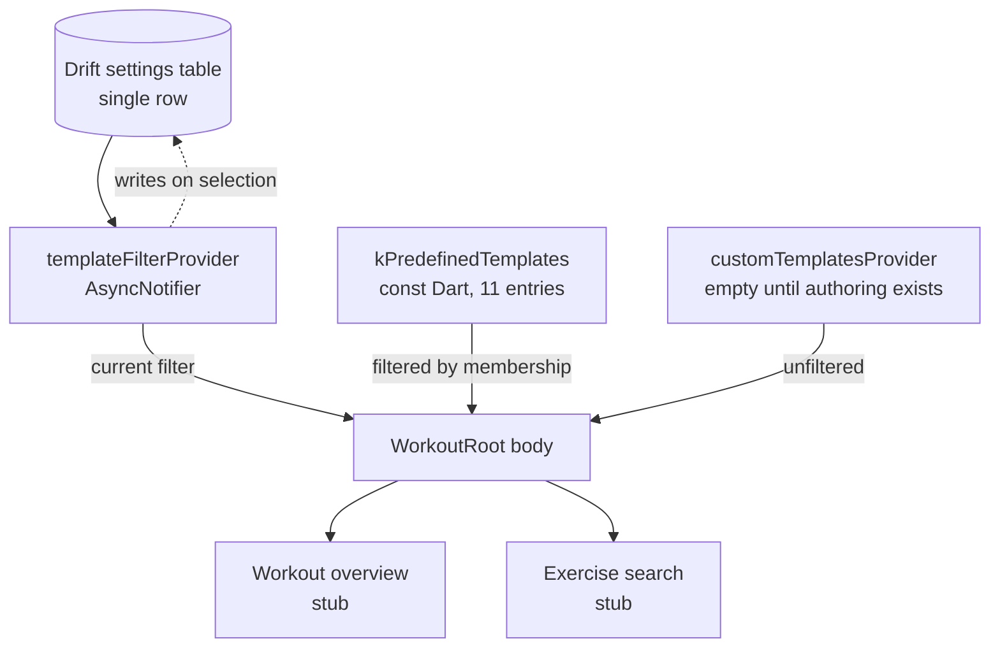

# Workout L0 Filtered Templates - Plan

## Goal Capsule

- **Objective:** Someone opening the app sees the workouts they can actually start and reaches the one they want in a single tap, instead of the placeholder empty state that ships today.
- **Means:** A filtered list of predefined templates on the Workout tab root, with a three-value split filter, a custom-template group, and an ad-hoc entry beneath (KTD7).
- **Authority:** `docs/01`–`04` govern product rules; `docs/00-build-spec.md` is a digest of them. `prototypes/workout-l0-filtered-templates.html` governs this screen's layout. `lib/src/ui/app_screen.dart` governs the screen contract. Where this plan overrides `docs/02-workout-tab-userflow.md`'s two-screen entry flow, U7 is the reconciliation — do not leave the docs disagreeing.
- **Stop conditions:** Stop and ask if standing up Drift (U2) turns out to need schema decisions beyond a single-row settings table, or if the filter menu cannot match the app's flat surfaces without introducing a twelfth colour.
- **Execution profile:** One implementer, seven units in order U1 → U2 → U3 → U4 → U5 → U6 → U7. This work contains the project's first Drift table and its first `build_runner` run.

---

## Product Contract

### Summary

The Workout tab root becomes a filtered list of workout templates. A "Templates" label carries a filter control on its right showing a glyph and the current filter's name; a count line sits beneath it; then the predefined templates matching that filter as tappable rows; then the user's own templates in their own group, unaffected by the filter; then an ad-hoc entry. Tapping a template opens the overview carrying it. The filter has three values and no unfiltered state, opens on Multi Split for a new user, and is remembered thereafter.

The work also creates two things the app does not have yet: the template model and its shipped data, and the first slice of the persistence layer.

### Problem Frame

`lib/src/ui/workout_root.dart` is a placeholder. It renders one `EmptyState` reading "Ready when you are" and offers no way to start anything, so the app's most-opened screen currently does nothing.

Nine predefined templates are described in `docs/01-app-idea.md:67-77`, but they exist only as prose — no model, no data, no table. The screen that was meant to show them was specified as a separate picker behind a "Start workout" button, which put two taps and a screen transition between opening the app and seeing a single workout.

### Key Decisions

- KD1. **Templates surface on the landing itself rather than behind a picker tap.** (session-settled: user-directed — chosen over the two-button landing in the prototypes: it removes a screen from the fastest path and makes day one show real content.) Governs R1, R4.
- KD2. **The split control is a filter over templates, not a declared training programme.** (session-settled: user-directed — chosen over a persisted Profile setting: a declared split is the multi-day split system `docs/01-app-idea.md:60` rules out.) Governs R7, R8, R11.
- KD3. **The filter has no unfiltered value.** (session-settled: user-directed — chosen over keeping "All" as the default: every arrival should land in a named split.) Governs R7.
- KD4. **Custom templates sit outside the filter as their own group.** (session-settled: user-directed — chosen over classifying them by muscle composition or making Multi Split a catch-all: neither keeps a custom template reliably reachable once "All" is gone.) Governs R5, R8.
- KD5. **Arms day counts as a single-muscle template.** (session-settled: user-directed — chosen over renaming the filter: the user treats arms as one muscle.) Governs R12.
- KD6. **The shipped template set grows to eleven.** (session-settled: user-directed — chosen over reshaping the mapping to avoid new templates: 1 Muscle per day needs a chest and a back entry to hold up.) Governs R12.
- KD7. **A new user sees Multi Split, and the choice is remembered thereafter.** (session-settled: user-directed — chosen over a fixed default with no memory.) Governs R9, R10.

### Requirements

**Landing composition**

- R1. The Workout tab root renders the template list in place of the empty state, leaving the pinned header and floating tab bar unchanged.
- R2. A "Templates" label sits at the top of the scroll body with the filter control on its right, showing a glyph and the current filter's name.
- R3. A count line beneath the control states how many templates the current filter yields.
- R4. Each predefined template row shows its name and its parent muscle groups, and is tappable.
- R5. Custom templates render in their own labelled group below the filtered list, and the group is absent entirely when the user has none.
- R6. An "Ad-hoc workout" entry sits below every template group.

**Filter behaviour**

- R7. The filter offers exactly three values — 1 Muscle per day, Multi Split, Push-Pull-Legs — and no unfiltered value.
- R8. The filter governs predefined templates only.
- R9. A user with no stored filter sees Multi Split.
- R10. The screen opens on the user's last selected filter on every later launch.
- R11. Nothing on this screen states or implies a schedule, a rotation, or a recommended workout.

**Template data**

- R12. Eleven predefined templates ship: the nine in `docs/01-app-idea.md:67-77` plus Chest day and Back day.
- R13. A template stores parent muscle group ids only; sub-groups derive from the taxonomy at render time.
- R14. A template may belong to more than one filter.
- R15. Predefined templates are immutable and are not authored on this screen.

**Navigation**

- R16. Tapping a template row opens the workout overview carrying that template.
- R17. Tapping the ad-hoc entry opens exercise search.

### Scope Boundaries

**In scope:** the landing body, the template model and shipped data, the filter and its persistence, the filter glyph and control, and placeholder destinations for the two navigation targets.

**Deferred to Follow-Up Work:**

- The real workout overview screen and the real exercise search screen. U5 stubs both.
- Creating a session from the tapped template. There is no session model yet, and building one here would pull in the whole data layer and the auto-save rule A6 defers.
- Template authoring behind the Profile avatar, which is where custom templates will come from.
- The active-session state of this tab root, which replaces the landing entirely (`docs/adr/0003-l0-navigation-variant-a.md`).

**Outside this screen's identity:** streak, last-session recall, body diagram, muscle-coverage chips, and a quick-log fast route. Each was considered during ideation and cut.

### Open Questions

- The separate workout template picker screen's fate is deferred by the user. This plan builds the landing so it works either way: if the picker survives it becomes a "see all templates" destination, and if it does not, `docs/02-workout-tab-userflow.md`'s screen list loses an entry. Not blocking.
- Whether the ad-hoc entry stays reachable once a user has many custom templates. Deferred until real custom-template counts exist. Not blocking.

### Sources

- `docs/01-app-idea.md:67-77` — the nine predefined templates and their muscle groups.
- `docs/00-build-spec.md` §2 — Template stores `name`, `isPredefined`, and parent group ids only. §11 — predefined templates are immutable; Profile is the only place templates are authored.
- `docs/adr/0003-l0-navigation-variant-a.md` — an active session replaces the tab root; no Resume card.
- `lib/src/data/generated/muscle_taxonomy.dart` — `kMuscleGroupLabels` maps parent ids to display names.
- `lib/src/ui/tab_glyph.dart` and `lib/src/ui/stroke_glyph.dart` — the hand-painted glyph pattern the filter icon follows.
- `lib/src/ui/tab_index.dart` — the `Notifier` provider pattern, and its note that `StateProvider` is legacy in Riverpod 3.
- `prototypes/workout-l0-filtered-templates.html` — the layout this screen implements, and the filter-membership data. Its own default of Push-Pull-Legs is superseded by KD7.

---

## Planning Contract

### Key Technical Decisions

- KTD1. **Predefined templates are hand-authored `const` Dart under `lib/src/data/`, not generated.** `CLAUDE.md`'s generated-data table does not list templates, no generator exists, and CI's `tool/sync_generated.sh --check` would not cover them. Adding the two new templates is two list entries, not a generator run.
- KTD2. **Filter membership is a set on each template, not a single field.** Leg day belongs to both 1 Muscle per day and Push-Pull-Legs, so unique templates (11) and total memberships (12) differ. Governs R14.
- KTD3. **The remembered filter lives in a single-row Drift settings table.** (session-settled: user-directed — chosen over adding `shared_preferences`: that would be a second persistence mechanism alongside the already-decided Drift, and a plugin, which `CLAUDE.md` constrains to those shipping `Package.swift`.) Governs R10.
- KTD4. **The stored value is the filter's stable key, never its display label,** so a copy change cannot strand a stored value.
- KTD5. **The filter glyph is three descending horizontal lines drawn through `scaledGlyphPath`/`strokeGlyphPaint`.** Chosen over a funnel: descending lines are the shape Material (`filter_list`) and SF Symbols (`line.3.horizontal.decrease`) agree on, and straight strokes stay crisp at 16px where a funnel's taper muddies. The app paints its own glyphs, so this is a path transcription, not an icon lookup.
- KTD6. **The custom-template source is a provider returning an empty list until template authoring exists.** Keeps R5's rendering path real and testable without waiting on a screen this plan does not build. Governs R5.
- KTD7. **The header is a "Templates" label with an icon-and-label filter chip and a plain count line.** (session-settled: user-directed — chosen over a filter-as-heading treatment and over icon-only chips: with no "All" value the chip's label always names a real filter, so it is not redundant.) Governs R2, R3.
- KTD8. **The filter menu is a dropdown anchored under the chip, painted from the app's own surfaces rather than a stock `PopupMenuButton`.** (session-settled: user-directed — chosen over a bottom sheet after seeing both on device: the menu should belong to the control that opened it. The trade accepted is reach — it lands at the top of the screen, the harder half to touch one-handed.) `lib/src/theme/app_theme.dart` sets no `popupMenuTheme`, so every visual property is passed explicitly; Material's defaults would otherwise bring elevation and a surface tint the app uses nowhere else. Governs R2, R7.
- KTD9. **The database is reached through an overridable provider seam, not constructed where it is used.** Widget tests substitute an in-memory database through that override; without it, `test/boot_test.dart` pumps the real app and the settings read reaches `drift_flutter`'s file-backed open and `path_provider`'s platform channel, neither of which exists under `flutter test`. Governs R10.

### Assumptions

- A1. Full body day's parent groups are all twelve. It is the only reading consistent with the name, and a template lock spanning every group is effectively unlocked, which is correct for a full-body session.
- A2. "Arms" in the template prose resolves to biceps and triceps. `arms` is not a parent id in the taxonomy.
- A3. A template row's subtitle is its parent-group labels joined with ", " in sentence case — the first label as `kMuscleGroupLabels` spells it, the rest lower-cased. Full body day is the one carve-out: it carries the prototype's bespoke string "A mix across all major groups", because A1 gives it all twelve groups and the literal join would run about four times longer than any other row. The prototype governs this screen's layout, and it already made that call.
- A4. The prototype's "new" badge on Chest day and Back day does not ship. It was an authoring annotation, and a badge drawing attention to two specific templates sits close to the suggestion rule R11 forbids.
- A5. Predefined rows keep the curated order in the filter mapping; custom templates append in creation order.
- A6. The auto-save-or-discard rule on starting a workout is unreachable from this screen, because an active session replaces the tab root. It is not implemented here; its real trigger lives in the active-session overview.
- A7. Tapping a template row pushes the overview carrying that template in one action, with no confirmation step. Creating the session belongs to the real overview screen, which this plan defers.

### High-Level Technical Design

Read path for a single screen build. The settings table is the only new persistence; everything else is const data or view state.



Vertical composition of the scroll body. The pinned header and floating tab bar sit outside it and are not this plan's to change.

```text
  [ pinned app bar: "Workout" + avatar ]   <- Scaffold.appBar, never scrolls
  ---------------------------------------
  TEMPLATES                 [glyph Multi Split v]   <- R2
  4 templates                                        <- R3
  ( Upper body day      chest, back, ... )        \
  ( Full body day       chest, back, ... )         |  filtered, R4
  ( Chest and triceps   chest, triceps   )         |
  ( Back and biceps     back, biceps     )        /
  YOUR TEMPLATES                                     <- R5, absent when none
  ( ...custom rows, unaffected by the filter )
  ( Ad-hoc workout      search and add as you go )   <- R6
  ---------------------------------------
  [ floating tab bar ]
```

### Sequencing

U1 and U2 are independent and could land in either order; both precede U3. U4 and U5 are independent of the data work and of each other. U6 consumes everything and is the only unit that changes user-visible behaviour, so it also carries the test updates that would otherwise leave the suite red. U7 is documentation and lands last.

---

## Implementation Units

### U1. Template model and the eleven predefined templates

**Goal:** A `Template` type, the shipped set as `const` Dart, and the filter enum, with a test that pins the data against the docs.

**Requirements:** R12, R13, R14, R15 · KTD1, KTD2 · A1, A2, A5

**Dependencies:** none

**Files:**
- `lib/src/data/workout_templates.dart` (new)
- `test/workout_templates_test.dart` (new)

**Approach:**
1. Define `TemplateFilter` as an enum with a stable string key per value (`single`, `multi`, `ppl`) and a display label. The key is what KTD4 persists.
2. Define `Template` with `id`, `name`, `isPredefined`, `groupIds` (parent ids only, per R13), and `filters` as a set (per KTD2).
3. Author the eleven predefined templates in the curated order of A5, resolving "arms" to biceps and triceps (A2) and Full body day to all twelve parents (A1).
4. Add a helper that joins parent ids into the subtitle string using `kMuscleGroupLabels`, sentence-casing per A3 — every value in that generated map is capitalised, so a naive join yields "Chest, Triceps". No such helper exists in the repo today.
5. Give Full body day the bespoke subtitle A3 carves out rather than routing it through the helper.

**Patterns to follow:** `lib/src/data/shipped_data.dart` for const data shape; `test/shipped_data_test.dart` for the drift-guard test style that pins counts against the docs.

**Test scenarios:**
- Eleven predefined templates exist, and every one has `isPredefined` true.
- Every `groupId` on every template exists as a key in `kMuscleGroupLabels`; an unknown id fails.
- Total filter memberships across all templates is twelve, and Leg day is the one template carrying two filters.
- Each of the three filters yields at least one template — the guard that keeps R5's "no empty state" promise honest rather than incidental.
- The label helper turns `['chest','triceps']` into `Chest, triceps` in taxonomy order — capitalised first, lower-cased after — and returns an empty string for an empty list.
- Full body day's subtitle is the bespoke string, not a twelve-label join.
- Chest day resolves to exactly `['chest']` and Back day to exactly `['back']`.

**Verification:** `flutter test test/workout_templates_test.dart` passes and `flutter analyze` is clean.

### U2. Drift database and the settings store

**Goal:** The project's first Drift database with a single-row settings table, and a store that reads and writes one filter key.

**Requirements:** R10 · KTD3, KTD4

**Dependencies:** none

**Files:**
- `lib/src/data/app_database.dart` (new)
- `lib/src/data/settings_store.dart` (new)
- `test/settings_store_test.dart` (new)

**Approach:**
1. Define the database with one table holding a single settings row, keyed so exactly one row can exist. Start `schemaVersion` at 1 with no migration steps yet.
2. Give the settings row a nullable last-used-filter column. Null means "never chosen", which is what R9's Multi Split default keys off — do not seed the column with a default value, or the distinction disappears.
3. Expose read and write through a small store rather than handing the database to UI code. The store reads and writes an opaque string; recognising a key and falling back is U3's job, so the key vocabulary stays in one place (KTD4).
4. Open the production database through `drift_flutter` and expose both the database and the store as overridable providers (KTD9). Without that seam no widget test can substitute an in-memory database, and nothing in the plan would open the real one.
5. Run `build_runner` for the first time in this project. `analysis_options.yaml` already excludes `**/*.g.dart`, so no lint config change is needed — but add the regenerate-then-diff CI guard the Verification Contract names, or a stale committed `.g.dart` passes every existing check.

**Execution note:** This is the first generated-code step in the repo. Prove the generated output compiles and the row round-trips in an in-memory database before any UI depends on it.

**Patterns to follow:** `lib/src/data/exercise_library.dart` for the provider-per-data-source convention. Nothing else exists — this unit establishes the persistence pattern, so keep the surface minimal.

**Test scenarios:**
- A fresh database returns null for the stored filter.
- Writing a filter key and reading it back returns the same key.
- Writing twice leaves exactly one settings row, not two.
- Overriding the database provider with an in-memory instance yields a working store, which is the seam every later widget test depends on.

**Verification:** the generated `.g.dart` file builds, `flutter analyze` is clean, and the round-trip test passes against an in-memory database.

### U3. Template filter state

**Goal:** A provider exposing the current filter, defaulting to Multi Split and persisting every change.

**Requirements:** R9, R10 · KTD3, KTD4 · KD7

**Dependencies:** U1, U2

**Files:**
- `lib/src/data/template_filter.dart` (new)
- `test/template_filter_test.dart` (new)

**Approach:**
1. Read the stored key **before the first frame** — `WidgetsFlutterBinding.ensureInitialized()` and an awaited settings read in `main()`, seeding the provider through a `ProviderScope` override — so the provider is synchronous at build time. An `AsyncNotifier` resolving after the first frame would show Multi Split's rows and then swap them, which is not what R10 claims.
2. Fall back to Multi Split when the stored key is null or unrecognised.
3. Selecting a filter updates state and writes the key through the settings store in one action.
4. Use `Notifier`, never `StateProvider` — `lib/src/ui/tab_index.dart` documents why that is legacy in Riverpod 3.

**Patterns to follow:** `lib/src/ui/tab_index.dart` for the provider and notifier shape.

**Test scenarios:**
- With nothing stored, the provider resolves to Multi Split.
- With `ppl` stored, it resolves to Push-Pull-Legs.
- With an unrecognised key stored, it resolves to Multi Split rather than throwing.
- Selecting a filter updates the exposed state and writes the corresponding key to the store.
- A provider rebuilt against the same store resolves to the previously selected filter, which is R10's actual claim.
- The provider is already resolved at first build — no loading state is observable to the widget layer.

**Verification:** `flutter test test/template_filter_test.dart` passes.

### U4. Filter glyph and filter control

**Goal:** The descending-lines glyph and the tappable chip that shows it alongside the current filter's name and opens the value menu.

**Requirements:** R2, R7 · KTD5, KTD7, KTD8

**Dependencies:** U1

**Files:**
- `lib/src/ui/filter_glyph.dart` (new)
- `lib/src/ui/template_filter_control.dart` (new)
- `test/template_filter_control_test.dart` (new)

**Approach:**
1. Add the glyph as a cached `Path` on a 24-unit viewBox built from `moveTo`/`lineTo`, transcribing the three descending lines, and paint it with `scaledGlyphPath` and `strokeGlyphPaint`.
2. Build the chip as a stateless control taking the current filter and an `onSelected` callback, mirroring how `GlassTabBar` takes `selectedIndex`/`onSelected` rather than holding selection itself.
3. Build the menu from the app's own surface and border colours (KTD8), showing all three values with the current one marked.
4. Give the chip a tappable area of at least 48pt even though its visible body is smaller, following the same visible-smaller-than-tappable treatment `lib/src/ui/l0_shell.dart` already uses for the profile avatar. This is the one control standing between the user and every template, tapped one-handed in a gym.

**Patterns to follow:** `lib/src/ui/tab_glyph.dart` for the enum-plus-cached-path glyph shape; `lib/src/ui/glass_tab_bar.dart` for the stateless-selection control shape.

**Test scenarios:**
- The chip renders the current filter's display label, and changing the filter changes the label.
- Tapping the chip opens the menu; the menu lists exactly three values.
- Selecting a value fires `onSelected` with that value and closes the menu.
- Selecting the already-current value closes the menu without firing a change.
- The chip's hit-testable box is at least 48x48 even when its visible body is smaller.
- The control introduces no colour outside `AppPalette` — the existing palette test covers the theme, not a widget's literals, so assert it here.

**Verification:** the widget tests pass and the control renders correctly at the smallest supported width without overflow.

### U5. Destination stubs for template start and ad-hoc search

**Goal:** Two placeholder pushed screens so U6's taps lead somewhere real.

**Requirements:** R16, R17

**Dependencies:** none

**Files:**
- `lib/src/ui/workout_overview_screen.dart` (new)
- `lib/src/ui/exercise_search_screen.dart` (new)

**Approach:**
1. Build both with `AppScreen.pushed` so the back arrow and compact title come for free and the floating tab bar correctly disappears behind an opaque route.
2. The overview stub accepts the template it was started from and displays its name, so U6's wiring is observable.
3. Mark both with a TODO naming the build-order step that replaces them, following `lib/src/ui/profile_screen.dart`.

**Patterns to follow:** `lib/src/ui/profile_screen.dart` — the existing placeholder-screen precedent.

**Test expectation:** none — these are scaffolding with no behaviour of their own. U6's navigation tests prove they are reachable.

**Verification:** both screens build and push without the tab bar showing through.

### U6. The Workout landing body

**Goal:** Replace the empty state with the filtered list, the custom group, and the ad-hoc entry — and update the three tests that assert the old copy.

**Requirements:** R1, R2, R3, R4, R5, R6, R8, R11, R16, R17 · KTD6, KTD7, KTD9

**Dependencies:** U1, U3, U4, U5

**Files:**
- `lib/src/ui/workout_root.dart` (rewrite)
- `lib/src/ui/template_row.dart` (new)
- `lib/src/data/custom_templates.dart` (new)
- `test/workout_root_test.dart` (new)
- `test/tab_roots_test.dart` (update — host helper gains a provider scope, plus the copy and glyph assertions)
- `test/l0_shell_test.dart` (update)
- `test/boot_test.dart` (update)

**Approach:**
1. Add the custom-template provider returning an empty list (KTD6), so the group's rendering path exists and is testable now.
2. Build the row widget: name, comma-joined parent groups from U1's helper, chevron, and a tap target sized for one-handed use.
3. Rewrite the `hasSession == false` arm as a `ListView` with `screenScrollPadding(context)` — skipping that padding hides the last row under the floating tab bar with nothing failing.
4. Compose header, count line, filtered rows, custom group, and ad-hoc entry in the order in the design sketch. Leave the `hasSession == true` branch and its TODO untouched.
5. Update the three existing tests the change breaks. This is structural, not three copy swaps: `test/tab_roots_test.dart` mounts roots bare with no `ProviderScope`, so once this widget reads providers every test in its registry throws — the clearance, scroll and safe-area cases included, none of which is a copy assertion. Give its host helper a `ProviderScope` with the database provider overridden to an in-memory instance (KTD9), re-home the empty-state glyph and typography assertions whose subject this change removes, and update the copy assertions in `test/l0_shell_test.dart` and `test/boot_test.dart`, which already wrap in a scope.

**Execution note:** Land the test-harness change first — give the roots registry its provider scope and watch the existing suite go green again before any new content exists. Only then update the assertions and build the body against them.

**Patterns to follow:** `lib/src/ui/muscles_root.dart` for a tab-root body; `lib/src/ui/empty_state.dart` for the const-`TextStyle`-near-the-widget convention, since the repo has no shared typography scale.

**Test scenarios:**
- With Multi Split selected, exactly the four Multi Split templates render, and none of the Push-Pull-Legs-only ones do.
- The count line reads "4 templates" for Multi Split and "3 templates" for Push-Pull-Legs.
- Leg day appears under both 1 Muscle per day and Push-Pull-Legs.
- Changing the filter through the control swaps the rendered rows without rebuilding the whole screen's scroll position.
- With no custom templates, the custom group's label does not render at all — not an empty heading.
- With a stubbed non-empty custom list, the group renders and its rows are unaffected by the current filter.
- The ad-hoc entry renders below the template rows under every filter.
- Tapping a template row pushes the overview stub carrying that template.
- Tapping the ad-hoc entry pushes the search stub.
- The first pumped frame already shows the stored filter's rows, with no loading placeholder and no swap on a later frame.
- The header does not scroll when the body does — the existing pinned-header contract, re-asserted against the new body.
- The last row clears the floating tab bar inset in a short viewport, which is what `test/tab_roots_test.dart`'s clearance machinery already checks.

**Verification:** `flutter test` is fully green, including the three updated files, and `flutter analyze` is clean.

### U7. Reconcile the docs with the shipped flow

**Goal:** Remove the disagreement between `docs/02-workout-tab-userflow.md` and the screen that now exists.

**Requirements:** R1, R7 · KD1

**Dependencies:** U6

**Files:**
- `docs/02-workout-tab-userflow.md`
- `docs/00-build-spec.md`

**Approach:**
1. Rewrite Step 1 so the landing is the filtered template list rather than two entry buttons leading to a picker.
2. Update the screen list so it reflects the picker's deferred status rather than asserting a screen that may not be built. State the open question rather than resolving it.
3. Update `docs/00-build-spec.md` §9's Entry line to match, and record the eleven-template set so `docs/01-app-idea.md:67-77` and the shipped data do not drift.
4. Name the filter's three values where the docs describe the workout tab, since they are product behaviour the docs must carry. Do not copy the per-template membership mapping into the docs — that is data, it lives in `lib/src/data/workout_templates.dart`, and a second copy would drift.

**Test expectation:** none — documentation only.

**Verification:** no doc still describes a two-button landing, the template set in the docs matches U1's data exactly, and the membership mapping exists in exactly one place.

---

## Verification Contract

- `flutter analyze` is clean. `analysis_options.yaml` includes `package:flutter_lints/flutter.yaml` and already excludes generated output.
- `flutter test` is fully green. The suite must be green at the end of every unit, which is why U6 carries its own test updates rather than deferring them to U7.
- CI (`.github/workflows/ci.yml`) additionally runs `tool/sync_generated.sh --check` and `flutter build apk --debug`. Templates are hand-authored and deliberately outside the generated-data pipeline (KTD1), so that check is unaffected.
- CI's Flutter job gains a regenerate-then-diff guard for the Drift codegen — run the generator, then fail on any diff — mirroring what the generated-data job already does for the Python-generated assets. Without it a stale committed `.g.dart` passes analyze, test and the APK build alike, because `analysis_options.yaml` excludes generated files from analysis.
- The pinned-header contract in `test/app_screen_test.dart` and the palette guard in `test/theme_palette_test.dart` must both still pass unchanged. Neither should need editing; if either does, the change has broken a project invariant rather than a test.

## Definition of Done

**Global:**
- Opening the app lands on the Workout tab showing real templates, and one tap opens the overview destination carrying the chosen template.
- The filter persists across a full app restart, and a fresh install opens on Multi Split.
- No colour outside `AppPalette` appears anywhere in the new widgets.
- No doc describes the two-button landing any more.
- Any scaffolding from abandoned approaches is removed rather than left in the diff.

**Per unit:** each unit's own Verification line holds, and the full suite is green at that commit — not only at the end of the sequence.
