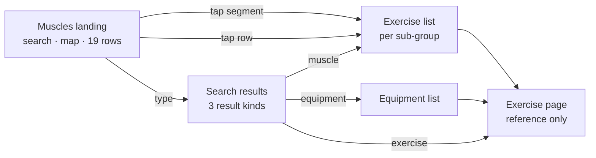
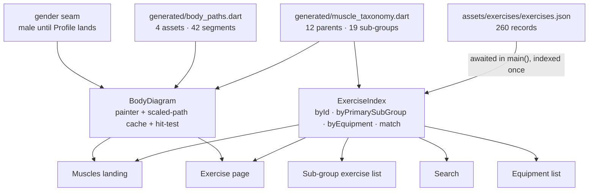

# Muscles Tab - Reference Slice

## Goal Capsule

- **Objective:** Someone who wants to know what a lift is, or which lifts train a muscle, can find it in the app instead of leaving for a browser — starting from a body, a list, or a search box, whichever matches what they already know.
- **Means:** The Muscles tab built as pure reference — a landing carrying search, a tappable body map and all 19 sub-group rows, leading to a per-muscle exercise list and an exercise page of reviewed how-to content and substitutes. Variant A of `docs/ideation/2026-09-14-muscles-tab-ideation.html`, as prototyped in `prototypes/muscles-tab-variants.html`.
- **Product authority:** `docs/01`–`04` govern product rules and `docs/00-build-spec.md` digests them. `prototypes/muscles-tab-variants.html` (variant A) governs this tab's layout. `lib/src/ui/app_screen.dart` governs the screen contract. Where this work overrides `docs/03-muscle-groups-tab-userflow.md`, R23 is the reconciliation.
- **Stop conditions:** Stop and ask if the diagram's hit-testing cannot be made reliable at phone scale without cropping or zooming (`docs/00` §5 deleted the crop system deliberately), or if any screen here turns out to need a Settings column — this slice is designed to add no drift migration.
- **Execution profile:** One implementer, seven units in order U1 → U2 → U3 → U4 → U5 → U6 → U7. The same implementer finishes and ships the work. This slice introduces the app's first filled `CustomPainter`, its first text input, and its first disclosure widget.
- **Open blockers:** None. The personal layer is deferred by decision, not blocked.

---

## Product Contract

### Summary

Build the Muscles tab as the app's reference surface: browse by body map or by list, search across exercises, muscles and equipment, and read the reviewed how-to content for any of the 260 exercises. Nothing in this slice reads or writes a user's training history — the map is uncoloured and the exercise page carries no history section — because the app cannot log a set yet.

### Problem Frame

The Muscles tab is a stub. `lib/src/ui/muscles_root.dart` renders a heading and the line "Search and the body map arrive with the exercise library"; there is no diagram, no search, no list. Meanwhile the assets it needs have been generated and validated for some time: 42 tappable body segments across four traced views, a 12-parent / 19-sub-group taxonomy, and 260 exercises carrying reviewed `setup` / `posture` / `execution` / `commonMistakes` copy. The reference value of that content is stranded behind an unbuilt screen.

The tab was specified as six screens in `docs/03-muscle-groups-tab-userflow.md`, four of which precede any reading. Two of those four are a parent-then-child muscle picker, and the same document contradicts them: line 104 requires a segment tap to land directly on a sub-muscle group's exercise list. The taxonomy settles which side is right — of 42 segments, exactly one is claimed by two sub-groups.

Separately, every personal figure the tab was specified to show is derived from session history, and no session table exists: `lib/src/data/app_database.dart` declares only `Settings`. There is also no set-logging screen, so no user could produce that history even if the tables existed.

### Key Decisions

- KD1. **The tab ships as reference only; the personal layer is a later plan.** (session-settled: user-directed — chosen over building the session tables and derived providers here, and over building set-logging too: with no way to log, every personal surface would render an empty state on device.) Governs R2, R15, R18.
- KD2. **Variant A: the body map and a full sub-group list share the landing.** (session-settled: user-directed — chosen from a working prototype over a full-bleed map and a search-led index.) Governs R1, R4.
- KD3. **The two muscle-selection screens are not built, and a segment tap lands on the exercise list.** Resolves the contradiction inside `docs/03` by deletion rather than by choosing a side; the taxonomy shows only one segment is ambiguous. Governs R6, R7, R9.
- KD4. **The map is uncoloured in this slice, and its fill is a caller-supplied parameter.** (session-settled: user-directed — chosen over filling by equipment coverage or by library depth: an uncoloured map makes no claim the app cannot support, and a parameterised fill means the personal-layer plan adds colour without reopening the widget.) Governs R2, R22.
- KD5. **The exercise page omits the history block entirely rather than showing the specified empty line.** (session-settled: user-directed — chosen over rendering "You haven't logged this yet" for every exercise: that copy blames the user for a gap the app created.) Governs R15.
- KD6. **Search indexes three vocabularies.** (session-settled: user-directed — chosen over exercise names alone: while the map carries no information of its own, search is the tab's only other complete route to a muscle.) Governs R11, R13.
- KD7. **The body diagram is one component, parameterised by view, gender and fill.** `docs/03` already requires one reusable full-body component; the taxonomy's exceptions are sharp enough that a second implementation would drift. Governs R20, R21, R22.

### Requirements

**The landing**

- R1. The tab root renders, in order: a search field, a front/back view control, the body map, and the sub-group list.
- R2. Every segment on the map renders in the muted surface colour. No segment is coloured to stand for training history, and the map shows nothing about the user.
- R3. The front/back control switches which view the map renders. The sub-group list beneath is the same in both views.
- R4. The sub-group list renders all 19 sub-groups as one flat list ordered by parent group, each row naming the sub-group and how many exercises target it as a primary muscle.
- R5. `shoulders/side-delt` is reachable from the sub-group list. It is the only sub-group with no artwork of its own, so the list is its sole route.

**Browsing to an exercise**

- R6. Tapping a body segment opens the exercise list for that sub-muscle group.
- R7. Tapping the front-delt segment, which carries both `shoulders/front-delt` and `shoulders/side-delt`, asks which of the two is meant before continuing. It is the only segment in the taxonomy that needs this.
- R8. Tapping a sub-group row opens the same exercise list R6 opens.
- R9. No muscle-group selection screen and no sub-muscle-group selection screen are built.
- R10. The exercise list names the sub-group, lists every exercise that targets it as a primary muscle, and shows each exercise's equipment.

**Finding an exercise**

- R11. One search field matches against exercise names, the 19 sub-group labels, and the 8 equipment values.
- R12. Each result states which kind it is, so an exercise, a muscle and an equipment result are never confused for one another.
- R13. Selecting an exercise result opens that exercise's page; a muscle result opens its exercise list; an equipment result opens a list of every exercise using that equipment.
- R14. A query matching no exercise name still returns muscle and equipment matches rather than an empty result set.

**The exercise page**

- R15. The page carries no history section: no stat tiles, no recent sessions, no personal-best badge, and no line standing in for them.
- R16. The page renders the exercise's primary and secondary muscles, its equipment, its load type, and a read-only body diagram marking those muscles.
- R17. The four reviewed content fields render verbatim as collapsible rows, with Common mistakes expanded and Setup, Posture and Execution collapsed. Their text is never rewritten, summarised or regenerated.
- R18. The page offers no action that would add the exercise to a workout.
- R19. The page closes with exercises that share its primary sub-muscle group, ordered so that different equipment comes first.

**The body diagram component**

- R20. One diagram component serves every screen in the tab, taking the view, the asset pair and the per-segment fill as parameters.
- R21. The component selects its asset pair from the Profile gender field, defaulting to the male pair when unset, and a change applies everywhere the diagram renders.
- R22. Callers supply the fill; the component asserts no relationship between a segment and any training data.

**Reconciling the specification**

- R23. `docs/03-muscle-groups-tab-userflow.md` is updated to record the two deleted screens and the deferred personal layer, so the shipped tab and its specification do not disagree.

### Key Flows

- F1. **Browse from the body.** Open the tab, pick front or back, tap a muscle, read the exercise list, open an exercise. Covers R3, R6, R10.
- F2. **Browse from the list.** Open the tab, scroll past the map, tap a sub-group row, open an exercise. The only route to side delt. Covers R4, R5, R8.
- F3. **Search.** Open the tab, type into the field, pick a result of any of the three kinds, land on the matching screen. Covers R11, R12, R13.
- F4. **Disambiguate a shared segment.** Tap the front-delt segment, choose front delt or side delt, land on that sub-group's exercise list. Covers R7.

Two screens `docs/03` specifies — a muscle-group picker and a sub-muscle-group picker — sit nowhere in this graph, per R9.

### Acceptance Examples

- AE1. Tapping the lats on the back view opens the Lats exercise list, with no intervening screen. Covers R6, R9.
- AE2. Tapping the front-delt segment offers Front delt and Side delt; choosing Side delt opens the Side delt exercise list. Covers R7.
- AE3. Scrolling the landing to Side delt and tapping it opens the same list as AE2 reaches. Covers R5, R8.
- AE4. Typing `lats` returns a result marked as a muscle; opening it lands on the Lats exercise list. Covers R11, R12, R13.
- AE5. Typing `kettlebell` returns a result marked as equipment; opening it lists the 12 kettlebell exercises. Covers R11, R13.
- AE6. Typing `zzzz` returns muscle and equipment matches rather than an empty screen. Covers R14.
- AE7. Opening Barbell bench press shows its muscles, equipment, a read-only diagram and four collapsible content rows with Common mistakes open — and nothing anywhere on the page reports what the user has lifted. Covers R15, R16, R17.
- AE8. Opening Assisted pull-up machine shows no inverted-personal-best banner, because the page states no record for it to qualify. Covers R15.
- AE9. Every segment on the landing map renders the same colour regardless of what is in the database. Covers R2.
- AE10. Opening Barbell bench press lists dumbbell and machine chest alternatives beneath the content. Covers R19.

### Scope Boundaries

**In scope:** the four screens in the F1–F4 graph, the reusable diagram component, and the `docs/03` reconciliation.

**Deferred to the personal-layer plan:** the `Session` / `SessionExercise` / `SetEntry` tables and every value derived from them; the map's trained/untrained fill and the front/back set counts; the `Last:` line on exercise-list rows; the Best / Last / Times tiles, the recent-sessions list and the personal-best badges; the exercise history screen; the assisted inverted-record banner; the `docs/03` empty-state line; and lateral navigation between muscles from the exercise list.

**Outside this tab's identity:** logging a set, creating or resuming a session, and "Add to current workout" — `docs/03` places logging outside this tab, and no session exists to add to. Recovery or readiness scoring, volume targets, and training-frequency figures were considered during ideation and cut.

### Outstanding Questions

- Q1. Does the equipment-filtered exercise list (R13) get its own entry in `docs/03`, or is it recorded as a search destination only? *Resolved in planning: a search destination only — nothing browses to it. U7 records it that way.*
- Q2. Does the 4-expand / 8-flat accordion rule stay documented as a Workout-tab rule once the screens that used it in this tab are deleted? *Resolved in planning: yes — it still governs the Workout tab's template list. U7 records it there.*

### Sources

- `docs/ideation/2026-09-14-muscles-tab-ideation.html` — variant A and the ideas it bundles.
- `prototypes/muscles-tab-variants.html` — the approved layout, running against real geometry and the real exercise library.
- `docs/03-muscle-groups-tab-userflow.md` — the tab's original specification, including the contradiction R9 resolves and the empty-state rule KD5 defers.
- `docs/00-build-spec.md` — the taxonomy, the segment mapping exceptions, the palette, and the gender-driven asset pair.
- `docs/adr/0003-l0-navigation-variant-a.md` — the accepted four-back-press cost of the browse chain.
- `lib/src/data/generated/body_paths.dart`, `lib/src/data/generated/muscle_taxonomy.dart`, `assets/exercises/exercises.json` — the generated assets this slice renders.

---

## Planning Contract

Product Contract preservation: unchanged. Planning added the sections below and altered no requirement, decision or ID.

### Key Technical Decisions

- KTD1. **The exercise library is loaded and indexed before the first frame, and exposed synchronously.** `exerciseLibraryProvider` is a `FutureProvider` over `rootBundle`, and no tab root in this app renders an `AsyncValue` today. `main.dart` already awaits the settings store before `runApp` and overrides a synchronous provider with the result; this follows that seam. Serves R4, which needs a per-sub-group exercise count on the first frame.
- KTD2. **A typed `Exercise` value type and a lookup index are introduced here.** `exercise_library.dart` yields raw `Map<String, Object?>` and its own doc defers a keyed type to the data-layer step. Four screens need lookup by id, by primary sub-group, and by equipment; raw maps would push that scan into every widget. Serves R4, R10, R11, R13, R19.
- KTD3. **Gender resolves through a provider seam; no Settings column and no migration in this slice.** The `Settings` table has `id` and `workoutTemplateFilter` only, and the schema is version 1 with no migration steps. A seam that resolves to the male pair until the Profile tab authors the field satisfies R21's "defaulting to the male pair when unset" without a schema bump or regenerated `app_database.g.dart`. Governs R21.
- KTD4. **The diagram owns its own scaled-path cache.** `stroke_glyph.dart`'s helpers assume a square 24-unit viewBox, a shortest-side scale, and stroked paint; the four body assets have four different non-square viewBoxes and are filled. Caching the *scaled* path, not the base path, is the trap named in both `CLAUDE.md` and `stroke_glyph.dart`'s header. Serves R20.
- KTD5. **Hit-testing runs `Path.contains` over the same scaled paths the painter fills, last match wins.** Sharing one transform between paint and hit-test is what keeps a tap on a segment and the colour of that segment from disagreeing. Serves R6, R7.
- KTD6. **The ambiguous-segment prompt is a modal bottom sheet, not the existing anchored menu.** `showTemplateFilterMenu` cannot serve this call site: it requires a `current` selection to mark, and it anchors off the tapped widget's own render box, while a segment tap produces a bare coordinate inside one painter with no per-segment widget. The approved prototype shows a bottom sheet here, and `CLAUDE.md` gives the prototype authority over how a screen looks. Carry over that menu's explicit-visuals discipline — the theme sets no `bottomSheetTheme` either, so every colour comes from `AppPalette` at the call site. Governs R7.
- KTD7. **Collapsible content rows are hand-rolled from the existing row idiom.** There is no `ExpansionTile`, `AnimatedCrossFade` or `AnimatedSize` anywhere in `lib/`, and Material's expansion widgets carry their own theming that `test/theme_palette_test.dart` would reject. Governs R17.
- KTD8. **The theme gains an `inputDecorationTheme`.** This slice adds the app's first `TextField`; Material's default `InputDecoration` paints colours outside §12, which is the same trap `showTemplateFilterMenu` documents for menus. Teaching the theme once keeps every later input palette-correct by default. Serves R11.
- KTD9. **Every pushed screen uses an opaque `MaterialPageRoute<void>`.** That is the only mechanism that covers the floating tab bar; a sheet or transparent route leaves it painted on top. Serves R6, R8, R13.

### High-Level Technical Design

Three generated sources feed one index and one painter, which four screens consume. Nothing in this slice reads the database at all: the gender seam resolves to a constant until the Profile tab authors the field.

The diagram widget takes its fill as a caller-supplied function (KD4). In this slice the landing passes a function returning the muted surface for every segment, and the exercise page passes one returning accent-strong for primary muscles and accent-light for secondary. No caller passes anything derived from training history, because none exists.

### Assumptions

- A1. The Profile tab's work adds the gender column and wires it to the seam KTD3 introduces. Until then the seam returns the male pair, which R21 already specifies as the unset default.
- A2. Parsing and indexing 260 records at boot is acceptable startup cost for all three tabs. No measurement has been taken; if it proves visible, the index moves behind a first-use future and the landing gains a loading state, which would reopen KTD1.
- A3. `kSubMuscleGroups` is insertion-ordered by parent group, so R4's "ordered by parent group" reads that order directly rather than re-sorting.

### Sequencing

U1 → U2 → U3 → U4 → U5 → U6 → U7. U1 and U2 are independent of each other and could run in parallel, but everything downstream needs both. U3 is the first unit that changes an existing file, and it is the one that breaks `test/tab_roots_test.dart`.

---

## Implementation Units

### U1. Exercise model, lookup index, and boot-time load

**Goal:** Every Muscles screen can look an exercise up by id, by primary sub-group, or by equipment, synchronously, on the first frame.

**Requirements:** R4, R10, R11, R13, R19. Implements KTD1 and KTD2.

**Dependencies:** none.

**Files:**
- `lib/src/data/exercise.dart` (new)
- `lib/src/data/exercise_index.dart` (new)
- `lib/main.dart` (modify)
- `test/exercise_index_test.dart` (new)

**Approach:**
1. Define an `Exercise` value type over the shipped JSON keys: `id`, `name`, `equipment`, `loadType`, `primary`, `secondary`, `setup`, `posture`, `execution`, `commonMistakes`. `primary` and `secondary` hold sub-group ids of the form `group/sub`.
2. Define `ExerciseIndex` built once from the decoded list, exposing lookup by id, the exercises whose `primary` contains a given sub-group id, the exercises for a given equipment value, and a matcher used by R11.
3. Expose `exerciseIndexProvider` as a synchronous `Provider<ExerciseIndex>` that throws if read without an override. This is new to the repo: `initialTemplateFilterProvider` takes the boot-override seam but deliberately returns a default instead of throwing, because a missed override there is survivable. Here it is not — a missing override would render every screen in the tab empty — so failing loudly is the point.
4. In `main()`, await the existing library load alongside the settings read already there, build the index, and add the override next to `appDatabaseProvider`'s.

**Patterns to follow:** `lib/src/data/template_filter.dart` for the pre-frame provider seam; `lib/main.dart` for the await-then-override boot shape; `lib/src/data/workout_templates.dart` for a plain value type with derived getters rather than stored fields.

**Test scenarios:**
- The index reports 260 exercises, and lookup by a known id returns that exercise with its equipment and load type intact.
- Lookup by an unknown id returns nothing rather than throwing.
- The exercises whose primary muscle is `chest/mid` all list `chest/mid` in `primary`, and none lists it only in `secondary`.
- Every sub-group id appearing in any exercise's `primary` or `secondary` exists in `kSubMuscleGroups` — this fails loudly if the exercise data and the taxonomy ever drift apart.
- Grouping by equipment yields the 8 shipped values and no others.
- Reading `exerciseIndexProvider` without an override throws, so a missing boot wiring fails a test rather than shipping an empty tab.

**Verification:** the index is constructed once at boot and every lookup a later unit needs is answerable from it without touching `rootBundle`.

### U2. The body diagram widget

**Goal:** One widget renders any of the four body assets, fills each segment from a caller-supplied function, and reports which sub-muscle group a tap landed on.

**Requirements:** R20, R21, R22. Serves R6 and R7 by reporting taps. Implements KTD3, KTD4, KTD5.

**Dependencies:** none.

**Files:**
- `lib/src/ui/body_diagram.dart` (new)
- `lib/src/data/body_gender.dart` (new)
- `test/body_diagram_test.dart` (new)

**Approach:**
1. `body_gender.dart` holds the gender seam: an enum of the three `docs/04` options and a provider resolving to the male asset pair, plus the mapping from view (`front`/`back`) and gender to a `kBodyAssets` key. The taxonomy's `view` strings and the asset-map keys are different vocabularies and this is the only place they are joined.
2. `BodyDiagramPainter` follows the repo's painter shape: `const` constructor, all-final fields, `shouldRepaint` typed to the concrete painter and comparing every field, and public helpers so tests can assert a parameter reached the canvas.
3. Draw the asset's `decorative` outlines first in the muted surface, then each segment filled by the caller's function.
4. Cache the *scaled* paths in a module-level map keyed by asset key and rendered size; rebuild on either change. Each asset has its own viewBox, so a scale computed for one must never be reused for another.
5. Hit-test by walking the scaled segment paths in reverse and returning the first whose `Path.contains` holds, then translating that segment id to sub-muscle group ids — one segment maps to two only for the front-delt case.

**Execution note:** build the painter and its hit-test against a test that taps a known interior point of a known segment before wiring any screen to it. A painter that silently ignores its fill still renders a plausible body, which is exactly the failure `test/tab_glyph_test.dart` was written to catch.

**Patterns to follow:** `lib/src/ui/tab_glyph.dart` for painter structure, the public-helper convention, and the `shouldRepaint` test group; `lib/src/ui/stroke_glyph.dart:14-21` for why the scaled path is what gets cached; the usage sketch in `lib/src/data/generated/body_paths.dart`'s header.

**Test scenarios:**
- Each of the four assets renders without throwing and at the requested size.
- `shouldRepaint` returns true when the view changes, when the gender changes, and when the fill function changes; false when every field is identical.
- A tap at an interior point of a known segment reports that segment's sub-muscle group.
- A tap outside every segment reports nothing, and does not throw.
- Covers AE2. A tap on the front-delt segment reports both `shoulders/front-delt` and `shoulders/side-delt`, and no other segment reports more than one.
- Covers AE9. With a fill function returning the muted surface for every id, no segment is painted in an accent colour.
- The male and female front assets produce different scaled paths at the same widget size, proving the per-asset viewBox is respected.

**Verification:** the widget renders all four assets, reports taps correctly, and repaints only when a parameter it actually uses changes.

### U3. The Muscles landing

**Goal:** The tab root becomes the real landing — search field, front/back control, the uncoloured map, and all 19 sub-group rows.

**Requirements:** R1, R2, R3, R4, R5. Serves R11 by placing the field. Implements KTD8.

**Dependencies:** U1, U2.

**Files:**
- `lib/src/ui/muscles_root.dart` (rewrite)
- `lib/src/ui/muscle_search_field.dart` (new)
- `lib/src/theme/app_theme.dart` (modify)
- `test/tab_roots_test.dart` (modify)
- `test/muscles_root_test.dart` (new)

**Approach:**
1. Add `inputDecorationTheme` to the theme, specifying every colour from `AppPalette` so the app's first text input does not paint a Material default.
2. Build the search field as a small widget that renders the decoration and hands its taps to the landing; it opens the search screen rather than filtering in place (U6 builds the destination, so until then it pushes a stub).
3. Compose the root as a `ConsumerWidget` returning a `ListView` with `screenScrollPadding(context)` as its own padding — a bare body, never a `Scaffold`.
4. Render the front/back control, then `BodyDiagram` with a fill returning the muted surface for every segment, then the 19 rows in `kSubMuscleGroups` order, each showing its label and its primary-exercise count.
5. Update the root registry entry and the two placeholder content assertions in `test/tab_roots_test.dart`, and re-check the clearance height now that the body is much taller.

**Execution note:** land the `test/tab_roots_test.dart` changes first and watch the existing suite go green before building the new body. Its two content assertions name the current placeholder strings verbatim, so they fail the moment the root changes — fixing them after the fact makes it unclear whether a geometry regression is new or expected.

**Patterns to follow:** `lib/src/ui/workout_root.dart` for tab-root composition and provider reads; `lib/src/ui/template_row.dart` for the row shape, its semantics wrapper, its 48pt minimum target and its exported text styles.

**Test scenarios:**
- Covers AE9. The landing renders with every segment in the muted surface colour and no accent fill anywhere.
- All 19 sub-group labels are present, in parent-group order.
- Covers AE3. The Side delt row is present and tappable even though no segment carries it.
- Each row shows the count of exercises that target it as a primary muscle, and the count for a known sub-group matches the index.
- Switching to the back view changes the rendered asset and leaves the 19 rows unchanged.
- The root is not a `Scaffold`, and its scrollable carries `screenScrollPadding` so the last row clears the floating tab bar.
- The search field renders with palette colours only — no Material default underline or fill.

**Verification:** the tab root shows the real landing, the whole suite is green, and the root-geometry tests still pass with the taller body.

### U4. Sub-group exercise list and the browse navigation

**Goal:** Tapping a segment or a row reaches that sub-muscle group's exercise list, with the one ambiguous segment asking first.

**Requirements:** R6, R7, R8, R9, R10. Implements KTD6, KTD9.

**Dependencies:** U1, U2, U3.

**Files:**
- `lib/src/ui/muscle_exercise_list_screen.dart` (new)
- `lib/src/ui/muscles_root.dart` (modify)
- `test/muscle_exercise_list_test.dart` (new)

**Approach:**
1. Build the screen as `AppScreen.pushed`, titled with the sub-group label, listing every exercise whose primary muscle is that sub-group, each row carrying the name and the equipment.
2. Wire both entry points on the landing to push it with an opaque `MaterialPageRoute<void>`.
3. When the tapped segment resolves to more than one sub-muscle group — only the front-delt case — show the anchored menu at the tap position and push whichever the user picks.
4. Build no muscle-group selection screen and no sub-muscle-group selection screen.

**Patterns to follow:** `lib/src/ui/template_filter_control.dart` for the anchored menu, its explicit visual properties, and the `Align(widthFactor: 1)` anchoring gotcha; `lib/src/ui/workout_root.dart:134` for the push shape.

**Test scenarios:**
- Covers AE1. Tapping the lats on the back view pushes the Lats exercise list directly, with no screen in between.
- Covers AE2. Tapping the front-delt segment shows a two-option prompt; choosing Side delt pushes the Side delt list.
- Covers AE3. Tapping the Side delt row pushes the same screen the prompt reaches.
- The list shows every exercise whose primary muscle is the chosen sub-group, and none whose only link is secondary.
- Each row shows the exercise's equipment.
- The pushed screen covers the floating tab bar.
- Every sub-group in the taxonomy opens a list without throwing, including the ones with the fewest exercises.

**Verification:** every one of the 19 sub-groups is reachable in one tap from either the map or the list, and no intermediate picker exists.

### U5. The exercise page

**Goal:** An exercise's reference content reads well and carries no claim about the user's training.

**Requirements:** R15, R16, R17, R18, R19. Implements KTD7.

**Dependencies:** U1, U2, U4.

**Files:**
- `lib/src/ui/exercise_detail_screen.dart` (new)
- `lib/src/ui/disclosure_row.dart` (new)
- `test/exercise_detail_test.dart` (new)

**Approach:**
1. Build `DisclosureRow` as a small stateful widget over the existing row idiom — a label, a chevron that rotates, and a body shown or hidden. No `ExpansionTile`.
2. Compose the page as `AppScreen.pushed`: the equipment and load type, the primary and secondary muscle labels, the read-only diagram, then the four content rows, then the substitutes.
2a. Choose the diagram's views from the exercise's own muscles, per `docs/00` §5 and `docs/03`: when its primary and secondary sub-groups span both views, render two full-body diagrams side by side, one per view; when a single view covers them all, render that one, centred. Neither is optional — 74 of the 260 shipped exercises have every primary muscle on the back view alone, so a page fixed to the front view would leave the muscle it exists to show unfilled. Primary muscles fill accent-strong, secondary accent-light.
3. Render the four reviewed fields verbatim, with Common mistakes open and the other three closed.
4. Close with exercises sharing **any** of the page's primary sub-groups, ordered so different equipment comes first, each pushing the page for that exercise. 31 of the 260 exercises carry two primary sub-groups, so requiring the full set to match would empty the rail for them. Title the rail after the muscle when the exercise has one primary, and neutrally when it has more than one — naming only the first would mislabel the other half of the list.
5. Render no history section and no action that adds the exercise to a workout.

**Patterns to follow:** `lib/src/theme/app_theme.dart:27-30` — `accentLight` is deliberately absent from the colour scheme because it belongs to the diagram painter, so read it from `AppPalette` directly here.

**Test scenarios:**
- Covers AE7. Opening a known exercise shows its muscles, equipment and four content rows, with Common mistakes expanded and the other three collapsed.
- Covers AE7. No stat tile, no session list, no personal-best badge and no "you haven't logged" line appears for any exercise.
- Covers AE8. An assisted exercise shows no inverted-record banner.
- The four content strings render exactly as they appear in the shipped data, with no truncation or reflowing of their text.
- Tapping a collapsed row reveals its content; tapping again hides it.
- Covers AE10. A known exercise lists substitutes that share its primary muscle, with different equipment ordered first, and never itself.
- A multi-primary exercise such as the barbell bent-over row lists substitutes matching either of its primary muscles, and its rail carries the neutral title.
- The page's diagram does not respond to taps.
- A back-only exercise such as the machine pullover — lats primary, triceps secondary, nothing drawn on the front — renders one centred back diagram with its primary muscle actually filled accent-strong, not an empty front view. The pull-up is not this case: its biceps, upper back and forearms are drawn on the front, so by the same rule it takes both views.
- An exercise whose muscles span both views renders two diagrams side by side, and the muscles named in its labels are filled across the pair.

**Verification:** the page is complete reference content, and a reader cannot tell from it whether the user has ever trained.

### U6. Search and the equipment list

**Goal:** One field finds an exercise, a muscle or an equipment type, and never dead-ends.

**Requirements:** R11, R12, R13, R14.

**Dependencies:** U1, U3, U4, U5.

**Files:**
- `lib/src/ui/muscle_search_screen.dart` (new)
- `lib/src/ui/equipment_exercise_list_screen.dart` (new)
- `lib/src/ui/muscles_root.dart` (modify)
- `test/muscle_search_test.dart` (new)

**Approach:**
1. Build the search screen as `AppScreen.pushed` carrying the field and the results, and point the landing's field at it.
2. Match the query against exercise names, the 19 sub-group labels and the 8 equipment values, and mark each result with which kind it is.
3. Route a result by its kind: an exercise to its page, a muscle to its exercise list, an equipment value to the equipment list.
4. Build the equipment list as a sibling of the sub-group list, differing only in how its contents are chosen.
5. When nothing matches a name, render the full sub-group list and the full equipment list, each under its own heading, rather than an empty screen. The prototype's fallback shows only muscles; R14 names both, and both are cheap to render.

**Test scenarios:**
- Covers AE4. Typing `lats` returns a result marked as a muscle that opens the Lats exercise list.
- Covers AE5. Typing `kettlebell` returns a result marked as equipment that opens a list of the 12 kettlebell exercises.
- Typing part of an exercise name returns that exercise, marked as an exercise, and opens its page.
- Covers AE6. Typing a string matching no exercise name still returns muscle and equipment results, with both lists present and headed.
- A query matching all three kinds returns all three, each labelled.
- An empty query does not throw and shows a usable starting state.
- Matching ignores case.

**Verification:** all three vocabularies are reachable from one field, each result goes where its kind implies, and no query produces a bare empty screen.

### U7. Reconcile the specification

**Goal:** The shipped tab and its specification stop disagreeing.

**Requirements:** R23.

**Dependencies:** U3, U4, U5, U6.

**Files:**
- `docs/03-muscle-groups-tab-userflow.md` (modify)
- `docs/00-build-spec.md` (modify — §5, §10, and the screen tables)

**Approach:**
1. In `docs/03`, replace the six-screen list with what ships, record that the muscle-group and sub-muscle-group selection screens were deleted rather than deferred, and say why — the taxonomy has exactly one ambiguous segment, so a picker for 42 segments earned nothing.
2. Record that the personal layer — the fills, the stat tiles, the recent list, the personal-best badges, the history screen and the "You haven't logged this yet" line — is deferred to a later plan, so the tab does not read as shipped-incomplete against its own spec.
3. Rewrite `docs/00` §10, the Muscle Groups tab digest. It is the section that disagrees most: it still describes the derived `Last:` line, the Best/Last/Times tiles, the assisted banner, the Exercise history screen and "Add to current workout" — every surface this slice defers. Update `docs/00` §5 and the screen tables in the same pass where they name the deleted screens.
4. Record the equipment-filtered list as a search destination rather than giving it its own screen entry, since nothing browses to it — this closes Q1.
5. Correct `docs/03`'s remaining instruction to render the exercise-detail diagrams "cropped to the relevant zoomed viewBox". `docs/00` §5 deleted the crop system; left standing, that line would have an implementer rebuild it.
6. Leave the accordion rule documented as a Workout-tab rule, since the screens that used it in this tab no longer exist.

**Test expectation:** none — documentation only. The behaviour these edits describe is covered by U3 through U6.

**Verification:** a reader of `docs/03` can predict what the app does, and finds no screen described that was never built.

---

## Verification Contract

The repo's CI runs two jobs and this work must keep both green.

- `flutter analyze` — clean. Note that `analysis_options.yaml` excludes `lib/src/data/generated/**`, so a mistyped segment id will not be caught here; the U1 test that resolves every exercise muscle id against the taxonomy is what catches it.
- `flutter test` — the whole suite, not just new files. `test/tab_roots_test.dart` and `test/theme_palette_test.dart` are the two most likely to break: the first asserts the Muscles placeholder strings and the root's scroll geometry, the second fails on any colour outside `docs/00` §12.
- `tool/sync_generated.sh --check` — must stay clean. No unit here edits generated data; if it reports a diff, something wrote into `lib/src/data/generated/` by hand.
- `dart run build_runner build` followed by a clean `git diff` — CI runs this. KTD3 keeps the drift schema untouched, so `app_database.g.dart` should be byte-identical; a diff here means a schema change crept in.
- `flutter build apk --debug` — must succeed.

Widget tests that reach a provider reading the database need the in-memory override and a `UniqueKey()` on the `ProviderScope`, per `test/workout_root_test.dart`. Tests that read the exercise library need `TestWidgetsFlutterBinding.ensureInitialized()` before `rootBundle`, per `test/shipped_data_test.dart`.

## Definition of Done

Global:

- Every requirement R1–R23 is implemented or explicitly carried by a unit above.
- All ten acceptance examples pass as tests.
- `flutter analyze`, `flutter test`, `tool/sync_generated.sh --check` and `flutter build apk --debug` all pass, and `build_runner` leaves no diff.
- No drift migration and no change to `app_database.g.dart`.
- No SVG rendering package is added, and no cropped or zoomed diagram variant is introduced.
- The four reviewed content fields are byte-identical to the shipped data.
- Nothing in the tab reads session history, because none exists to read.
- Abandoned or experimental code from approaches that did not work out is removed rather than left in the diff.

Per unit: the unit's own test scenarios pass, and the full suite is green before the next unit starts.
