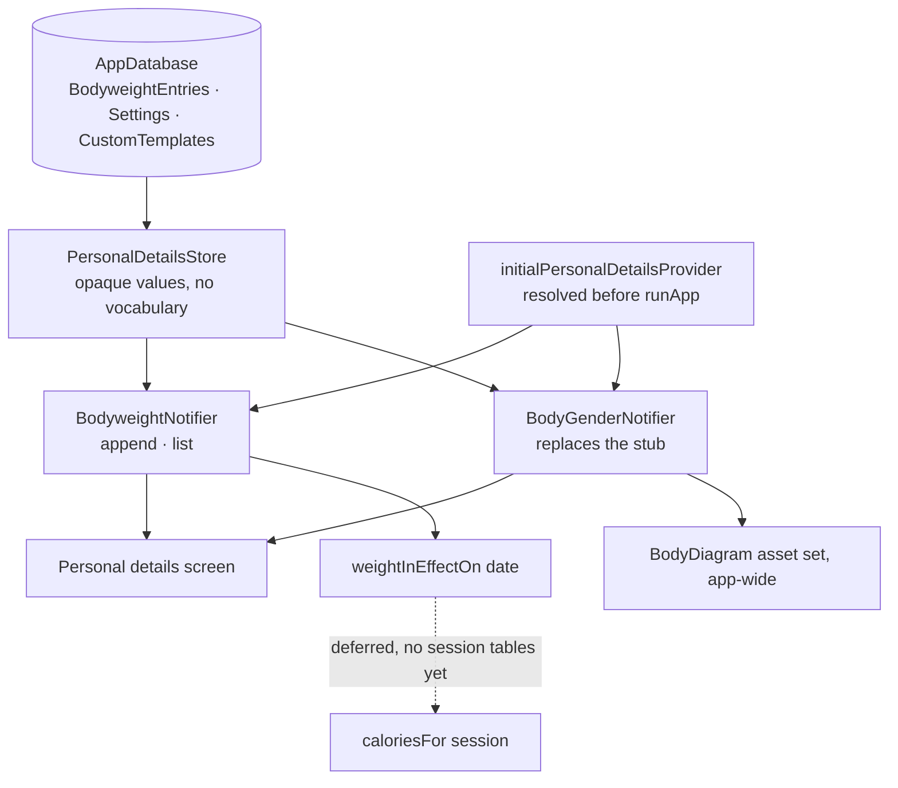
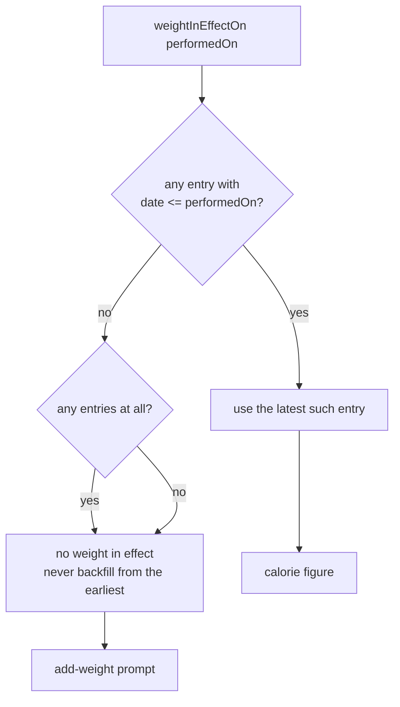

# Profile Split and Dated Bodyweight - Plan

## Goal Capsule

**Objective:** A user can find and change everything the app remembers about them — their weight, their gender, their saved templates — and every number the app shows them stays correct after they do.

**Means:** One placement rule decides where each thing lives (computed from sessions → History tab; typed by the user → behind the avatar), and bodyweight becomes a dated series so a weight change stops rewriting the past (KD1, KTD1).

**Authority hierarchy:** `docs/01`–`04` state product rules and win over `docs/00`, which is a digest. `prototypes/screens.html` wins on layout. `CLAUDE.md`'s hard rules — nothing derivable is stored, `performedOn` is a local calendar date, the app bar is pinned — override all of them. Where this plan and a doc disagree, the plan is amending the doc deliberately (U9) or it is wrong.

**Stop conditions:** Stop and ask if implementing this requires storing a value that can be recomputed from session rows, if the avatar label cannot be added without changing what the avatar pushes, or if the first migration cannot be written without a session table that does not exist.

**Who finishes it:** `ce-work` or a human implementer; the work lands as one branch off `main`.

---

## Product Contract

### Summary

Resolve the split `docs/adr/0003-l0-navigation-variant-a.md` left open, then build the destination it creates. One rule places every field; the avatar gains a real screen holding templates, personal details and the data actions; bodyweight becomes an append-only dated series so the derived calorie estimate stops moving retroactively; and two discovery routes keep the rule from burying what it moves.

### Problem Frame

ADR 0003 promoted History to a tab and moved Profile behind a header avatar, then recorded that "the split of everything else between the History tab and the avatar destination is unresolved and belongs to whoever builds those screens." Nobody has built those screens, so the question is still open and `lib/src/ui/profile_screen.dart` is a one-line placeholder.

Two costs have accrued while it stayed open. Bodyweight lives as a single undated field in the one-row `Settings` table while the calorie estimate is derived on read, so changing a weight silently rewrites the calorie figure on every session ever logged — including one the user has screenshotted. And `lib/src/data/body_gender.dart:53-59` ships a stub provider returning a constant, with a doc comment that names this exact build step as the thing that will replace it.

### Key Decisions

- KD1. **Derived lives on the tab; authored lives behind the avatar.** `lib/src/data/app_database.dart:7-14` already sorts storage on this axis — "Everything here is a preference, never a derived value" — so placing screens on the same axis means a field's home on screen and in the schema can never disagree. (session-settled: user-approved — chosen over case-by-case placement: it decides the next field too, not just today's four.) Governs R1, R2, R4.
- KD2. **Template authoring gets a visible route in.** (session-settled: user-directed — chosen over accepting the discovery cost: burying the one thing a new user wants is the rule's real weakness.) Governs R7, R8.
- KD3. **A session with no bodyweight in effect never shows calories, permanently.** (session-settled: user-directed — chosen over back-filling from the earliest entry: `docs/01-app-idea.md:257` already chose a prompt over a wrong number.) Governs R11.
- KD4. **The template surface duplicates, renames and deletes; the from-scratch muscle-group builder is deferred.** (session-settled: user-directed — chosen over full `docs/04` authoring and over a read-only list: it makes the door lead somewhere useful without doubling the plan.) Governs R5.
- KD5. **A bodyweight entry is immutable and takes effect from the day it is recorded.** No edit, no delete, no backdating — a correction is a new entry that supersedes the old one going forward, never a rewrite of it. (session-settled: user-directed — chosen over allowing edit and delete with a narrowed promise: any mutation of the series re-resolves past dates on the next view, which is the bug this work exists to fix.) Governs R9, R11.

### Requirements

**The placement rule**

- R1. Every figure the app displays is placed by one test: computed from session rows, or typed by the user. The first lives on the History tab; the second lives behind the header avatar. No figure appears in both places.
- R2. The avatar destination displays no figure derived from session rows.
- R3. `docs/adr/0003-l0-navigation-variant-a.md`, `docs/04-profile-tab-userflow.md` and `docs/00-build-spec.md` record the rule as decided rather than open.

**The avatar destination**

- R4. The avatar destination lists templates, personal details, and the two data actions (export, delete all) as its entries.
- R5. The template surface lists predefined and custom templates, and supports duplicating a predefined template into an editable custom copy, renaming a custom template, and deleting one. Predefined templates are never edited in place.
- R6. Custom templates survive an app restart.

**Discovery**

- R7. The header avatar carries a visible label identifying its destination.
- R8. The Workout tab's template picker offers a route to the template surface that is visible when the user has zero custom templates.

**Bodyweight, gender and calories**

- R9. Bodyweight is an append-only series of entries, each carrying a local calendar date and a weight in kilograms. An entry is immutable once recorded — it cannot be edited or deleted — and takes effect from the day it is recorded, so no entry may be dated in the past.
- R10. A session's calorie estimate resolves the bodyweight in effect on that session's `performedOn`, not the newest weight on record.
- R11. A session whose `performedOn` precedes the earliest bodyweight entry shows the add-weight prompt and never a calorie figure. Entering a weight later does not backfill it.
- R12. Gender is read from stored state rather than a constant, and changing it switches the body-diagram asset set app-wide.

### Success Criteria

- `weightInEffectOn` resolves a past date to the same weight after a newer entry is added, proven at the function level against synthetic dates. The user-observable form of this guarantee — an already-displayed session's calorie figure never moving — cannot be verified in this plan, because no session or calorie call site exists yet; it stays unproven until KTD6's deferred wiring lands.
- A user who has never opened the avatar destination can still reach template authoring from the Workout tab.
- `flutter test` passes with the avatar-geometry and workout-root assertions updated deliberately, not deleted.

### Scope Boundaries

**In scope:** the placement rule and its doc amendments; the avatar destination and its three entries; duplicate/rename/delete for templates; the dated bodyweight series and gender storage; the two discovery routes.

**Not in scope — deferred for later:**

- The History tab's own layout. Six candidate variants are ranked in `docs/ideation/2026-09-14-history-tab-l0-ideation.html` and none is chosen; this plan only establishes that derived figures belong there.
- Promoting a past session into a template. It needs an explicit amendment to the only-place-authored rule at `docs/04-profile-tab-userflow.md:20` and `docs/00-build-spec.md:240`, which this plan does not make.
- Creating a template from scratch by muscle-group multi-select (`docs/04-profile-tab-userflow.md:18`). Deferred per KD4.
- Wiring `caloriesFor(session)` to real session rows — see Risks.

**Outside this product's identity:** cloud sync of personal details, a units toggle, and any weight-trend chart. V1 stores kilograms only and shows no progress graph.

### Sources

- `docs/adr/0003-l0-navigation-variant-a.md:71-74` — the unresolved split this plan closes.
- `docs/04-profile-tab-userflow.md` — the four Profile sections, the calorie MET table, the gender rule.
- `docs/01-app-idea.md:257` — calories gated behind bodyweight; the prompt-over-wrong-number choice KD3 extends.
- `docs/ideation/2026-09-14-history-tab-l0-ideation.html` — idea D1 (this rule) and the confirmed bodyweight finding.
- `prototypes/history-tab-variants.html` — Profile → Personal details renders the dated weight log this plan builds.

---

## Planning Contract

### Key Technical Decisions

- KTD1. **A bodyweight entry's date is a text `YYYY-MM-DD` column, not a `DateTimeColumn`.** No `DateTimeColumn` exists anywhere in the schema today, and drift's default round-trips as a timestamp, which would reintroduce the timezone bug `CLAUDE.md` forbids for `performedOn`. Governs R9.
- KTD2. **This is the repo's first schema migration, and it takes version 3.** `lib/src/data/app_database.dart` was at `schemaVersion` 1 with no `MigrationStrategy`; this change writes one from scratch. Version 2 is reserved for the session tables planned in `docs/plans/2026-09-14-2351-feat-workout-session-flow-plan.md`, which claims it explicitly and is expected to land first — so this step numbers around the gap rather than colliding with it. The guard is `from < 3`, not `from == 2`, so a user arriving straight from version 1 still gets these tables before that step exists. The regenerated `lib/src/data/app_database.g.dart` is committed in the same change or CI's build_runner diff step fails. Governs R9, R12. *(session-settled: user-directed — chosen over keeping version 2 and making the session work rebase: that plan already assumed it owned 2, and moving one uncommitted migration step is far cheaper than moving theirs.)*
- KTD3. **Personal details follow the existing three-layer provider shape**, mirroring `lib/src/data/template_filter.dart`: a DB-backed store dealing in opaque values, a domain `Notifier` owning vocabulary, and a separately overridable initial `Provider` resolved before `runApp` so the first frame never shows a wrong value. `StateProvider` is legacy on Riverpod 3 and is not used. Governs R9, R12.
- KTD4. **Custom templates move to the same Drift migration.** `lib/src/data/custom_templates.dart:24-27` returns a hardcoded empty list; R6 cannot hold until it is DB-backed, and doing it in KTD2's migration avoids a second schema bump. Governs R6.
- KTD5. **The manage-templates row sits outside the `custom.isNotEmpty` conditional** in `lib/src/ui/workout_root.dart:113`, beside the always-visible ad-hoc row. Inside that block it would be invisible to every user who has no custom templates, which is everyone today. Governs R8.
- KTD6. **Weight resolution ships as a standalone, unit-tested function; the calorie call site is deferred.** `Session`, `SessionExercise`, `SetEntry` and `caloriesFor` do not exist anywhere in `lib/`. The resolution rule is fully testable against dates alone, so it is built and proven now and wired when the session tables land. Governs R10, R11.
- KTD7. **New screens are hand-rolled over `AppScreen.pushed`**, following `TemplateRow` and `DisclosureRow` rather than Material's `ListTile`/`ExpansionTile`, whose theming does not exist in this app and would trip `test/theme_palette_test.dart`.

### High-Level Technical Design

The provider layering this plan adds, mirroring the shape `template_filter.dart` already establishes:

Weight resolution, which is the one branching rule worth drawing (R10, R11):

### Assumptions

- The two data actions (export, delete all) are named rows that push nothing yet. `lib/src/ui/profile_screen.dart` names both as things the destination will hold; building them is not in the confirmed scope, and a row that pushes a placeholder is honest about that.
- Kilograms only, no unit conversion, per `docs/04-profile-tab-userflow.md:57`.
- A second entry recorded on a day that already has one replaces that day's value rather than creating two. This is the only overwrite KD5 permits, and it is safe because the day in question is always today, whose sessions have not yet become history.

### Sequencing

U1 → U2 → U3 form the data spine and must land in order. U4 depends on U1 for the custom-templates table and can land in parallel with U2 and U3. U5 depends on U2 and U4. U6 depends on U4 and U5; U7 depends on U2 and U5. U8 depends on U5 and U6. U9 can land at any point but should not land before U1, so the docs do not describe a schema that does not exist.

---

## Implementation Units

### U1. Bodyweight and custom-template tables, and the first migration

**Goal:** The schema carries dated bodyweight entries, a gender setting, and persisted custom templates, reached by the repo's first real migration.

**Requirements:** R6, R9, R12

**Dependencies:** none

**Files:**
- `lib/src/data/app_database.dart`
- `lib/src/data/app_database.g.dart` (regenerated, committed)
- `test/app_database_migration_test.dart`

**Approach:**
1. Declare a `BodyweightEntries` table: a text date column in `YYYY-MM-DD` form per KTD1, a real weight column in kilograms, and a uniqueness constraint on the date so one day holds one entry.
2. Declare a `CustomTemplates` table sufficient to round-trip a `WorkoutTemplate` as `lib/src/data/workout_templates.dart` models it, per KTD4.
3. Add a gender column to the existing `Settings` row rather than a new table — it is a single scalar preference, which is what that table is for.
4. Add all new tables to `@DriftDatabase`, bump `schemaVersion` to 3, and write `MigrationStrategy.onUpgrade` creating them under a `from < 3` guard, per KTD2.
5. Regenerate and commit `app_database.g.dart`.

**Patterns to follow:** the `Settings` table declaration and its fixed-row upsert at `lib/src/data/app_database.dart:39-64`.

**Test scenarios:**
- A database opened fresh at version 3 has all three new tables and accepts a write to each.
- A database created at version 1 with a `Settings` row, then upgraded, retains that row and gains the new tables.
- Inserting two bodyweight entries for the same date leaves one row, carrying the later weight.
- A date is stored and read back as the same `YYYY-MM-DD` string with no timezone shift, including for a session logged at 23:00 local.

**Verification:** `dart run build_runner build` leaves no diff, and the migration test passes against both a fresh and an upgraded database.

---

### U2. Personal-details store and providers

**Goal:** Bodyweight and gender are read and written through the project's standard three-layer provider shape, and the gender stub is gone.

**Requirements:** R9, R12

**Dependencies:** U1

**Files:**
- `lib/src/data/personal_details_store.dart`
- `lib/src/data/body_gender.dart` (stub replaced)
- `lib/main.dart`
- `test/personal_details_store_test.dart`

**Approach:**
1. Write a store over `appDatabaseProvider` dealing in opaque values — append an entry, list entries, read and write the gender key — with no domain vocabulary, per KTD3. Expose no update or delete for bodyweight entries; KD5 makes them immutable, so the absence is the enforcement.
2. Put vocabulary in `Notifier`s above it, and resolve their initial values through a separately overridable provider before `runApp`, matching `lib/src/data/template_filter.dart` and `lib/main.dart:34-46`.
3. Replace `bodyGenderProvider`'s constant body with the stored read. Every existing call site keeps its current signature.

**Execution note:** the gender swap is the riskiest edit here because it is read app-wide; add a test proving an existing `BodyDiagram` call site follows the stored value before changing the provider body.

**Patterns to follow:** `lib/src/data/template_filter.dart` for the Notifier and `fromKey` split; `lib/src/data/settings_store.dart` for the store.

**Test scenarios:**
- Appending an entry, then reading the list, returns it in date order.
- Setting gender to female and rereading returns female; the `BodyDiagram` asset selection follows.
- Overriding `appDatabaseProvider` with an in-memory database swaps the instance the store uses.
- Appending a second entry on a date that already has one replaces that day's weight rather than adding a row.
- The store exposes no way to delete or edit a recorded entry — asserted structurally, so a later contributor reintroducing one fails this test.
- Gender left unset reads as male, preserving today's default.

**Verification:** `body_gender.dart` contains no constant return, and the store test covers append, list, delete and the gender round-trip.

---

### U3. Weight-in-effect resolution

**Goal:** Given a date, the app can say which bodyweight applied then, or that none did.

**Requirements:** R10, R11

**Dependencies:** U2

**Files:**
- `lib/src/data/bodyweight_resolution.dart`
- `test/bodyweight_resolution_test.dart`

**Approach:**
1. Implement `weightInEffectOn(date)` returning the latest entry whose date is on or before the given date, or nothing when none is.
2. Never fall back to the earliest entry when the date precedes all of them — that absence is the answer, per KD3.
3. Leave the `caloriesFor` call site unwired, per KTD6, and say so in a doc comment naming the session tables as the prerequisite.

**Execution note:** build this test-first. It is pure date logic with no UI or database dependency, and it is the rule the whole bodyweight fix exists to enforce.

**Test scenarios:**
- A date after the only entry resolves to that entry.
- A date exactly on an entry's date resolves to that entry, not the one before it.
- A date between two entries resolves to the earlier one.
- A date before every entry resolves to nothing, even though entries exist.
- With no entries at all, any date resolves to nothing.
- Adding a newer entry does not change what an older date resolves to.
- Because KD5 forbids backdating, **a date is frozen once a weigh-in later than it exists**, and no sequence of legal writes can move it afterwards. Prove this with a property-style test: apply an arbitrary series of appends, each dated at or after the last, freeze each probe date at the first write dated strictly after it, and assert it keeps that answer for the rest of the run. Note the invariant is *not* "every past date keeps its answer" — recording a weight today legitimately changes what next month resolves to, and no session can exist on a day that has not happened.

**Verification:** the last scenario is the regression guard for the bug this plan fixes; it must fail against a naive "use the current weight" implementation.

---

### U4. Drift-backed custom templates

**Goal:** Custom templates persist instead of living in a hardcoded empty list.

**Requirements:** R6

**Dependencies:** U1

**Files:**
- `lib/src/data/custom_templates.dart`
- `test/custom_templates_test.dart`

**Approach:**
1. Replace the `Provider<List<WorkoutTemplate>>` returning `const []` with a store plus `Notifier` over the new table, keeping the same read shape so `lib/src/ui/workout_root.dart` needs no change in this unit.
2. Expose add, rename and delete for U6.
3. Keep an overridable seam so widget tests inject fixtures without touching the real database.

**Patterns to follow:** the existing provider's doc comment at `lib/src/data/custom_templates.dart:24-27`, which anticipates this exact change.

**Test scenarios:**
- A saved custom template is returned after the provider is rebuilt.
- Renaming changes the name and preserves the template's exercises.
- Deleting removes it from the list and leaves other custom templates alone.
- The Workout tab's custom section stays hidden when the list is empty and appears once one is saved.

**Verification:** `workout_root_test.dart` passes unchanged, proving the read shape is preserved.

---

### U5. The avatar destination

**Goal:** The avatar pushes a real screen listing templates, personal details and the data actions.

**Requirements:** R1, R2, R4

**Dependencies:** U2, U4

**Files:**
- `lib/src/ui/profile_screen.dart`
- `test/profile_screen_test.dart`

**Approach:**
1. Replace the placeholder with an `AppScreen.pushed` whose body is the scrollable carrying `screenScrollPadding(context)`, per KTD7.
2. Render four rows across two labelled groups: templates and personal details, then export and delete-all.
3. Show no count, streak, total or calorie figure anywhere on this screen, per R2.

**Patterns to follow:** `lib/src/ui/muscles_root.dart` for the section-label idiom; `TemplateRow` for the row shape.

**Test scenarios:**
- The screen renders all four rows with their labels.
- Tapping templates pushes the template surface; tapping personal details pushes that screen.
- No widget on this screen renders a value derived from session rows.
- The screen has exactly one `Scaffold` and its header does not scroll.

**Verification:** the derived-figure assertion is the executable form of KD1 and must be a real test, not a comment.

---

### U6. The template surface

**Goal:** A user can duplicate a predefined template, rename the copy, and delete it.

**Requirements:** R5

**Dependencies:** U4, U5

**Files:**
- `lib/src/ui/template_library_screen.dart`
- `test/template_library_screen_test.dart`

**Approach:**
1. List predefined templates and custom templates under separate labels. `TemplateRow` cannot be reused here — it wraps the whole row in one `GestureDetector` under a single `onTap` and reports itself as one button, so it structurally cannot carry two actions. Build a template-library row that follows `TemplateRow`'s visual shape and exposes a trailing actions slot, the way `DividerRow` and `DisclosureRow` already generalise the same row pattern for their own screens.
2. Give each predefined row a duplicate action producing an editable copy with a distinct default name; give each custom row rename and delete.
3. Confirm deletion, and paint that confirmation in `AppPalette.danger`, never `accentStrong`.
4. Offer no from-scratch creation, per KD4.

**Test scenarios:**
- Duplicating a predefined template adds one custom template and leaves the predefined one unchanged.
- Duplicating the same predefined template twice produces two distinct custom names.
- Renaming persists across a rebuild.
- Deleting asks for confirmation first, and cancelling leaves the template in place.
- No predefined template exposes a rename or delete action.

**Verification:** the destructive confirmation uses `AppPalette.danger` and `test/theme_palette_test.dart` still passes.

---

### U7. Personal details screen

**Goal:** A user can set their gender and keep a dated log of their bodyweight.

**Requirements:** R9, R11, R12 — and KD5, which is what makes the log read-only

**Dependencies:** U2, U5

**Files:**
- `lib/src/ui/personal_details_screen.dart`
- `test/personal_details_screen_test.dart`

**Approach:**
1. Render gender as a three-way choice (male, female, prefer not to say) writing through the notifier from U2.
2. Render the bodyweight series newest-first, each row showing its weight and the date it took effect. Rows are read-only: no swipe action, no edit affordance, no delete — per KD5.
3. Recording a weight always dates it today. There is no date picker, because KD5 forbids backdating; the only control is the weight itself.
4. Carry the calorie explanation copy from `docs/04-profile-tab-userflow.md` beneath the weight log, including the fact that a session before the first entry never gets a figure.

**Test scenarios:**
- Changing gender updates the stored value and the rendered selection.
- Recording a weight puts it at the top of the list, dated today.
- Recording a second weight on the same day replaces the first rather than adding a row.
- No row in the weight log exposes an edit, swipe or delete affordance.
- With no entries, the screen shows the add-weight prompt rather than a weight of zero.

**Verification:** the empty state shows a prompt, never a figure — the screen-level counterpart of R11.

---

### U8. The two discovery routes

**Goal:** Template authoring is reachable without knowing the avatar is a button.

**Requirements:** R7, R8

**Dependencies:** U5, U6

**Files:**
- `lib/src/ui/l0_shell.dart`
- `lib/src/ui/workout_root.dart`
- `test/l0_shell_test.dart` (updated)
- `test/workout_root_test.dart` (updated)

**Approach:**
1. Add a visible label to `ProfileAvatarButton` without changing what it pushes, keeping the 48pt tap target.
2. Add a manage-templates row to the Workout tab outside the `custom.isNotEmpty` block at `lib/src/ui/workout_root.dart:113`, beside the ad-hoc row, per KTD5.
3. Update the pinned geometry assertions in `test/l0_shell_test.dart`'s avatar group to the new measurements deliberately, and extend `renderedTemplateNames` in `test/workout_root_test.dart` to account for the new row.

**Execution note:** the two existing test files pin current behavior on purpose. Change their expected values to the new intended ones; do not delete the assertions or loosen them to matchers that would pass either way.

**Test scenarios:**
- The avatar renders its label and still meets the 48pt tap target.
- The avatar still pushes the profile destination, unchanged.
- The manage-templates row renders when the user has zero custom templates.
- The row renders exactly once when the user has several custom templates.
- Tapping it reaches the same template surface the avatar route reaches.

**Verification:** the zero-custom-templates scenario is the one KTD5 exists for and must be an explicit test.

---

### U9. Doc amendments

**Goal:** The docs record the split as decided, so the next reader does not re-litigate it.

**Requirements:** R1, R3

**Dependencies:** U1

**Files:**
- `docs/adr/0003-l0-navigation-variant-a.md`
- `docs/04-profile-tab-userflow.md`
- `docs/00-build-spec.md`

**Approach:**
1. Amend ADR 0003's "Profile's contents need a home" consequence to record the rule and cite this plan, leaving the original decision text intact.
2. In `docs/04`, remove the stats grid from the Profile landing mockup per R2, mark the from-scratch template builder deferred, and replace the single bodyweight field with the dated series. Two further bullets there still promise more than KD4 ships and must be corrected in the same pass: "Edit or delete a custom template" becomes rename-or-delete, and the Template-editor entry in the Screen list is marked deferred alongside the builder.
3. In `docs/00`, change "Create/edit/delete custom" at `docs/00-build-spec.md:240` to "Duplicate, rename, delete custom", so the digest matches KD4 rather than promising content editing this plan does not build.
4. In `docs/00`, update the Profile section to match, and correct `docs/00-build-spec.md:88` — it reads "Set count is the headline stat", dropping "volume proxy" from `docs/01-app-idea.md:220` and making it read as a layout instruction it was never meant to be.

**Test expectation:** none — documentation only. The rule itself is tested by U5's derived-figure assertion.

**Verification:** no doc still describes the split as unresolved, and no doc still shows a derived figure on the Profile landing.

---

## Verification Contract

The repo's CI (`.github/workflows/ci.yml`) runs two jobs on every push and PR; this plan must leave both green.

- `flutter analyze` — clean.
- `flutter test` — passes, including the deliberately updated `test/l0_shell_test.dart` and `test/workout_root_test.dart`.
- `dart run build_runner build` followed by `git diff --exit-code` — the regenerated `lib/src/data/app_database.g.dart` must be committed, or this step fails the build. This is the single most likely CI failure in this plan.
- `tool/sync_generated.sh --check` — unaffected by this work, but still gated.
- `flutter build apk --debug` — succeeds.

The proof this plan can actually run is U3's last scenario: adding a newer bodyweight entry leaves an older date's resolved weight unchanged. That test fails against a naive "use the current weight" implementation and passes against the specified one. It proves the rule at the function level only — there is no session row and no calorie figure in the codebase for a test to hold steady, so the Problem Frame's motivating bug is not demonstrably fixed end to end until KTD6's deferred wiring lands. Do not read a green suite here as that bug being closed.

---

## Definition of Done

- Every requirement R1–R12 is either implemented or explicitly deferred in Scope Boundaries with a reason.
- The migration runs clean from a version-1 database carrying a `Settings` row, not only against a fresh install.
- No screen behind the avatar renders a figure derived from session rows, and the History tab is not restyled by this work.
- `bodyGenderProvider` no longer returns a constant, and no call site of it changed signature.
- No code path edits, deletes or backdates a bodyweight entry, and no screen offers to. KD5 is enforced by the store's shape, not by UI restraint alone.
- The two pinned test files were updated to new intended values rather than loosened or deleted.
- The three docs no longer describe the split as unresolved.
- Abandoned or experimental code from approaches that did not work out is removed before the branch is declared done.

---

## Risks

- **The session tables do not exist.** `Session`, `SessionExercise`, `SetEntry` and `caloriesFor` are absent from `lib/` entirely. U3 builds and proves the resolution rule against dates alone; the calorie call site cannot be wired or integration-tested in this plan. If build-order step 1 lands first, wire it there and drop U3's deferral note.
- **First migration, no precedent.** `schemaVersion` was 1 with no `MigrationStrategy` anywhere in the codebase, so U1 writes the pattern every later migration will copy — including the range-guard shape that lets the reserved version-2 session step slot in beside it. Getting the `onUpgrade` shape wrong here is cheap now and expensive after real session data exists.
- **Three tables in one migration.** U1 adds bodyweight, custom templates and a gender column together to avoid two schema bumps. If any one of them turns out to need a different shape, the whole migration is revised rather than one table.
- **Test-pinned avatar geometry.** `test/l0_shell_test.dart` asserts exact sizes and tap targets for `ProfileAvatarButton`. U8 changes them on purpose; the risk is an implementer loosening the assertions instead of updating them, which would silently retire the coverage.
- **The deferred builder weakens the door.** KD2 required a visible route because authoring was buried, and KD4 ships that route to a surface that can duplicate but not create from scratch. A user with no template they want to copy still cannot build one. This is an accepted, bounded gap — not an oversight — and it closes when the deferred builder lands.
