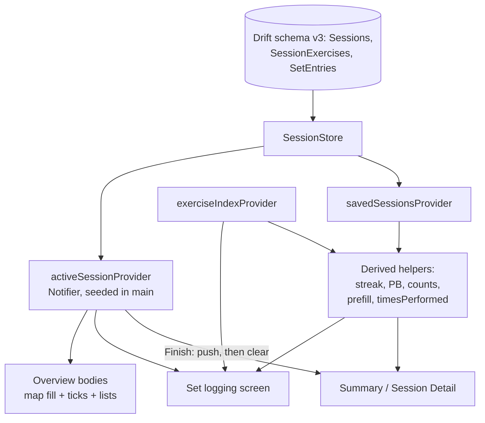
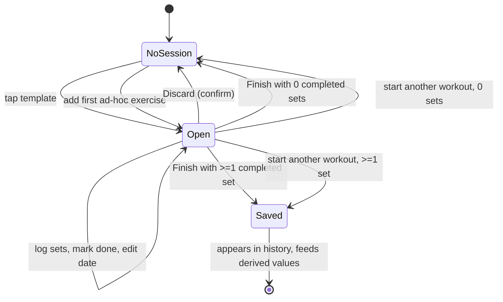

# Workout Session Flow - Plan

## Goal Capsule

- **Objective:** Someone can walk into a gym, log every set they actually do, and walk out with that workout saved, counted in their streak, and shown back to them as a card worth screenshotting. Today the app can list workouts but cannot record one.
- **Means:** Session storage, the derived-value layer everything reads through, the four-variant set-logging screen, both overview paths, the open-session takeover of the Workout tab root, and the finish summary (KTD2, KTD6, KTD9).
- **Authority:** `docs/01`–`04` govern product rules; `docs/00-build-spec.md` is a digest of them and loses on conflict. `prototypes/screens.html` screens 9–17, 22 govern layout. `lib/src/ui/app_screen.dart` and `lib/src/ui/l0_shell.dart` govern the screen contract, and they override any doc or ticket wording that implies a second `Scaffold` (KTD6).
- **Stop conditions:** Stop and ask if the schema-version negotiation with `docs/plans/2026-09-14-2324-feat-profile-split-plan.md` turns out to need more than a version renumber, or if the live muscle map needs a colour outside `docs/00` §12 to express a template's untrained target regions (R13).
- **Execution profile:** One implementer, sixteen units in four phases. U1 → U2 → U3 gate everything; the screens then land in dependency order. The suite stays green at every unit.

---

## Product Contract

### Summary

The Workout tab gains the session it has been navigating toward. Tapping a template or adding the first ad-hoc exercise creates a session that takes over the tab root and persists until the user finishes or discards it. Sets are logged on one screen that reshapes itself for the four load types, the body map heats as work is logged, and Finish produces a summary card that is also the editable record of that session forever after. Every figure on every one of those screens is computed from the logged sets, never stored.

### Problem Frame

The app has a landing that lists eleven templates and two placeholder screens behind it. `lib/src/ui/workout_overview_screen.dart` shows a template's name and a line of prose; `lib/src/ui/exercise_search_screen.dart` shows one sentence. Nothing writes a set, so the muscle map cannot heat, the streak cannot count, and personal bests have no data to derive from.

Three consequences have accrued. `docs/adr/0003-l0-navigation-variant-a.md` removed the Resume card in favour of a session takeover and recorded that this removed the trigger for the auto-save rule, which has had no entry point since. `lib/src/ui/exercise_detail_screen.dart` carries a doc comment explaining that "Add to workout" cannot exist because there is no session to add to. And `lib/src/ui/workout_root.dart` carries a `hasSession` parameter that renders an empty box, written so that the branch would be real code when something finally set it.

**The persistence layer is no longer empty, and this plan is written against the working tree rather than against `HEAD`.** The Profile split plan's schema unit is implemented and uncommitted on this branch: `lib/src/data/app_database.dart` is at schema version 3 with a bodyweight series, custom templates, a gender column, a hand-written `MigrationStrategy`, and a file-backed upgrade test. That implementer already honoured the split recorded in KD8 — version 2 is explicitly reserved for the session tables, and the existing upgrade step guards on a range so a session step slots in beside it. This plan follows that precedent rather than replacing it (KTD1), and the calorie estimate is no longer blocked on a bodyweight that now exists (R36).

### Key Decisions

- KD1. **A muscle ticks and fills when the exercise has a completed set, or when it is marked done.** (session-settled: user-directed — chosen over requiring Mark exercise done: a user who logs three sets and walks to the next machine must not lose the tick to a button they never tapped.) Governs R12, R13.
- KD2. **The ad-hoc session is created by the first exercise added, not by tapping the ad-hoc entry.** (session-settled: user-directed — chosen over creating it on entry: that strands the user in an empty takeover whose only exits are Discard or starting another workout.) Governs R6, R24.
- KD3. **An ad-hoc exercise can be swiped away while the session is open; the template path has no removal.** (session-settled: user-directed — chosen over removal on both paths: a template-path exercise with no sets stops being pinned on its own, so there is no stuck row to remove.) Governs R25.
- KD4. **Numeric entry is a stepper plus a keypad: weight 2.5kg, reps 1, duration 5 seconds.** (session-settled: user-directed — chosen over keypad-only: gym plates come in 2.5kg pairs and between-set changes are usually one step.) Governs R17.
- KD5. **Template and ad-hoc overviews are two separate widgets sharing their parts.** (session-settled: user-directed — chosen over one widget with a path flag: the two lists answer different questions and only the surrounding furniture is common.) Governs R23, R24.
- KD6. **The open session's header carries a trailing action that opens the template list, and that is what fires the auto-save rule.** (session-settled: user-directed — chosen over a row beneath Finish and over leaving the rule untriggered: the ADR's missing entry point is restored without pushing Finish down the screen.) Governs R28, R29.
- KD7. **The app's display name is TurtleLift.** (session-settled: user-directed — chosen over "Turtle Lift" and over keeping the placeholder: the summary card is meant to be screenshotted and cannot ship showing a bracketed placeholder.) Governs R38.
- KD8. **The session tables take the reserved schema version 2.** (session-settled: user-directed — chosen over the reverse order: this work is next.) The Profile work landed at version 3 and reserved 2 for exactly this, so the code already reflects the decision; only its plan document still says otherwise. Governs R1, R39.

### Requirements

**Session storage**

- R1. A session stores an id, an optional title of at most 40 characters, `performedOn`, `loggedAt`, and a nullable `templateId`, created by the reserved version-2 upgrade step while `schemaVersion` itself stays at 3.
- R2. `performedOn` is a local calendar date with no time and no timezone, so a session logged at 11pm files on the day the user experienced.
- R3. `performedOn` defaults to today, is editable, and is refused for any date after today.
- R4. `loggedAt` is an internal timestamp that breaks ties between sessions sharing a `performedOn` and is never displayed.
- R5. A session exercise stores its exercise id, its order, and whether the user marked it done. Its `not started / in progress / done` display state is derived, not stored.
- R6. At most one session is open at a time, and an open session survives app close, date change, and any elapsed time.
- R7. A set entry stores whether it is completed plus the fields its exercise's load type uses, each an unsigned positive number, with assistance in its own field rather than a negative added weight.
- R8. Deleting a session deletes its exercises and their sets with it, leaving nothing behind.

**Derived values**

- R9. Streak, set count, exercise count, personal bests, per-session personal-best count, the calorie estimate, the trained tick, the resolved title, and the "last time" hint are computed on read from logged sets. No aggregate is stored.
- R10. Figures derived from training history — streak, personal bests, per-session personal-best count, the calorie estimate, prefill and times-performed — read saved sessions only, and the open session contributes to none of them until it is saved. Within-session rules — set completion, the trained tick, per-exercise display state, and a session's own set and exercise counts — are pure functions over one session's rows and run identically against an open session and a saved one.
- R11. A set is complete when the user taps its checkmark and its required field exceeds zero. Tapping the checkmark on an empty required field focuses that field instead.
- R12. A sub-muscle group is trained when at least one exercise naming it as a primary muscle has a completed set in this session or is marked done.
- R13. The body map fills primary and secondary muscles; the muscle list ticks primary only. The two disagree by design.
- R14. A personal best is the strictly greater maximum of the load type's metric against saved sessions with an earlier `performedOn`, and requires at least one such prior session. For assisted exercises less assistance is the record.
- R15. The per-session personal-best count is computed per exercise in one chronological pass over all completed sets with a running per-exercise best.
- R16. The streak walks back from a given date through distinct `performedOn` dates of sessions with at least one completed set, chaining while each gap is three days or fewer, and decays against the date it is asked about rather than against stored data.

**Set logging**

- R17. Each numeric field offers a stepper and a keypad, and never accepts a minus sign.
- R18. The first set of an exercise prefills from the same set index of the user's most recent saved session of it; each set added afterwards prefills from the previous set in the current session.
- R19. A prefilled value renders muted until the user touches it, so a guess is visually distinct from an entry.
- R20. The screen orders sets, then Add set, then Mark exercise done, then the last two sessions with all their sets, then a link to the full history.
- R21. Optional weight is a collapsed chip on every bodyweight and timed exercise, and duration offers 30, 45, 60 and 90 second quick-fills with no running stopwatch.
- R22. A set row can be deleted, and everything derived from it recomputes.

**The session flow**

- R23. Tapping a template creates a session carrying that template's name as its title and its parent muscle groups as the session's own list of allowed groups.
- R24. The ad-hoc path creates its session when the first exercise is added, and its title starts empty.
- R25. An ad-hoc exercise can be removed from the open session, with a confirmation when it has completed sets.
- R26. On the template path, an exercise outside the session's muscle groups cannot be added. Swapping within a sub-muscle group is unrestricted.
- R27. An open session replaces the Workout tab's landing at stack depth zero, with the tab bar still visible and no back arrow.
- R28. The open session's header offers a route to the template list, from which a new workout can be started.
- R29. Starting a new workout while one is open saves the old one when it has at least one completed set, keeping its original `performedOn` and announcing the save. With no completed sets it is dropped, silently when nothing was written and after a confirmation when typed rows exist.
- R30. Tapping an exercise opens set logging directly, except that an exercise the user has never completed a set of opens Exercise Detail first, with an action that starts logging.
- R31. Exercise Detail offers "Add to current workout" only while an ad-hoc session is open, and offers nothing while a template session is open or no session exists.
- R32. A trained sub-muscle group row stays tappable and opens its exercise list with this session's logged exercises pinned to the top.

**Finishing**

- R33. Finish is available at any time. A session with zero completed sets is never saved. It is dropped silently only when nothing was ever written; if the user typed values without ticking them, dropping it asks for confirmation first.
- R34. Discard asks for confirmation and then permanently drops the session and its sets.
- R35. Finishing plays a brief celebration under one second, then lands on the summary.
- R36. The summary shows the filled body map, set and exercise counts, the streak as of the session's `performedOn`, and either the calorie estimate beside an information control explaining how it is estimated, or a prompt to add bodyweight that leads to where bodyweight is entered.
- R37. A personal-best pill renders above the stats only when the count is at least one, and the exercises that set them are marked in the log below.
- R38. The summary card carries the app's display name, TurtleLift.
- R39. The summary is the same component as Session Detail, editable in both places: title, date, set values, adding and removing sets, removing an exercise, and deleting the workout.

### Success Criteria

- A session logged on Monday, abandoned, and auto-saved on Wednesday appears in history under Monday and contributes to Monday's streak.
- Changing a saved session's date or deleting it changes the streak, the counts, the personal bests, and the prefill hint with no repair code anywhere.
- An assisted exercise logged at 15kg of assistance beats the same exercise's 20kg record, and 25kg does not.
- The summary screen can be screenshotted as it stands, with no export step and no chrome to crop out.

### Scope Boundaries

**In scope:** the three session tables and their migration, the derived-value layer, set logging for all four load types, ad-hoc search and add, both overview screens, the takeover and auto-save, the finish celebration and summary, the exercise history screen, and the doc amendments this work's decisions require.

#### Deferred to Follow-Up Work

- Authoring a custom template. The landing already renders them from the database, and a session started from one works through the same snapshot as any other (KTD11). Creating, renaming and deleting them belongs to `docs/plans/2026-09-14-2324-feat-profile-split-plan.md`.
- The History tab's **layout**. Six candidate variants sit unranked in `docs/ideation/2026-09-14-history-tab-l0-ideation.html`. Its data source is not deferred: the tab is already built against a preview fixture, and U12 switches it to real sessions so a finished workout cannot appear beside fabricated ones.
- The Profile template surface's own route from the Workout landing. `docs/00` §11 and the ADR amendment on this branch require one, and it belongs to the Profile plan that is building that surface. This work must not delete it from the docs.
- The Best / Last / Times block and the personal-best badge on Exercise Detail, deferred by `docs/00` §10. U13 builds the history screen those tiles would summarise; the tiles stay deferred with the Muscles tab.
- The turtle mascot on the overview and the celebration. `CLAUDE.md` puts it last, after these screens are running.

**Outside this product's identity:** a rest timer, workout duration, a lifted-volume figure, notifications, soft delete, and any achievement, badge, or level-up framework.

### Outstanding Questions

- Whether a template's untrained target sub-groups can be shown as "faint outlines" (`docs/02` Step 2) within the eleven-colour palette. `BodyDiagramPainter` strokes every segment in the border colour already, so the only unused signal is a fill between `mutedSurface` and `accentLight`. Not blocking: U8 ships the map without target outlines if no palette-legal treatment reads as a target, and R13's stop condition covers the case.
- Whether the shipped exercise ids in `assets/exercises/exercises.json` are a frozen contract. KTD17 removes the dangerous half of this by storing the load type on the row, so a retired id can no longer change what a stored number means. What remains is cosmetic: an id absent from the library has no name to render. Not blocking: the sets still format and compare, the row shows a neutral label, and an id lock belongs to that generator's own validator.

### Sources

- `docs/02-workout-tab-userflow.md` Steps 1–6 — the flow, the trained-tick definition, the template lock, and the animation list.
- `docs/01-app-idea.md` §Workout sessions, §Derived values, §Progress tracking, §Set logging by loadType — the two date fields, the streak function, the personal-best metrics, the display formatters.
- `docs/00-build-spec.md` §2, §3, §6–§9 — the data model digest, the title fallback chain, the calorie formula and its warning that the mockup figures do not match it.
- `docs/adr/0003-l0-navigation-variant-a.md` — the takeover at stack depth zero, and the auto-save trigger it recorded as missing.
- `prototypes/screens.html` — screens 9 (template overview), 10–12 (the four logging variants), 13 (exercise history), 15 (summary), 16 (ad-hoc add), 17 (ad-hoc overview), 22 (session detail).
- `lib/src/ui/l0_shell.dart` — the single-Scaffold rule and the `L0TabSpec` fields that already anticipate this work.
- `lib/src/data/template_filter.dart` — the read-before-first-frame provider shape the active session follows.
- `lib/src/ui/exercise_detail_screen.dart` — `bodyViewsForExercise` and the memoized fill callback, both reusable by the overview and the summary.

---

## Planning Contract

### Key Technical Decisions

- KTD1. **The session step extends the existing hand-written migration rather than introducing drift's generated step-by-step tooling.** The working tree already holds a `MigrationStrategy` whose upgrade path guards on a version range precisely so this step can be added beside it, and a file-backed test that builds a real old database and reopens it. Following that precedent costs one branch and one test group; adopting the generated stepper now would mean either absorbing that hand-written step into it or running two migration mechanisms side by side. Framework research recommended the generated tooling on the assumption that no migration existed yet; the repo evidence supersedes it. Inherits KD8 and governs R1.
- KTD15. **Every migration is one transaction and is idempotent, or it does not ship.** This step is pure table creation with no data movement, so a process killed mid-upgrade rolls back and retries on next launch. That guarantee disappears the moment a migration reads, transforms and writes rows in batches. The rule is written down now, while the precedent is being set and before any user has training history to lose. Governs R1.
- KTD16. **The session tables' version number only works while nothing has shipped, and the plan says so.** A device that installed the version-3 build before the session step exists would never run the reserved version-2 branch, because its stored version is already past it. No build has been uploaded to any track, so no *user's* device is in this state. Development installs are: every simulator and handset the Profile work has run on already holds a version-3 database that will never run the reserved branch, so their app data must be cleared once U1 lands. The session step must also land before any upload, or it needs its own version bump instead of the reserved slot. Governs R1.
- KTD17. **The exercise's load type is stored on the session-exercise row at the moment it is added.** Load types live in `assets/exercises/exercises.json`, which ships in the binary and is regenerated by a generator. A set row is otherwise a bag of nullable numbers whose meaning is resolved at read time against content a later build can change: reclassify one of the three assisted exercises and every historical set of it is reinterpreted, turning a record that is a minimum into one read as a maximum, silently. Same category as KTD11 and as the dated bodyweight series, which `lib/src/data/app_database.dart` justifies as "the user told us, and then time passed". Governs R7, R14.
- KTD18. **The open-session marker is a nullable column with a unique index, so "one at a time" is a database constraint rather than a promise.** A plain boolean is something application code has to write correctly forever. SQLite treats nulls as distinct in a unique index, so any number of closed sessions coexist and a second open row is rejected outright. Without it, a partial write during auto-save leaves two open sessions, the loader picks one, and the other becomes permanently invisible and permanently unfinishable with its sets still on disk. There is no repair path in a local-only app. Governs R6, R29.
- KTD2. **`performedOn` is a text `yyyy-MM-dd` column behind a type converter, not a `DateTimeColumn`.** Drift's default stores date-times as unix seconds and discards UTC-ness on read, and neither storage mode models a calendar date at all. `docs/plans/2026-09-14-2324-feat-profile-split-plan.md` already chose text dates for bodyweight entries, so the two plans agree. Governs R2.
- KTD3. **Foreign keys cascade from session to exercise to set, and the pragma that enforces them is set on every open.** SQLite disables foreign keys per connection, and setting the pragma inside a migration callback arms it for that call only. An unenforced cascade fails silently as orphaned rows rather than as an error. Governs R8.
- KTD4. **Enum columns store the enum's name, not its index.** Index storage silently remaps every existing row if a variant is ever inserted or reordered, and the load types are plausibly extensible. Governs R5, R7.
- KTD5. **The active session is a `Notifier` seeded before the first frame, not an `AsyncNotifier` or a stream.** `lib/src/data/template_filter.dart` establishes the shape and its doc comment explains the rejection: a provider that resolves after the first frame renders the landing and then swaps it for the takeover. `lib/src/data/exercise_index.dart` records that no tab root in this app renders an `AsyncValue`. Governs R6, R27.
- KTD19. **The store is the session's only writer, and state is assigned only from what a write read back.** Holding the session graph in a notifier means the screen and the database can diverge, and a write that throws must leave the notifier behind disk rather than ahead of it. Writes are serialized, because a held stepper fires a burst of mutations whose interleaving would reorder a value the user is watching. Governs R6.
- KTD20. **The boot read of the open session degrades to "no session" instead of throwing.** It is the first thing read before `runApp` that is both user-generated and load-bearing. The shipped-content reads may throw, and `lib/src/data/exercise_index.dart` does so deliberately, because a broken asset is a broken build. A session row an older build cannot interpret is not a broken build, and killing `main()` over it leaves the user unable to launch the app at all, with reinstall as the only recovery and their whole history as the cost. The unreadable row stays on disk, but it does not stay *open*: creating a session clears any existing open marker in the same transaction that sets the new one, the shape auto-save already uses. Without that, an unreadable row plus the unique constraint of KTD18 is a device that launches, shows the landing, and can never start a workout again — a worse outcome than the crash it was meant to avoid, and unrepairable. Governs R6, R27.
- KTD21. **Saved sessions are read through a self-invalidating query, not a value resolved once at boot.** `CLAUDE.md` chose Riverpod for derived values that "invalidate themselves — no manual refresh path to forget". Session Detail edits and deletes saved sessions from a pushed screen, and a one-shot read would leave the streak and every count stale on every other surface until relaunch. `AsyncValue` is fine here because it never reaches a tab root. It reads the same three tables as the open-session read, so whatever makes one uninterpretable errors this too: every history surface renders its own failure state and says the history could not be read, rather than showing a zero streak and no records, which a user would read as lost data. Governs R9, R10, R39.
- KTD6. **The two overview screens are bodies inside `WorkoutRoot`, not two `AppScreen.root`s.** `lib/src/ui/l0_shell.dart` holds the app's only `Scaffold` and `test/l0_shell_test.dart` pins that; a root that grew its own would nest two and swallow the tab bar's inset. Inherits KD5 and governs R23, R24, R27.
- KTD7. **A tab contributes its own header chrome through a provider the tab's own feature owns, and the shell stays ignorant of sessions.** Making `L0Shell.tabs` a function of the active session would have the app's navigation chassis import the session model and the auto-save rule to render one tab's title. Instead the shell reads a small chrome value for the current tab and knows only that a tab may contribute a title widget and actions. The Workout feature's chrome provider lives beside the session and depends on it. The shell's structural tab list stays constant, its existing one-spec-per-label test survives, and the Muscles tab's future search affordance gets the same seam. Governs R27, R28.
- KTD22. **The shell watches a coarse session selector, never the session graph.** The shell rebuilds `AppScreen.root`, the tab stack and the animated tab bar. Watching the whole session would rebuild all of it on every logged set and every keystroke in the title field, from whichever tab the user is on. It watches whether a session is open and the header's semantics label, nothing more. Governs R27.
- KTD8. **Only `markedDone` is stored on a session exercise; the tri-state display value is derived.** `docs/00` §2 lists a stored `state` field, which contradicts `docs/01` §Derived values — deleting every set from an `in_progress` exercise would leave the stored state wrong. Report this as a spec conflict when amending the docs. Inherits KD1 and governs R5, R12.
- KTD9. **One formatter and one metric table keyed by load type, shared by every screen.** The logging row, the recent-history line, the exercise-list subtitle, the summary log, the history screen, and Session Detail all render sets. Four screens each writing their own formatter is how the assisted inversion ships backwards in one of them. Governs R14, R18.
- KTD10. **A row's existence in storage is the touched flag.** Rows are written only once touched, and incomplete rows are dropped when the session is saved, so no ghost row reaches a card meant to be screenshotted. The muted prefill rendering of R19 then follows from whether a row exists rather than from a separate flag: a per-row boolean held in widget state is lost on navigating away and on restart, and a stored one is a second source of truth for something storage already answers. Governs R11, R19, R22.
- KTD11. **The session snapshots its template's name and parent muscle group ids at creation, and `templateId` carries no foreign key.** Eleven of the twelve template ids are `const` Dart in `lib/src/data/workout_templates.dart` rather than database rows, so a foreign key is not merely unwise but impossible. The snapshot is not an aggregate over the user's own data and cannot go stale the way a stored count would — it records the constraint that was in force when the session started, the same category as the dated bodyweight series. The name is snapshotted too because the title fallback chain's second step is the template name, which a deleted custom template no longer has. Read the snapshot only while the session is open; a saved session's muscles come from its sets, or it gains a second source of truth for what it trained. Governs R23, R26.
- KTD12. **A session exercise is unique per session, and adding one already present navigates to it.** The same exercise twice in one session would split its sets across two rows and two prefill chains for no gain. Governs R25, R30.
- KTD13. **Only the route push is ordered before the root rebuild; the session stops being open the moment its save commits.** The overview is the tab root, so clearing the state first rebuilds the landing underneath the outgoing transition. But the database marker and the in-memory state are not two separate clears: between a commit that says saved and a state that still says open, the takeover is still mounted under the pushed summary with Finish and Discard live on a session that is already saved. A user who taps the tab bar during the celebration and then taps Discard would permanently delete the workout they are looking at. If the save itself throws, nothing is pushed and the session stays open with an error surfaced on the overview — never a summary card for a workout that was not saved. Governs R33, R34, R35.
- KTD23. **Both save paths are no-ops when no session is open.** Finish tapped twice in a frame, or a template tapped twice on the pushed list, otherwise runs the save against a session whose marker is already cleared — a duplicate row without KTD18's constraint, and an exception with it. Either way the user's tap produced something other than one saved workout. Governs R29, R33.
- KTD14. **The body map's fill is memoized per trained-muscle set and repaints through a listenable rather than through a new closure.** `BodyDiagramPainter.shouldRepaint` compares the fill by identity, so a fresh closure per build repaints 42 polygons every frame, while a stable identity holding an animation never repaints at all. Animating the fill therefore needs the painter to take a repaint listenable, which is a change to `lib/src/ui/body_diagram.dart` itself. The memo is scoped to the screen rather than kept in a global map: `lib/src/ui/exercise_detail_screen.dart` can memoize globally because its key space is the 260 shipped exercises, and a trained-muscle set has no such bound. Governs R12, R13.
- KTD24. **Numeric set columns carry non-negative checks. The required-field rule is not a database constraint.** R17 keeps the minus sign off the keypad, which protects nothing against a stepper underflow or a converter bug, and a negative assistance value inverts the inverted metric back into a plausible-looking record. Those checks cost nothing and turn silent corruption into a failing test. The required-field rule cannot join them: the load type lives on the session-exercise row (KTD17), and a check on a set row cannot see another table. It should not anyway — a row is written as soon as one field is touched (A13), so a user who steps the weight before typing reps would have that write rejected and watch the number vanish. R11's completion rule and KTD10's drop-on-save are what enforce it. Governs R7, R11.

### Assumptions

- A1. "Completed exercise" in `docs/02`'s trained-tick rule means an exercise with a completed set or marked done, per KD1. Mark exercise done stays available only once a set is completed, so it cannot fill the map for work that Finish would then discard.
- A2. The number of set rows an exercise opens with is the set count of its most recent saved session, and one row when there is none.
- A3. Prefill reads the most recent saved session of that exercise by `performedOn` then `loggedAt`, regardless of the open session's own date. A backdated session still prefills from what the user actually last lifted.
- A4. Editing a completed set's value keeps it completed while the required field stays above zero, and un-completes it at zero or empty.
- A5. A saved session edited down to zero completed sets stays saved, and the edit that removes the last one offers to delete the workout instead.
- A6. The summary carries Delete workout at the bottom of the scrollable log, below the screenshot composition. It never shows Discard, because the session is already saved by then.
- A7. Duration is typed as whole seconds and displayed as minutes and seconds above sixty. Weight accepts one decimal place.
- A8. After Mark exercise done the flow returns to the overview at the tab root, including from the ad-hoc path where the user arrived through search.
- A9. The first-time detour to Exercise Detail fires only for an exercise not already in this session, so it does not recur every time the user re-opens a row whose sets are not yet complete.
- A10. The pushed template list reached from the open session's header is the existing landing body on a pushed screen, carrying its filter control.
- A11. Date arithmetic runs on the date triple, never by subtracting two local date-times. A spring-forward day is 23 hours, and truncating it turns a three-day gap into two — landing exactly on the Friday-to-Monday boundary the streak's tolerance was chosen for, in every region that observes daylight saving, twice a year.
- A12. The clamp validates a date the user chose. It never rewrites a date already stored, so a user who crosses a time zone westward does not have an open session silently moved to the previous day by an unrelated edit.
- A13. A touched field is committed as it changes, not on blur or on navigation. The app is used in a gym where the process is killed while backgrounded, and a set the user typed and watched has to survive that.
- A14. The rule is that no session is *created* with zero completed sets. A saved session edited down to zero stays saved (A5), so every derived helper must tolerate one: it contributes nothing to the streak, still resolves a non-empty title, and renders an unfilled map rather than failing.
- A15. A saved session holds no incomplete set rows, on any path. Editing one in Session Detail cannot leave a ghost row on a card meant to be screenshotted.

### High-Level Technical Design

The read path. Everything the user sees is derived from saved sessions plus the one open session, and the two sources are deliberately separate: no derived figure reads the open session.



The session lifecycle. The open session is a single slot; every transition either fills it, empties it, or moves its contents to saved storage.



The Workout tab root's two structural shapes. The header is the shell's, in both.

```text
  no session                          session open
  ------------------------------      ------------------------------
  [ Workout        (avatar) ]         [ <title field>  (list) (avatar) ]
  TEMPLATES        [filter v]         Mon 28 Jul
  4 templates                         ( body map, heating )
  ( template rows )                   ( muscle list | exercise list )
  YOUR TEMPLATES                      [ Finish workout ]
  ( ad-hoc workout )                  [ Discard workout ]
  ------------------------------      ------------------------------
  [ floating tab bar ]                [ floating tab bar ]
```

### System-Wide Impact

This is the first work in the app that stores something the user cannot recreate, and it reaches well beyond the Workout tab.

- **The Muscles tab's screens gain session behaviour in shared code.** `lib/src/ui/muscle_exercise_list_screen.dart` holds the row and the list scaffold that `lib/src/ui/equipment_exercise_list_screen.dart` also renders, so U6's pinning and logged-set subtitle land in code the equipment list runs too. The mode is opt-in and defaulted off, and the equipment list keeps a regression test. That file's own doc comment currently states that nothing on the screen is derived from training history; U6 amends it, because leaving it would strand a false claim beside the code that falsifies it.
- **The boot path grows a sixth awaited read, and it is the first whose failure mode is a user's own session rather than shipped content.** The bodyweight log and the user's custom templates are already read there, so the precedent for a user-generated boot read exists; what is new is that a session is large, mutable, and written mid-workout. `test/boot_test.dart` runs the real `main()`, so the session read must stay on the database handle already open there. KTD20 governs what happens when that read fails.
- **The shell gains a chrome seam that every later feature will copy.** KTD7 and KTD22 decide its shape and its rebuild scope. The tab roots stay mounted together, so anything the Workout root holds per session is cleared when the session ends rather than on unmount.
- **The root-geometry registry only covers the landing.** `test/tab_roots_test.dart` constructs the Workout root in its no-session state, so the takeover body's bottom inset goes unproven unless U11 adds a variant. That test exists because a last row sliding under the floating bar fails nothing.
- **The body-diagram painter's repaint contract is load-bearing and currently unlisted.** KTD14 changes `lib/src/ui/body_diagram.dart`, which the Muscles tab and Exercise Detail also render.
- **CI already guards the generated Drift output** with a regenerate-then-diff step, so U1's regenerated code is covered without new configuration.
- **The Profile split plan is being implemented on this branch in parallel.** Both plans touch the schema, the boot sequence, and overlapping doc sections. The schema is already reconciled; the doc amendments are not, and U14 is written to avoid reversing that plan's edits.

### Risks and Dependencies

| Risk | Consequence if unmitigated | Mitigation |
|---|---|---|
| The reserved version-2 slot is only correct while nothing has shipped | A device that installed the version-3 build first never runs the session step, and every session query fails against a half-schema | KTD16, and land the session step before any upload to any track |
| Load types live in regenerated content | A reclassified exercise silently reinterprets stored numbers, and an assisted record flips from minimum to maximum | KTD17 stores the load type on the row |
| Two open sessions after a partial write | The loader picks one; the other is unreachable from every screen with its sets on disk, and a local-only app has no repair path | KTD18 makes it a database constraint, and the auto-save ordering is one transaction |
| Discard reachable on an already-saved session | The workout the user is looking at is permanently deleted | KTD13 |
| A one-shot read of saved sessions | Editing a saved session leaves the streak and counts stale everywhere else until relaunch | KTD21 |
| Local date-time arithmetic | The streak breaks or extends by a day across daylight-saving transitions, on the exact gap the tolerance was chosen for | A11 |
| A session row an older build cannot read | The app cannot launch at all, and reinstall destroys all history | KTD20 |
| U11 concentrates the existing-test rewrites | A rushed update deletes an assertion rather than adapting it | KTD7 removes the shell-test rewrite; the Verification Contract names what may not be deleted |

**Dependencies:** the Profile split plan's schema and personal-details work, already present in the working tree, for the bodyweight the calorie estimate resolves against.

### Sequencing

U1 through U3 are the foundation and run in order; nothing else can start without them, and every later unit reads the active session and the derived helpers whether or not its dependency line repeats them.

U15 and U4 land next, in that order, because logging exercises every hard decision at once — that is `CLAUDE.md`'s build order, which fixes when the logging screen is built rather than requiring it to be one commit. U5, U6 and U7 are the three routes into it and are independent of each other. U8 has no dependency on the logging units and can run beside them; it is placed after only because one implementer cannot do both.

U9 and U10 consume U8's furniture. U11 turns the takeover on and is the first unit that changes what the app does on launch, so it carries the deliberate rewrite of the existing landing-navigation tests. U12 delivers the objective on its own: finish, celebrate, and show a saved card. U16 adds editing of a saved session afterwards, so that if it slips the flow is still complete and demoable. U13 needs U12 for its tap-through. U14 is documentation and lands last.

---

## Implementation Units

### Unit Index

Phase 1 is a standing precondition for every unit after it; the dependency column names only what a unit needs beyond it.

| U-ID | Title | Key files | Depends on |
|---|---|---|---|
| U1 | Session tables and the version-2 migration step | `lib/src/data/app_database.dart`, `lib/src/data/local_date.dart` | — |
| U2 | Session store and the active-session seam | `lib/src/data/session_store.dart`, `lib/src/data/active_session.dart`, `lib/main.dart` | U1 |
| U3 | Derived-value helpers | `lib/src/data/load_type.dart`, `lib/src/data/set_format.dart`, `lib/src/data/derived.dart` | U2 |
| U15 | Numeric entry and the set row | `lib/src/ui/stepper_field.dart`, `lib/src/ui/set_row.dart` | U3 |
| U4 | Set-logging screen | `lib/src/ui/set_logging_screen.dart` | U15 |
| U5 | Exercise Detail entry modes | `lib/src/ui/exercise_detail_screen.dart` | U4 |
| U6 | Sub-group exercise options, session-aware | `lib/src/ui/muscle_exercise_list_screen.dart`, `lib/src/ui/equipment_exercise_list_screen.dart` | U4 |
| U7 | Ad-hoc exercise search and add | `lib/src/ui/exercise_search_screen.dart` | U4 |
| U8 | Shared overview parts | `lib/src/ui/session_header.dart`, `lib/src/ui/session_body_map.dart`, `lib/src/ui/session_actions.dart`, `lib/src/ui/body_diagram.dart` | U3 |
| U9 | Template overview body | `lib/src/ui/template_overview_body.dart`, `lib/src/ui/muscle_accordion.dart` | U6, U8 |
| U10 | Ad-hoc overview body | `lib/src/ui/adhoc_overview_body.dart` | U7, U8 |
| U11 | Takeover, persistence, auto-save | `lib/src/ui/workout_root.dart`, `lib/src/ui/l0_shell.dart`, `lib/src/ui/template_list_screen.dart` | U9, U10 |
| U12 | Finish, celebration and the summary card | `lib/src/ui/session_summary_screen.dart`, `lib/src/ui/finish_celebration.dart` | U11 |
| U16 | Session Detail editing | `lib/src/ui/session_summary_screen.dart`, `lib/src/ui/session_log_list.dart` | U12 |
| U13 | Exercise history screen | `lib/src/ui/exercise_history_screen.dart` | U12 |
| U14 | Doc amendments | `docs/02-workout-tab-userflow.md`, `CLAUDE.md`, `docs/00-build-spec.md` | U5, U11, U12 |

---

### Phase 1 — Foundation

### U1. Session tables and the version-2 migration step

**Goal:** Three tables with their constraints, a shared calendar-date type, and an upgrade step added beside the one that already exists.

**Requirements:** R1, R2, R4, R5, R7, R8 · KTD1, KTD2, KTD3, KTD4, KTD8, KTD15, KTD16, KTD17, KTD18, KTD24 · A1

**Dependencies:** none

**Files:**
- `lib/src/data/app_database.dart` (modify)
- `lib/src/data/local_date.dart` (new)
- `lib/src/data/personal_details_store.dart` (modify)
- `test/local_date_test.dart` (new)
- `test/app_database_migration_test.dart` (modify)

**Approach:**
1. Add `LocalDate` as the shared calendar-date type, built on the `encodeCalendarDate`, `decodeCalendarDate` and `todayLocal` helpers that already exist in `lib/src/data/personal_details_store.dart` rather than reimplementing the formatting. Move those helpers into the new file and have the bodyweight series import them, so the app carries one spelling of a calendar date instead of two. It must compare, sort, and do gap arithmetic on the date triple (A11).
2. Add the three tables per R1, R5 and R7, with the constraints their KTDs require: cascade from session to exercise to set (KTD3), unique `(session, exercise)` (KTD12), the open marker as a nullable unique column (KTD18), non-negative checks on every numeric set column (KTD24).
3. Store the exercise's load type on the session-exercise row (KTD17) and the template's name and group ids on the session (KTD11).
4. Add a `from < 2` branch to the existing `onUpgrade`, beside the branch already there. The existing doc comment explains the range-guard shape and names this step; extend it rather than rewriting it. **`schemaVersion` stays at 3.** This step adds a branch, not a bump, so the only upgrade path that ever reaches it is 1 to 3; setting it to 2 would be a downgrade against every database already on disk.
5. Add the foreign-key pragma to the open callback, on the shared open path so `AppDatabase.forTesting` arms it too. A cascade test against an unenforced database passes whether or not the cascade works.

**Execution note:** Extend `test/app_database_migration_test.dart` rather than adding a second migration suite. It already builds a real old database on disk, reopens it through the app's own database class, and explains in its own header why an in-memory database cannot prove a migration. Two migration suites with different ideas of what a version contains is a merge hazard on a branch where another plan is also editing this schema.

**Patterns to follow:** the existing table declarations in `lib/src/data/app_database.dart` — `@DataClassName`, explicit primary keys, and doc comments that say why a column is nullable. `lib/src/data/personal_details_store.dart` for the calendar-date column treatment.

**Test scenarios:**
- A date constructed at 23:00 local time stores and reads back as that same local day, not the next UTC day.
- A three-day gap measures as three across a daylight-saving transition in both directions, and across a month and a year boundary.
- A database at version 1 with a stored filter key upgrades to the current version with the key intact, the three session tables present, and the bodyweight and custom-template tables present.
- A database already at version 3 runs no upgrade branch at all: its bodyweight rows and stored gender are intact and the session tables are absent. That is KTD16's limit written as a test rather than discovered on a device.
- A fresh install created from scratch has every table, session tables included.
- Deleting a session row removes its session exercises and their set entries, with foreign keys confirmed armed rather than assumed.
- Inserting a second open session is rejected by the database, not by the calling code.
- Inserting two session exercises with the same exercise id into one session is rejected.
- A negative assistance value is rejected by the database.
- A weighted row holding a weight but no reps is accepted while the session is open, and is dropped when the session is saved.
- A set row keeps formatting and comparing by its stored load type after the exercise library is swapped for a fixture that reclassifies that exercise.
- An enum column round-trips by name, and a row written before a new variant is appended still reads as its original variant.

**Verification:** the migration test passes from version 1 and pins that a version-3 database gets no session tables, the generated Drift output matches a fresh build, and every constraint above is refused by the database rather than by Dart.

---

### U2. Session store and the active-session seam

**Goal:** One place that reads and writes sessions, and an active-session provider available before the first frame.

**Requirements:** R3, R6, R10, R23, R24, R27 · KTD5, KTD10, KTD11, KTD12, KTD18, KTD19, KTD20, KTD21, KTD23 · A12, A13, A14, A15

**Dependencies:** U1

**Files:**
- `lib/src/data/session_store.dart` (new)
- `lib/src/data/active_session.dart` (new)
- `lib/main.dart` (modify)
- `test/session_store_test.dart` (new)
- `test/active_session_test.dart` (new)
- `test/boot_test.dart` (modify)

**Approach:**
1. Name it `SessionStore`, matching the two stores this codebase already has, and fold the in-memory session, exercise and set read models into the same file. Every other domain type here lives beside its store rather than in a separate models file.
2. Build the store over the tables: create from a template or empty, load the open one, mutate exercises and sets, save, and discard. Saving drops incomplete rows (KTD10) and clears the open marker in one transaction.
3. The auto-save sequence clears the old marker and sets the new one inside a single transaction, old first, so a process killed between them cannot leave two open sessions or none. Both save paths are no-ops when nothing is open (KTD23).
4. Expose saved sessions as a self-invalidating read (KTD21), separate from the open one. History aggregates read it; within-session rules read whichever session they are given (R10).
5. Add `activeSessionProvider` as a `Notifier` seeded from an initial-value override, mirroring `lib/src/data/template_filter.dart` and the gender and bodyweight providers that now follow it. Writes go through the store and assign state from what the write read back (KTD19).
6. Join the boot read to the existing awaited group in `main()` rather than adding a second await, and degrade to no session when it fails (KTD20).
7. Clamp `performedOn` when the user picks one (R3). Never re-clamp a date already stored (A12).

**Execution note:** Write the concurrency and failure cases first — a burst of stepper mutations, a write that throws, a kill between the two halves of auto-save. They are the cases that produce unreachable user data, and they are almost impossible to retrofit a test for once the happy path is written and passing.

**Patterns to follow:** `lib/src/data/settings_store.dart` and `lib/src/data/personal_details_store.dart` for the store-over-database shape and its `@visibleForTesting` accessors. `lib/main.dart`'s existing five-way awaited read and override block.

**Test scenarios:**
- A session created from a template carries the template's name and group ids as a snapshot, and today's date.
- A session created ad-hoc has an empty title and no template id.
- An open session written, then re-read through a fresh store against the same database, comes back with its exercises and sets.
- A value typed into a set and never navigated away from is on disk when the store is reopened.
- Saving drops set rows that were never completed and keeps the completed ones.
- Saving keeps the session's original date rather than stamping today, including when the clock passes midnight between the first set and Finish.
- Discarding leaves no session, exercise, or set rows behind.
- Setting the date to tomorrow is refused; setting it to last Monday succeeds; an unrelated edit after the device's date moves backwards leaves the stored date untouched.
- A saved-sessions read excludes the currently open session.
- Ten rapid mutations to one set apply in order, with the last value winning.
- A write that throws leaves the notifier matching disk, not ahead of it.
- Killing between the two halves of auto-save leaves exactly one open session on reopen.
- Calling each save path twice in succession produces one saved session and no exception.
- A corrupt or uninterpretable session row boots the app to the landing with the row left on disk, rather than failing to launch.
- After such a boot the user can still start, log and finish a new workout, and the unreadable row is still on disk afterwards.
- Editing a saved session changes the streak and counts read from another surface with no explicit refresh.

**Verification:** the store round-trips against an in-memory database, the real `main()` boots with an open session seeded before the first frame, and it still boots when that read fails.

---

### U3. Derived-value helpers

**Goal:** Every figure the app displays, as pure functions over saved sessions.

**Requirements:** R9, R10, R11, R12, R13, R14, R15, R16, R18 · KTD9, KTD17 · A1, A3, A11, A14

**Dependencies:** U2

**Files:**
- `lib/src/data/load_type.dart` (new)
- `lib/src/data/set_format.dart` (new)
- `lib/src/data/derived.dart` (new)
- `lib/src/data/personal_best.dart` (new)
- `lib/src/data/bodyweight_resolution.dart` (reuse, unmodified)
- `test/load_type_test.dart` (new)
- `test/set_format_test.dart` (new)
- `test/derived_test.dart` (new)
- `test/personal_best_test.dart` (new)

**Approach:**
1. Introduce a `LoadType` enum resolved by name, following `BodyGender.fromName` rather than `TemplateFilter.fromKey`. The four shipped strings are already valid enum member names, so a separate stored key would invent a distinction the data does not have. `lib/src/data/exercise.dart` deliberately keeps its own field a string; this enum is the typed view, and it reads from the session row rather than the library (KTD17).
2. Write one formatter per load type behind a single entry point (KTD9), matching `docs/01` §Display formatting exactly. It returns strings and comparable metrics only — no colour, no text style, no widget, however strongly six consuming screens pull that way.
3. Write the completed-set rule (R11) once, and have the set count, the calorie tier, and the streak all call it.
4. Write the personal-best metric per load type as a comparable pair. The assisted metric inverts, and its test is the one that matters most in this unit.
5. Write `pbCountFor` as a single chronological pass with a running per-exercise best (R15). The running best advances at a date boundary, not per set, so the pass stays an optimisation of R14's "strictly greater than every earlier date" rather than a second, disagreeing definition. Two sessions on the same day compare against the same prior best, and both can earn a record.
6. Write `streakAsOf`, the resolved-title fallback chain, the trained-tick set, the prefill lookup, and `timesPerformed`. All date arithmetic runs on the date triple (A11).
7. Write the calorie estimate over the `weightInEffectOn` resolver that already exists in `lib/src/data/bodyweight_resolution.dart`, proven by its own test. Do not re-implement the walk: that file warns explicitly against softening a null result into the earliest entry, which is the back-fill the product rejected, and a fresh re-implementation is exactly where that shortcut reappears. A null weight stays null and drives the add-weight prompt.
8. Every history aggregate takes saved sessions; every within-session rule takes one session's rows and works on the open session too (R10). The live map and ticks depend on that second group, so giving the whole file a saved-sessions signature would force either a rewrite across three later units or a second copy of the tick rule — the drift KTD9 exists to prevent. All of them tolerate a saved session with zero completed sets (A14) and are cached nowhere an edit would not invalidate.

**Execution note:** Write the assisted personal-best case first, before the metric is implemented. It is the one place in the app where a smaller number is the record, and a test written after the implementation tends to agree with whatever the implementation did.

**Patterns to follow:** `lib/src/data/workout_templates.dart` for the enum-with-stable-key shape and for doc comments that record why a rule exists. `test/workout_templates_test.dart` for pinning data rules against the docs.

**Test scenarios:**
- Each of the six display formats renders exactly as `docs/01` §Display formatting specifies, including the two conditional bodyweight forms and the two timed forms.
- 90 seconds renders as one minute thirty; 45 renders as zero minutes forty-five.
- A set with a zero required field is not complete even when its optional field is filled.
- Assisted: a 15kg-assist set beats a 20kg record; a 25kg-assist set does not; an equal set does not.
- Weighted: a heavier set at fewer reps beats a lighter set at more reps.
- A personal best is not awarded on the first-ever session of an exercise.
- Backdating a heavier session before an existing one removes the later session's personal best.
- Three progressively heavier sets of one exercise in one session count as one personal best, not three.
- Two sessions on the same day produce the same personal-best count whether derived for the summary card or for the history screen.
- The streak chains across a Friday-to-Monday gap and breaks across a four-day gap.
- The same Friday-to-Monday chain holds in a time zone observing daylight saving, across the transition weekend, in both directions.
- `streakAsOf(today)` returns zero when the last session was five days ago and nothing in storage changed.
- A session with no completed sets does not count toward the streak, still resolves a non-empty title, and yields an empty trained set rather than failing.
- The resolved title falls through all four steps, and never produces a time-of-day name.
- A session whose custom template was deleted still resolves its title from the snapshotted template name.
- An exercise whose primary muscle is trained ticks that sub-group; an exercise that names it only as a secondary muscle does not.
- The calorie estimate returns nothing when the session predates every bodyweight entry, and resolves the weight in effect on the session's own date rather than the newest one.
- Adding a bodyweight entry today leaves the calorie figure on an older session unchanged.
- Prefill returns the most recent saved session's set at the same index, even when the open session is backdated before it.

**Verification:** every helper is covered, and deleting a session from the fixture changes the streak, the counts, and the personal bests with no other code touched.

---

### Phase 2 — Logging and its routes

### U15. Numeric entry and the set row

**Goal:** The stepper-plus-keypad field and the one row widget that reshapes for all four load types.

**Requirements:** R11, R17, R18, R19, R22 · KTD9, KTD10 · A2, A4, A7

**Dependencies:** U3

**Files:**
- `lib/src/ui/stepper_field.dart` (new)
- `lib/src/ui/set_row.dart` (new)
- `test/stepper_field_test.dart` (new)
- `test/set_row_test.dart` (new)

**Approach:**
1. Build one row that reshapes by load type rather than four row widgets, so the completion rule and the prefill rendering exist once.
2. Each numeric field pairs a stepper with an unsigned keypad (R17, KD4). There is no minus key anywhere in the app.
3. A row renders muted while it exists only as a prefill and normally once it has been written (KTD10). There is no separate touched flag.
4. Duration is typed as whole seconds and displayed formatted above sixty (A7); weight takes one decimal.
5. Deleting a row is a swipe or long-press.

**Execution note:** Build the four variants against one fixture so the formatter, the completion rule and the prefill are exercised identically by each. A variant that needs a special case has found a real difference worth recording rather than working around. Settle the stepper's placement in the row once, on the densest variant, before building the other three: no prototype screen shows a stepper, so four independently built rows will otherwise each solve that layout differently.

**Patterns to follow:** `lib/src/ui/divider_row.dart` for the 48pt target floor and the semantics idiom. `lib/src/theme/app_theme.dart`'s input decoration theme, which already styles fields.

**Test scenarios:**
- Weighted, bodyweight, assisted and timed each render their specified row shape.
- Each completes when its required field exceeds zero.
- Tapping the checkmark with an empty required field focuses that field and does not complete the set.
- The weight stepper moves in 2.5kg steps, reps in 1, duration in 5 seconds.
- No numeric field accepts a minus sign, by keypad or by stepping below zero.
- A row that exists only as a prefill renders muted; once written it renders normally, and it still does after the widget is rebuilt from storage.
- The optional weight chip is collapsed until tapped, on both bodyweight and timed rows.
- A duration quick-fill writes its seconds and displays them formatted.
- Editing a completed set's weight to zero un-completes it.
- Swiping a row deletes it.

**Verification:** every row variant logs, completes, and deletes against a fixture, with the stepper increments asserted.

---

### U4. Set-logging screen

**Goal:** The screen that assembles the rows, the history block, and the routes out.

**Requirements:** R20, R21 · KTD9 · A1, A8

**Dependencies:** U15

**Files:**
- `lib/src/ui/set_logging_screen.dart` (new)
- `test/set_logging_test.dart` (new)

**Approach:**
1. Lay the screen out in the order R20 fixes, with the prototype's equipment and load-type chip row under the header.
2. The assisted screen carries the prototype's "less assistance is better" banner. It is the one place in the app where that inversion is explained to the user rather than only encoded.
3. Open with the set count of the last saved session (A2).
4. The header's info button opens Exercise Detail without leaving the session.
5. Mark exercise done is disabled until at least one set is complete (A1), and returns to the tab root (A8).
6. The recent block shows the last two saved sessions with all of each session's sets, over a link to the full history. **With no saved sessions the heading and the link are absent entirely**, following the landing's rule that an empty group is no group rather than a heading over nothing. Every exercise is in this state the first time it is logged, so it is the common case, not an edge one.

**Patterns to follow:** `lib/src/ui/muscle_exercise_list_screen.dart` for the pushed-screen scaffolding and its `push…` helper convention, which every navigation entry point in this app follows.

**Test scenarios:**
- The screen orders sets, Add set, Mark exercise done, recent history, then the see-all link.
- The recent block shows the last two saved sessions with all of each session's sets.
- An exercise with no saved sessions shows no recent heading and no see-all link.
- The assisted screen shows the inverted-record banner and the others do not.
- An exercise with no history opens with one empty row.
- The second set added prefills from the first set of this session, not from history.
- Mark exercise done is unavailable with no completed sets, available with one, and returns to the tab root.
- Deleting a completed set reduces the session's set count.
- The info button opens Exercise Detail and returns without clearing the session.

**Verification:** the screen logs a full exercise end to end against an in-memory database and returns to the overview.

---

### U5. Exercise Detail entry modes

**Goal:** Exercise Detail gains the two session-aware actions, each shown only on its own route.

**Requirements:** R30, R31 · KTD12 · A9

**Dependencies:** U4

**Files:**
- `lib/src/ui/exercise_detail_screen.dart` (modify)
- `test/exercise_detail_test.dart` (modify)

**Approach:**
1. Add an entry mode to the screen: reference, workout-start, or from-logging. The mode decides which action renders, so the same screen can be a pure reference surface from the Muscles tab and a first-time gate inside the flow.
2. Workout-start shows "Start logging", which adds the exercise if needed and pushes the logging screen. From-logging shows nothing, since the user is already there. Reference shows "Add to current workout" only while an ad-hoc session is open (R31).
3. Under the template lock, an exercise is addable when one of its primary sub-groups belongs to the session's snapshotted groups (KTD11). Substitutes reached from the rail inherit the mode only when they are addable.
4. Amend the two existing assertions deliberately. `test/exercise_detail_test.dart` currently pins that nothing on the page adds the exercise to a workout — that rule was written because no session existed, and it now becomes route-conditional rather than absolute.

**Patterns to follow:** `pushExerciseDetail` in the same file for the push helper, extended with the mode.

**Test scenarios:**
- Reached from the Muscles tab with no session, the screen shows neither action.
- Reached from the Muscles tab during an ad-hoc session, it shows Add to current workout, and tapping it adds the exercise as not started with a brief confirmation.
- Reached from the Muscles tab during a template session, it shows neither action.
- Reached as the first-time gate, Start logging adds the exercise and opens logging.
- Reached from the logging screen's info button, it shows neither action.
- Adding an exercise already in the session navigates to it rather than adding a second row.
- A substitute outside the template's groups does not offer Start logging.
- The four content fields, the diagrams and the substitutes rail render identically in every mode.

**Verification:** the existing detail tests pass with their two amended assertions, and each of the three modes shows exactly its own actions.

---

### U6. Sub-group exercise options, session-aware

**Goal:** The template path's exercise list, with this session's logged exercises pinned on top.

**Requirements:** R26, R30, R32 · A9

**Dependencies:** U4

**Files:**
- `lib/src/ui/muscle_exercise_list_screen.dart` (modify)
- `lib/src/ui/equipment_exercise_list_screen.dart` (verify)
- `test/muscle_exercise_list_test.dart` (modify)
- `test/equipment_exercise_list_test.dart` (new)

**Approach:**
1. Extend the existing screen with an optional session-aware mode rather than building a second list. The Muscles tab keeps calling it exactly as it does now.
2. The mode is opt-in and defaulted off, because the row and the list scaffold in this file are also what the equipment list renders. Left on by default, the equipment list would silently gain session behaviour that nothing covers.
3. In session mode, exercises already logged this session sort to the top and show their logged sets through the shared formatter. This is the only route back in to add a fourth set or fix a mistyped weight, so it must work whether or not the sub-group is already ticked (R32).
4. Tapping an exercise opens logging directly, with the first-time detour per R30 and A9.
5. Amend this file's own doc comment, which currently states that nothing on the screen is derived from training history. Leaving it would strand a false claim beside the code that falsifies it, and it is this unit's claim to fix rather than the documentation unit's.
6. Swapping within a sub-group is unrestricted; the lock governs which sub-groups are reachable, and that is the overview's list (U9).

**Patterns to follow:** `ExerciseRow` and the shared list scaffold in the same file. The subtitle slot already renders equipment and is where the logged-sets line goes.

**Test scenarios:**
- Without a session the screen renders exactly as it does today.
- The equipment list renders unchanged with a session open.
- With a session, a logged exercise appears first with its sets rendered in the load type's format.
- An exercise with no sets this session keeps its ordinary position and its equipment subtitle.
- Opening the list from a ticked sub-group row works and shows the same pinned order.
- Tapping a never-completed exercise opens Exercise Detail first; tapping a familiar one opens logging.
- End to end: log a set through the real store, reopen this list, and the exercise is pinned with that set shown.

**Verification:** the Muscles tab's existing tests pass unchanged, the equipment list is unaffected, and the session-mode ordering holds through the real store.

---

### U7. Ad-hoc exercise search and add

**Goal:** Search the library, add what you want, and create the session on the first add.

**Requirements:** R24, R25, R30 · KTD12 · A9

**Dependencies:** U4

**Files:**
- `lib/src/ui/exercise_search_screen.dart` (rewrite)
- `test/exercise_search_test.dart` (new)

**Approach:**
1. Replace the placeholder with a search over exercise names, reusing `ExerciseIndex.searchByName` and the existing `MuscleSearchField.editable` and `ExerciseRow`. The muscle and equipment vocabularies belong to the Muscles tab's search; this screen searches exercises.
2. Creating the session happens on the first successful add (KD2), so backing out with nothing added leaves the landing intact.
3. Adding appends the exercise as not started and goes straight to logging, subject to the first-time detour. A result already in the session navigates to it instead (KTD12).
4. The same screen is reachable mid-session from the ad-hoc overview's Add exercise action.
5. Show each result's last logged set where there is one, using the shared formatter, as the prototype's add screen does.

**Patterns to follow:** `lib/src/ui/muscle_search_screen.dart` for the controller-and-query state shape; `lib/src/ui/muscle_search_field.dart` for the field itself.

**Test scenarios:**
- Typing a query filters the 260 exercises by name, case-insensitively.
- A blank query shows no results rather than the whole library.
- Backing out of search without adding anything leaves no session behind.
- Adding the first exercise creates an ad-hoc session with an empty title and today's date.
- Adding a second exercise appends it to the same session.
- Adding an exercise already in the session opens it rather than duplicating it.
- A result the user has never completed opens Exercise Detail first.
- A result with history shows its last set in the load type's format.

**Verification:** search adds exercises to a live session and creates one exactly once, on the first add.

---

### Phase 3 — The overview and the takeover

### U8. Shared overview parts

**Goal:** The editable title, the date control, the live body map and the finish actions, as widgets both paths use.

**Requirements:** R3, R12, R13, R33, R34 · KTD6, KTD14, KTD22 · A1, A12

**Dependencies:** U3

**Files:**
- `lib/src/ui/session_header.dart` (new)
- `lib/src/ui/session_date_control.dart` (new)
- `lib/src/ui/session_body_map.dart` (new)
- `lib/src/ui/session_actions.dart` (new)
- `lib/src/ui/destructive_confirmation.dart` (new)
- `lib/src/ui/body_diagram.dart` (modify)
- `lib/src/ui/exercise_detail_screen.dart` (modify)
- `test/session_header_test.dart` (new)
- `test/session_date_control_test.dart` (new)
- `test/session_body_map_test.dart` (new)
- `test/session_actions_test.dart` (new)

**Approach:**
1. The title is an editable field capped at 40 characters, placeholder "Name this workout" when empty. It reaches the pinned header through the chrome seam (KTD7), which wraps it in a header semantics node, so the field needs its own label or typing goes unannounced. It owns its controller behind a stable key and writes on commit, not per keystroke — the shell rebuilds the tab bar, and a field rebuilt from session state on every character loses focus and selection.
2. The date control is the body's first row, showing the weekday and date prominently whenever it is not today, and opening a picker clamped to today or earlier (A12). The picker is styled explicitly; the theme sets no date-picker theme.
3. Generalise the fill helper in `lib/src/ui/exercise_detail_screen.dart` so the three-branch colour rule and its memoization are parameterised on a pair of muscle sets rather than on one exercise, and have both that screen and the session map use it. Writing a second copy of the rule is how the two drift apart.
4. Give `BodyDiagramPainter` a repaint listenable so the fill can animate. Its `shouldRepaint` compares the fill by identity, which means a stable identity holding an animation never repaints and a fresh closure per frame repaints all 42 polygons — the animation requirement and KTD14 cannot both hold without this change. Scope the session memo to the screen; its key space is the set of trained muscles, which is unbounded, unlike the 260 shipped exercise ids the existing global memo is bounded by.
5. Finish is the primary filled button. Discard is a secondary surface over a shared destructive confirmation helper, used here and by the summary's delete action, built from the app's own surfaces in `AppPalette.danger`. That colour exists precisely so a destructive confirmation is not painted in the colour that means "this has been worked".

**Patterns to follow:** `lib/src/ui/template_filter_control.dart` for a control that opens an app-styled overlay because the theme provides no sub-theme — the date control's exact situation. `lib/src/ui/muscle_segment_sheet.dart` for modal surfaces at elevation zero.

**Test scenarios:**
- The title field accepts 40 characters and refuses the 41st.
- An empty title shows its placeholder and still carries a non-empty semantics label.
- Typing in the title field does not rebuild the tab bar, and focus and selection survive a session change from elsewhere.
- The date control shows "Today" for today and the weekday and date for any earlier day.
- The picker refuses a date after today.
- A completed exercise fills its primary segments in the strong accent and its secondary segments in the light one.
- A segment belonging to no trained group stays in the muted surface colour.
- The fill identity is stable across a rebuild with unchanged session state, and changes when the trained set changes.
- Exercise Detail's diagrams render unchanged after the fill helper is generalised.
- Discard shows a confirmation, and cancelling it leaves the session open.
- The confirmation's destructive action uses the destructive colour, and no new colour enters the theme.

**Verification:** the palette guard and the body-diagram tests pass unchanged, and the map heats as sets are completed without repainting on unrelated rebuilds.

---

### U9. Template overview body

**Goal:** The template path's nested muscle list, with ticks, over the shared furniture.

**Requirements:** R12, R13, R23, R26, R32 · KTD6, KTD8, KTD11

**Dependencies:** U6, U8

**Files:**
- `lib/src/ui/template_overview_body.dart` (new)
- `lib/src/ui/muscle_accordion.dart` (new)
- `test/template_overview_test.dart` (new)

**Approach:**
1. Derive the list from the taxonomy at render time using the session's snapshotted group ids. Accordions exist only for chest, back, shoulders and abs; the other eight parents render one flat row (`docs/00` §4).
2. A sub-group row shows a tick when trained and a chevron otherwise. There is no "not started" label and no stored state to render.
3. Accordions start **expanded**. The tick only renders inside an accordion body, and this screen exists to be read at a glance between sets; starting collapsed would make a user open four groups by hand to see what they have trained.
3. Side delt gets its own row like any other sub-group, even though it shares the front-delt segment on the map. The list is driven by the taxonomy and the map by the segment mapping; only the latter has the exception.
4. Tapping any row, ticked or not, opens U6's list for that sub-group.
5. **The accordion reveals instantly and its chevron rotates, matching the app's existing disclosure behaviour.** `docs/02` asks for a smooth expand and collapse, but `lib/src/ui/disclosure_row.dart` states as a convention that no cross-fade or size animation exists anywhere in `lib/` and that the chevron carries the state change. One of the two has to give, and matching the shipped convention keeps every disclosure in the app behaving alike. Record it in U14 as a deliberate departure from the flow doc rather than leaving the contradiction implicit. A tick still animates in when its group becomes trained; that is a new element appearing, not a container resizing.
6. `DisclosureRow` takes a string body and renders it as text, so it cannot host child rows as it stands. Either generalise that field to a widget and keep one disclosure widget, or build the accordion beside it — decide in the unit, and do not leave two disclosure idioms.
7. The body is a `ListView` carrying the shared screen padding, like every other tab-root body, so the tab-bar inset rule holds.

**Patterns to follow:** `lib/src/ui/disclosure_row.dart` for the chevron rotation and the present-or-absent body. `lib/src/ui/sub_group_row.dart` for the row shape.

**Test scenarios:**
- A Chest and triceps day renders chest as an accordion of three sub-groups and triceps as one flat row.
- An Arms day renders two flat rows and no accordion.
- Completing an incline press ticks upper chest, leaves triceps unticked, and fills the triceps segment on the map in the light accent.
- A ticked row still opens its exercise list.
- Side delt appears as its own row on a shoulders day.
- The body's scroll padding matches the shared screen padding, so the last row clears the tab bar.

**Verification:** the tick and the map disagree exactly as `docs/02` requires, and the root-geometry assertions in `test/tab_roots_test.dart` still hold.

---

### U10. Ad-hoc overview body

**Goal:** The ad-hoc path's flat exercise list, with per-exercise state and removal.

**Requirements:** R24, R25 · KTD8, KD3

**Dependencies:** U7, U8

**Files:**
- `lib/src/ui/adhoc_overview_body.dart` (new)
- `test/adhoc_overview_test.dart` (new)

**Approach:**
1. List the session's exercises in the order they were added, each showing a derived state: done when marked or fully logged, in progress with at least one completed set, to do otherwise (KTD8).
2. Each row summarises its logged sets beneath the name.
3. Swipe or long-press removes an exercise, with a confirmation when it has completed sets (KD3). Removing a set offers both gestures; removing an exercise must too, or the one action with no fallback is the one a user reaches for one-handed mid-session.
4. An Add exercise action returns to U7's search, and Finish and Discard come from U8.
5. There is no muscle list on this path, because there is no template to derive one from.

**Patterns to follow:** `lib/src/ui/divider_row.dart` for the row, and `lib/src/ui/template_row.dart` for the card surface treatment.

**Test scenarios:**
- Three added exercises render in add order with their three states.
- A row's summary line renders its sets in the load type's format.
- Swiping or long-pressing an exercise with no completed sets removes it without a prompt.
- Swiping one with completed sets asks first, and cancelling keeps it.
- Add exercise opens search, and adding from there appends a row.
- The map heats from this path exactly as it does from the template path.

**Verification:** the ad-hoc session runs end to end from first add to Finish.

---

### U11. Takeover, persistence, auto-save

**Goal:** An open session becomes the Workout tab, survives restarts, and starting another one saves it.

**Requirements:** R6, R23, R27, R28, R29 · KTD5, KTD6, KTD7, KTD22, KTD23 · A10

**Dependencies:** U9, U10

**Files:**
- `lib/src/ui/workout_root.dart` (modify)
- `lib/src/ui/l0_shell.dart` (modify)
- `lib/src/ui/template_list_screen.dart` (new)
- `test/workout_root_test.dart` (modify)
- `test/tab_roots_test.dart` (modify)
- `test/session_takeover_test.dart` (new)

**Approach:**
1. Replace `WorkoutRoot.hasSession` with a read of the active session, and render U9's or U10's body from the session's own template id. The parameter was written as a seam for exactly this.
2. Add the per-tab chrome provider (KTD7). The shell reads a small chrome value for the current tab; the Workout feature owns the provider that builds it from the session. The shell's structural tab list stays constant and its one-spec-per-label test stands. Watch only whether a session is open and the header's label (KTD22).
3. Add the trailing header action (KD6) before the avatar, carrying its own spacing so the avatar still lands on the gutter line, and sized to the 48pt floor. **It is a list glyph labelled "Browse templates", never a plus.** A plus here sits inches from the ad-hoc path's Add-exercise button and means something far more consequential: this control can save or drop the workout in progress. It postdates the prototypes, so nothing else fixes its shape. It pushes a template list screen built from the landing body (A10), through a `push…` helper like every other entry point in this app.
4. **Only a template tap applies R29** — save or drop the open session, create the new one in the same transaction, pop to the root. The landing body also carries a Manage-templates row and the ad-hoc entry, and neither is a new workout: Manage templates pushes the library and leaves the open session untouched, and the ad-hoc entry pushes search, with R29 firing later in the same transaction that creates the session on the first add (KD2). Treating every tap as a new workout would close a user's workout because they went to look at their templates.
5. Tapping a template on the landing now creates the session in place rather than pushing a screen, so `test/workout_root_test.dart`'s navigation assertions are rewritten deliberately to assert the takeover instead.
6. Add a takeover variant to the root-geometry registry in `test/tab_roots_test.dart`. It currently constructs the Workout root in its no-session state only, so without this the takeover body's bottom inset is never proven and its last row can hide behind the floating bar with nothing failing — which is the exact failure that test exists to catch.
7. The snackbar clears the floating tab bar, and the header title field's focus collapsing that bar is expected behaviour the tests must not fight.

**Execution note:** This is the first unit that changes what the app does on launch. Update the landing-navigation assertions as part of it rather than after, so the suite is green at this commit.

**Patterns to follow:** `lib/src/ui/l0_shell.dart`'s existing `L0TabSpec` construction and avatar spacing. `lib/src/ui/workout_root.dart`'s existing branch comment, which names this unit.

**Test scenarios:**
- With no session the root shows the landing exactly as it does today.
- With an open template session the root shows the template overview, the tab bar is visible, and there is no back arrow.
- An app relaunch with an open session renders the overview on the first frame, never the landing.
- The header action opens the template list, and choosing a template with one completed set logged saves the old session, keeps its original date, and shows the save announcement.
- Tapping Manage templates from that list leaves the open session open and unchanged.
- Opening ad-hoc search from that list and backing out without adding leaves the open session open and unchanged.
- Adding the first ad-hoc exercise from that route saves or drops the old session and creates the new one without tripping the one-open-session constraint.
- The same flow with zero completed sets leaves no saved session behind.
- Switching to the Muscles tab and back returns to the open session.
- Exactly one Scaffold exists in the app in the takeover state.
- The root body's scroll padding still matches the shared screen padding in both states.
- The avatar's position is unchanged by the new trailing action.

**Verification:** the single-Scaffold and root-geometry suites pass with the takeover live, and an open session survives a full restart.

---

### Phase 4 — Finishing and the record

### U12. Finish, celebration and the summary card

**Goal:** The session saves, a brief celebration plays, the user lands on a card worth screenshotting, and the History tab starts showing real workouts.

**Requirements:** R33, R34, R35, R36, R37, R38 · KTD13, KTD23

**Dependencies:** U11

**Files:**
- `lib/src/ui/session_summary_screen.dart` (new)
- `lib/src/ui/finish_celebration.dart` (new)
- `lib/src/ui/session_log_list.dart` (new)
- `lib/src/data/history_preview_data.dart` (modify)
- `test/session_summary_test.dart` (new)
- `test/finish_flow_test.dart` (new)
- `test/tab_roots_test.dart` (modify)

**Approach:**
1. Finish saves and clears the open state together; only the route push is ordered before the root rebuild (KTD13). Finishing with zero completed sets never saves. It returns to the landing with no celebration, silently when nothing was written and after the shared destructive confirmation when the user typed values but never ticked them (R33). The app commits every keystroke precisely so typed work survives (A13); throwing it away unannounced would spend that guarantee on nothing.
2. The celebration is a checkmark and a quick radiating burst under one second, followed by the stats counting up. No confetti, no badges, no sound. It is decoration on a saved workout, not an award for one — `CLAUDE.md` rules out achievements, and this screen is where that line is easiest to cross.
3. The card shows only the views containing trained muscles, side by side when both apply, never an empty second diagram. The existing view-selection helper already makes this decision for Exercise Detail and generalises to a session's whole muscle set.
4. Stats are sets, exercises, the streak as of the session's date, and calories or the add-weight prompt. No volume figure and no duration. The calorie figure carries an information control opening the same explanation already written for personal details, because a single unqualified number on a card built to be screenshotted reads as measured rather than estimated. The add-weight prompt links to where bodyweight is entered.
5. The personal-best pill renders above the stats only at one or more (R37), and the log below marks which exercises set them.
6. The title is inline-editable on the card; the session is already saved and the title is optional.
7. The card carries the display name TurtleLift (KD7).
8. **Point the History tab at real sessions and delete the preview fixture.** `lib/src/data/history_preview_data.dart` currently serves hand-written workouts that the History tab renders as if they were the user's, and its own header says to delete them when the session tables land. Left in place, the first workout a user finishes appears beside a training split they never did. Keep its projection helper but reconcile it with the derived helpers from U3, so the row's personal-best figure and the card's pill come from one derivation rather than two that can disagree — the fixture's projection does not carry the assisted inversion.

**Patterns to follow:** `lib/src/ui/exercise_detail_screen.dart` for the side-by-side diagram row and its height constant. `lib/src/ui/set_row.dart` and the shared formatter for rendering logged sets. `prototypes/screens.html` screen 15 for the composition.

**Test scenarios:**
- Finishing with sets logged saves the session and lands on the summary; the tab root underneath does not flash the landing.
- Finishing with zero completed sets saves nothing and returns to the landing with no celebration.
- Finishing with typed but unticked rows asks before dropping them, and cancelling leaves the session open with the values intact.
- Discard is unreachable once the save has committed, including from the tab bar during the celebration.
- Finish tapped twice in one frame produces one saved session and no exception.
- The celebration completes within one second and renders no badge, trophy, level or streak-milestone language.
- A session training only back muscles renders one diagram, centred; one spanning both renders two, side by side.
- Zero personal bests renders no pill; two renders the pill and marks both exercises in the log.
- The streak shown is the streak as of the session's date, not today's.
- Calories are absent for a session predating every bodyweight entry and present otherwise.
- The information control opens the calorie explanation, and the add-weight prompt navigates to where bodyweight is entered.
- Editing the title on the card saves it, and clearing it falls back through the resolution chain.
- The card shows the app's display name.
- The History tab lists the session just finished, and no preview data remains anywhere in the app.

**Verification:** a full workout runs from template tap to summary, and a screenshot of that summary needs no cropping.

---

### U16. Session Detail editing

**Goal:** A saved session is corrected in the same component that first showed it.

**Requirements:** R39 · A5, A6, A15

**Dependencies:** U12

**Files:**
- `lib/src/ui/session_summary_screen.dart` (modify)
- `lib/src/ui/session_log_list.dart` (modify)
- `test/session_detail_test.dart` (new)

**Approach:**
1. Open the same component on a saved session and make it editable throughout: title, date, set values, adding and removing sets, removing an exercise. Reuse the set row and the date control rather than building a read-mostly second rendering of a set.
2. Delete workout sits at the bottom of the scrollable log, below the screenshot composition (A6), over the shared destructive confirmation. It never shows Discard; by this point the session is saved.
3. Editing away the last completed set offers to delete the workout instead of leaving an empty one (A5). The session may stay saved with zero completed sets if the user declines.
4. An edit must not leave an incomplete row behind (A15), and must not re-stamp the internal timestamp, or two sessions on the same day would reorder under the user.

**Patterns to follow:** `lib/src/ui/set_row.dart` and `lib/src/ui/session_date_control.dart`, fed a saved session instead of the open one.

**Test scenarios:**
- Opening a saved session shows the same composition as the fresh summary.
- Editing a set value changes the session's counts and the streak read from another surface.
- Removing an exercise removes its sets with it.
- Editing away the last completed set offers deletion; declining leaves a saved session that contributes nothing to the streak and still renders a title.
- Deleting the workout removes it and everything derived from it.
- Changing the date to a future date is refused.
- An edit leaves no incomplete rows and does not change the session's position among the same day's sessions.

**Verification:** every edit in R39 works against a saved session and every derived figure follows it with no manual refresh.

---

### U13. Exercise history screen

**Goal:** The full record of one exercise, reached from the logging screen.

**Requirements:** R20 · KTD9

**Dependencies:** U12

**Files:**
- `lib/src/ui/exercise_history_screen.dart` (new)
- `test/exercise_history_test.dart` (new)

**Approach:**
1. Build the screen `docs/03` specifies as deferred: a summary strip of total sessions, best, and first-logged date, then every session newest first with each set as its own pill.
2. Sessions that set a personal best carry a badge with the record-setting set highlighted, using the same derivation as the summary card so the two cannot disagree — including for two sessions on the same day, which U3 settles. For an assisted exercise the badge says what kind of record it is, so a badge beside a smaller number does not read as a bug weeks later; the logging screen's banner is not on screen here.
3. Paging appends 20 sessions per tap. No infinite scroll.
4. Tapping a session opens that whole workout through U12's component, which is why this unit follows it.
5. Reached from the logging screen's see-all link, through a `push…` helper. The Exercise Detail route stays deferred with that screen's history block.

**Patterns to follow:** `prototypes/screens.html` screen 13 for the layout. `lib/src/ui/muscle_exercise_list_screen.dart` for the list scaffolding and its push helper.

**Test scenarios:**
- Sessions render newest first, ordered by date then by logged time.
- Each session shows all of its sets individually, in the load type's format.
- A session that set a personal best carries the badge and highlights the record set.
- The assisted case badges the lightest assistance, not the heaviest.
- An exercise with no logged history renders a single muted line rather than an empty strip of dashes.
- See more appends exactly 20 more sessions.
- Tapping a session opens that workout's detail.

**Verification:** the screen renders from a fixture of a dozen sessions with the badges on the right ones, and from an empty one without looking broken.

---

### U14. Doc amendments

**Goal:** Leave no doc describing a rule this work changed.

**Requirements:** R38, R39 · KTD8, KTD16 · KD7, KD8

**Dependencies:** U5, U11, U12

**Files:**
- `docs/02-workout-tab-userflow.md` (modify)
- `docs/00-build-spec.md` (modify)
- `docs/01-app-idea.md` (modify)
- `CLAUDE.md` (modify)
- `docs/plans/2026-09-14-2324-feat-profile-split-plan.md` (modify)
- `docs/03-muscle-groups-tab-userflow.md` (modify)
- `android/app/src/main/AndroidManifest.xml`, `ios/Runner/Info.plist`, `lib/main.dart` (modify)

**Approach:**
1. Record the app display name as decided in `CLAUDE.md`, remove it from "Still undecided", and set it in both platform manifests and the app widget. Pin the iOS label and the app widget's title, which nothing currently asserts.
2. Record the overview's two-widget shape as decided, removing that question from "Still undecided" too.
3. Correct `docs/00` §2's stored `state` field to a stored marked-done flag with a derived display state, and report the conflict with `docs/01` §Derived values that made it wrong (KTD8).
4. Record in `docs/02` Step 2 that a muscle ticks on a completed set as well as on Mark exercise done (KD1), where the current wording says only "marked complete".
5. Record in `docs/02` that the muscle accordion reveals instantly rather than animating, and why (U9 step 5).
6. Amend the Profile split plan's schema wording, which still describes itself as the first migration bumping to version 2. Its code already landed at version 3 with version 2 reserved; only the document disagrees. Do not touch its requirement that the Workout landing carries a route to the template surface, which is that plan's to build.
7. Record the shipping constraint from KTD16 beside the migration, so the reserved-version scheme is not mistaken for a general pattern.
8. Lift the "Add to current workout" deferral in `docs/03`, which U5 built, and leave the Best / Last / Times tiles deferred.

**Test expectation:** none — documentation and platform metadata only. The existing manifest test asserts a different attribute and must still pass.

**Verification:** no doc still describes the placeholder app name, an undecided overview shape, a stored exercise state, or a first migration that has already happened; and no edit here reverses an amendment the Profile work is making on the same branch.

---

## Verification Contract

- `flutter analyze` is clean at every unit.
- `flutter test` is fully green at every unit, not only at the end of the sequence. Units that change existing behaviour carry their own test updates.
- CI (`.github/workflows/ci.yml`) additionally runs `tool/sync_generated.sh --check`, a regenerate-then-diff guard over the Drift codegen, and `flutter build apk --debug`. U1 regenerates Drift output, which that guard already covers.
- `test/app_database_migration_test.dart` must pass after U1 extends it. It is the only test that proves an upgrade against a real database file rather than a fresh one.
- Every database constraint U1 adds is proven by a direct insert that bypasses the store. A constraint tested only through the code that is supposed to respect it proves nothing about the day something else writes.
- `test/app_screen_test.dart` and `test/theme_palette_test.dart` must both pass unchanged throughout. If either needs editing, the change has broken a project invariant rather than a test.
- `test/l0_shell_test.dart`'s single-Scaffold assertion and `test/tab_roots_test.dart`'s root-geometry registry must pass with the takeover live. The registry gains a takeover variant in U11; no existing case may be deleted.
- `test/workout_root_test.dart` and `test/exercise_detail_test.dart` change deliberately in U11 and U5. Each amended assertion carries a comment naming the rule that changed.
- The Muscles tab's suites must pass unchanged. U6 touches code the equipment list also runs, and U8 touches the diagram painter every tab renders.

## Definition of Done

**Global:**
- A user can start a workout from a template or ad-hoc, log sets of all four load types, finish, and see the session in a summary they could screenshot.
- Closing and reopening the app with a session in progress returns to that session, on the first frame.
- Deleting or editing a saved session changes every figure derived from it, with no stored counter anywhere in the schema.
- An assisted personal best goes to the lightest assistance, proven by a test written before the metric.
- Every invariant that would otherwise be a promise in Dart is a constraint the database enforces: one open session, one row per exercise per session, no negative numbers, and a cascade that leaves no orphans.
- The app still launches when the open session cannot be read, and a new workout can still be started afterwards.
- No colour outside `AppPalette` appears in any new widget, and the destructive colour appears only on destructive confirmations.
- No doc describes a rule this work changed.
- Scaffolding from abandoned approaches is removed rather than left in the diff.

**Per unit:** each unit's own Verification line holds, and the full suite is green at that commit.
